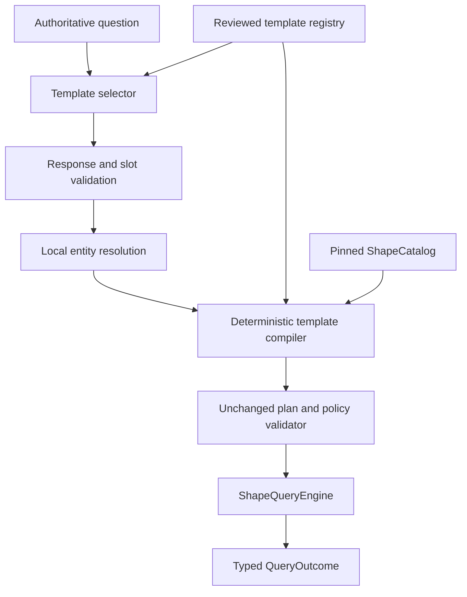

# ShapeLens Phase 2.1 design: reviewed template selection

**Status:** Proposed experimental design  
**Date:** 7 August 2026  
**Decision basis:** [`phase2/DECISION.md`](./phase2/DECISION.md)  
**Current supported interface:** Caller-authored plans executed by `ShapeQueryEngine`  
**Entry condition:** Phase 2.1 may run only as the constrained experiment authorized by the Phase 2 decision

## Executive summary

Phase 2 showed that a small language model usually understood the broad meaning of a question but could not reliably author a complete low-level ShapeLens plan. The model repeatedly failed on catalog-local identifiers, RDF terms, entity binding, atom ownership, and exact intent coverage. The unchanged validator rejected those plans correctly, but the result was zero faithful completions in the full benchmark and one completion in twelve supported pilot attempts.

Phase 2.1 narrows the model's role to two operations:

1. select one reviewed query template; and
2. copy the template's required slot values from the user's question.

Ordinary Python owns every other operation. It validates the response schema, verifies that slot text came from the question, resolves authorized labels and aliases, detects unknown or ambiguous entities, instantiates an already accepted base plan, generates intent coverage, applies policy, invokes the unchanged 0.1 validator, and delegates execution to `ShapeQueryEngine`.

A template is not generated automatically from SHACL. It is a project-owned, reviewed product capability built from an accepted ShapeLens plan. SHACL and Semantic Qualification determine which graph operations are available; the template registry determines which complete combinations the application promises to support.

Phase 2.1 introduces no new query algebra, SPARQL surface, authorization mechanism, answer synthesizer, document retriever, vector store, or public `ShapeQueryEngine` behavior. The complete-plan Phase 2 code and artifacts remain frozen as historical evidence. Caller-authored plans remain the only supported interface until a new frozen Phase 2.1 revision passes every gate.

## 1. Context and problem statement

The Phase 2 planner asked the model to perform six coupled jobs:

1. interpret the question;
2. enumerate every material intent item;
3. choose only catalog cards present in its context;
4. resolve graph roles and entities;
5. construct a revision-bound typed plan; and
6. construct an exact bidirectional coverage proof.

The experiment demonstrated that broad semantic understanding did not translate into reliable plan bookkeeping. Prompt revisions and shorter handles moved failures between fields without removing the failure mode. Cost was acceptable; correctness was not. The measurements and stop decision are recorded in [`phase2/DECISION.md`](./phase2/DECISION.md).

The useful remaining hypothesis is smaller:

> Given a short menu of reviewed, mutually distinguishable query templates, can the model reliably choose the one template that covers the whole question and copy a few slot values without inventing or omitting user intent?

Phase 2.1 tests only that hypothesis.

## 2. Goals and non-goals

### 2.1 Goals

Phase 2.1 will:

- preserve the complete ShapeLens 0.1 validation, policy, evidence, and execution boundary;
- derive a small registry from already accepted Phase 0 plans;
- give the model human-readable template descriptions, examples, and slot definitions rather than plan schemas or catalog keys;
- resolve entity and literal values deterministically over authorized local data;
- compile a selected template into the exact existing `BoundQueryPlan` representation;
- generate plan atoms and intent coverage without model authorship;
- fail closed on unknown templates, malformed responses, slot mismatch, ambiguity, stale catalogs, unsupported mixed intent, and validation failure;
- retain reproducible prompts, registries, manifests, attempts, reviews, and reports; and
- establish whether reviewed template selection is reliable enough for a later graph-only `ShapeRAG` composition.

### 2.2 Non-goals

Phase 2.1 will not:

- generate templates automatically from SHACL;
- allow the model to compose templates or combine parts of several templates;
- allow model-authored RDF identifiers, catalog keys, plan atoms, coverage mappings, SPARQL, filters, projections, or authorization scopes;
- add a new query operation or weaken an existing validator rule;
- silently relax a question or execute the closest supported template;
- claim that successful plan execution proves that the selected template faithfully represented the question;
- add document retrieval, embeddings, answer synthesis, community detection, remote stores, or Phase 3 capabilities; or
- make template planning part of the supported 0.1 runtime before the experiment passes.

## 3. Normative invariants

The terms **MUST**, **MUST NOT**, **SHOULD**, and **MAY** in this document apply to the Phase 2.1 experiment. They do not amend [`SPEC-0.1.md`](./SPEC-0.1.md).

1. `ShapeQueryEngine` and its public types MUST remain unchanged during the experiment.
2. Every executable result MUST pass the unchanged 0.1 structural, semantic, qualification, authorization, complexity, and catalog-revision checks.
3. A template MUST be derived from an accepted, reviewed plan that already passes the 0.1 validator.
4. Template instantiation MUST change only fields explicitly declared as slots.
5. The model MUST NOT supply canonical RDF terms, catalog keys, plan identifiers, coverage ownership, or executable fragments.
6. A slot value MUST be traceable to text in the authoritative user question after fixed Unicode, whitespace, case, and punctuation normalization.
7. Entity resolution MUST use exact normalized matching over authorized labels and reviewed aliases. Zero matches produce `unsupported`; multiple matches produce `ambiguous`; similarity MUST NOT silently choose a match.
8. A template may execute only when it covers the complete request. If the question adds a condition, projection, aggregation, absence claim, or second request not represented by the selected template, the correct disposition is `unsupported`.
9. Template selection MUST NOT remove or alter trusted policy and authorization inputs.
10. Registry, prompt, catalog, benchmark, provider-visible context, model, price, harness, and environment revisions MUST be frozen before the first measured call.
11. A stale catalog revision, stale local key, unresolved portable reference, or changed base-plan digest MUST fail before model execution.
12. The deterministic renderer MUST continue to report only the typed ShapeLens outcome and MUST NOT assert natural-language question fidelity, consistent with `SL-017`.

## 4. System boundary and architecture



The model is outside the trust boundary. Its output is an untrusted proposal. The reviewed registry is trusted application configuration, but it does not bypass the runtime validator or authorization policy. The compiled plan is revision-bound and has the same status as a caller-authored plan only after every existing check passes.

### 4.1 Responsibility allocation

| Responsibility | Model | Deterministic code or reviewed configuration |
|---|---|---|
| Interpret the question | Select one template | Supply the eligible menu and validate the selection |
| Slot extraction | Copy short question spans | Verify provenance, cardinality, and slot types |
| Entity identity | None | Resolve authorized labels and aliases to RDF terms |
| Ambiguity | May safely defer | Confirm from local resolver results |
| SHACL/catalog references | None | Registry and compiler |
| Plan construction | None | Instantiate an accepted base plan |
| Intent and atom coverage | None | Generate from the template contract |
| Authorization and policy | None | Existing trusted inputs and validator |
| Query execution | None | Existing `ShapeQueryEngine` |
| Result wording | None in this phase | Existing deterministic renderer |

## 5. Project-owned template packs

Applications using ShapeLens define their supported menu in a versioned **Template Pack**. A pack is stored alongside application configuration and reviewed fixtures. It is separate from the SHACL source because it expresses product intent rather than data-validation semantics.

The four layers remain distinct:

| Layer | Question answered |
|---|---|
| SHACL source | What targets, paths, value contracts, and constraints exist? |
| Trust and Semantic Qualification | Which derived behaviors may enter the executable catalog? |
| Template Pack | Which complete user questions does this application support? |
| Query policy and authorization | Who may execute which plan over which dataset scope? |

### 5.1 Template origin

For Phase 2.1, every template starts from one accepted Phase 0 plan. The current 28-case benchmark contains 20 supported cases referencing 18 distinct accepted plan fixtures. The pilot registry contains only the four templates needed by the four supported pilot cases. The full registry is created only after the pilot passes.

The base-plan approach is intentional. Phase 2.1 does not introduce a new graph-query DSL. A template is an accepted canonical plan plus a small, typed substitution map.

### 5.2 Registry representation

The normative experiment artifact is UTF-8 JSON with deterministic canonical serialization. The following abbreviated example is illustrative:

```json
{
  "schema_version": 1,
  "registry_id": "phase2.1-pilot",
  "catalog_revision": "sha256:...",
  "templates": [
    {
      "template_id": "staffing.employees_by_project_and_skill",
      "description": "Find employees who worked on a project and have a skill.",
      "examples": [
        "Who worked on Project Atlas and has artificial-intelligence expertise?"
      ],
      "base_plan_path": "phase0/fixtures/plans/staffing-q01.json",
      "base_plan_digest": "sha256:...",
      "slots": [
        {
          "name": "project",
          "kind": "entity",
          "target": {"kind": "entity_binding", "entity_id": "project"},
          "resolver": "staffing.project_titles",
          "required": true
        },
        {
          "name": "skill",
          "kind": "entity",
          "target": {"kind": "entity_binding", "entity_id": "skill"},
          "resolver": "staffing.skill_labels",
          "required": true
        }
      ],
      "fixtures": ["staffing-q01", "safety-partial-staffing"],
      "reviewed_by": ["workforce-operations", "phase2-rdf-reviewer"]
    }
  ]
}
```

The real registry MUST use project-approved descriptions and examples. Example questions are selection metadata, not executable instructions.

### 5.3 Required template fields

Each template contains:

- a stable `template_id` unique within the pack;
- a concise description of the complete supported question;
- reviewed positive examples and, in the fixture set, near-miss examples;
- a base-plan path and digest;
- the exact catalog revision against which the base plan was accepted;
- an exact slot schema;
- one allowed substitution target for each slot;
- a resolver identifier and value type for each slot;
- a fixed output contract inherited from the base plan;
- fixed intent and atom-coverage ownership generated during registry compilation;
- scenario and policy metadata used only by trusted local eligibility filtering;
- review ownership and fixture references; and
- a canonical template digest.

Descriptions MUST state the entire question form, including conditions, projections, Boolean versus record result, and important result-extent limitations. They MUST NOT imply aggregation, absence, lexical search, ordering, pagination, or completeness semantics not supported by the base plan.

### 5.4 Slot kinds

Phase 2.1 supports only slot kinds needed by the accepted corpus:

| Slot kind | Model supplies | Deterministic handling |
|---|---|---|
| `entity` | Exact question text | Resolve to one authorized IRI or return unknown/ambiguous |
| `literal` | Exact question text | Parse under one declared RDF datatype and lexical policy |
| `enum` | Exact question text | Match one reviewed alias to one fixed RDF term |

Slots do not control selectors, paths, plan kind, lenses, projections, requiredness, limits, or policy. Optional slots are out of scope for the pilot because they effectively create multiple plan shapes. A distinct supported combination SHOULD be a distinct template.

### 5.5 Allowed substitution targets

The compiler supports a closed set of target types:

- `entity_binding`: replace the binding of one existing entity variable with one resolved RDF term;
- `filter_term`: replace the RDF term of one existing exact-identity filter; and
- `enum_term`: replace one fixed term from a reviewed finite allowlist.

No target may address catalog revision, entity IDs, lens IDs or keys, selector keys, property or branch keys, edge topology, filter operators, projections, plan kind, result limit, authorization, or evidence requirements.

### 5.6 Catalog identity and portability

Phase 2.1 templates are bound to the catalog revision recorded by their accepted base plan. This is stricter than desirable for a future SDK, but it matches `SL-014`: blank-node-backed declarations have only Catalog-Local Keys, and a rebuild may assign new keys.

For later reusable Template Packs, IRI-backed node and property shapes may use Portable Logical Keys. Projects whose executable property shapes are anonymous may either:

1. accept catalog-bound templates and re-review them after a catalog rebuild; or
2. introduce stable, qualified IRI-backed declarations or a reviewed alias manifest that resolves to exact qualified behavior.

An alias may improve identity and authoring ergonomics but MUST NOT qualify new behavior or broaden the executable catalog.

## 6. Model selection protocol

### 6.1 Provider-visible input

The provider receives only:

- the authoritative question;
- the fixed selection instructions;
- eligible template IDs;
- approved template descriptions and examples; and
- slot names and plain-language slot descriptions marked `provider_allowed`.

The provider does not receive raw RDF data, evidence, source documents, catalog-local keys, base plans, hidden policy metadata, authorization reasons, unapproved aliases, or resolver contents. This preserves the Phase 2 provider boundary defined by `OQ-013`.

The full eligible template menu is sent for this experiment. With four pilot templates and eighteen eventual templates, a retrieval stage would add another independent failure mode without a demonstrated need. Before serialization, deterministic code filters the registry by scenario, provider policy, and coarse authorization eligibility. Final authorization still occurs after plan construction.

### 6.2 Response schema

The model returns exactly one JSON object:

```json
{
  "status": "selected",
  "template_id": "staffing.employees_by_project_and_skill",
  "slots": {
    "project": "Project Atlas",
    "skill": "artificial-intelligence"
  }
}
```

Allowed statuses are:

- `selected`: one complete template appears to match the whole question;
- `unsupported`: no single eligible template covers the whole question; or
- `ambiguous`: a template appears applicable but the model cannot identify a unique reading.

For `selected` and `ambiguous`, `template_id` and the exact required slot set are mandatory. For `unsupported`, `template_id` MUST be absent and `slots` MUST be empty. Extra keys, extra slots, missing slots, unknown template IDs, non-string slot values, duplicate JSON keys, or text outside the JSON object are invalid.

`ambiguous` is advisory and cannot itself establish a public `Ambiguous` result. Local resolution must confirm multiple authorized matches for a typed slot. An unconfirmed model ambiguity is a safe deferral and is marked incorrect during evaluation when a unique supported answer existed.

### 6.3 Selection rules

The prompt instructs the model to:

- select only when one template covers every material condition, requested projection, and requested result form;
- reject requests that combine a supported template with any unsupported operation;
- never merge templates;
- copy slot spans rather than normalize them to canonical entity names;
- avoid guessing unknown values; and
- prefer `unsupported` to a partial match.

A user mentioning a template ID in the question does not authorize execution. It remains untrusted question text; the selected template, slots, local resolution, policy, and final plan must all validate normally.

### 6.4 Retry policy

One retry is permitted only when the first response fails the mechanical response schema. The retry receives a fixed, non-sensitive list of schema violations. Semantic disagreement, entity ambiguity, an unsupported disposition, a stale registry, plan validation failure, or an empty query result MUST NOT trigger a model retry.

Every attempt reports whether a retry occurred. A pilot in which any attempt needs a schema retry fails the preferred reliability target even if the existing maximum of two calls is not exceeded.

## 7. Deterministic processing

### 7.1 Question-span validation

Every returned slot string is checked against the authoritative question. Matching uses a frozen normalization function covering Unicode normalization, case folding, whitespace collapse, and an explicit punctuation-equivalence table. It does not apply embeddings, stemming, synonym expansion, or model-generated rewriting.

Reviewed entity aliases allow a copied span such as `AI` to resolve to the canonical skill IRI. The alias, not the model, owns that semantic normalization.

### 7.2 Entity resolution

Resolver inputs are trusted local indexes built from authorized labels and reviewed aliases. Resolution is scoped by the template's slot type and the current authorization context.

| Match count | Result |
|---:|---|
| 0 | `Unsupported` with an unknown-entity diagnostic |
| 1 | Bind the exact RDF term and continue |
| 2 or more | `Ambiguous` with authorized clarification choices when policy permits |

Similarity MAY rank already known ambiguous choices for presentation. It MUST NOT convert zero or multiple exact matches into one binding.

### 7.3 Literal and enum resolution

Literal parsing uses one declared datatype and a frozen lexical policy. A year template, for example, may accept only a four-digit lexical form and produce one `xsd:gYear` or `xsd:integer` term according to the reviewed base plan. Locale-dependent dates, units, ranges, ordered comparisons, and free-form coercion are out of scope unless represented by a separate reviewed deterministic resolver and accepted plan.

Enum resolution uses a reviewed finite map. Unknown and multiply mapped aliases fail closed.

### 7.4 Plan instantiation

For a valid selection, the compiler:

1. loads the exact base plan and verifies its digest;
2. verifies the pinned catalog revision and all referenced local keys;
3. deep-copies the validated base plan;
4. replaces only the declared slot targets with locally resolved RDF terms;
5. proves that no undeclared normalized plan field changed;
6. canonicalizes and validates the instantiated plan;
7. generates fixed intent items and bidirectional atom coverage from the template contract;
8. records question, registry, template, plan, catalog, policy, and authorization digests; and
9. passes the plan to the unchanged engine.

The compiler never edits an accepted plan in place and never reuses mutable plan state between attempts.

### 7.5 Mechanical coverage

Coverage is a property of the reviewed template, not model output. Registry compilation enumerates every selector, relationship, filter, and projection atom in the accepted plan and binds it to a fixed intent role. A slot declares which fixed atom receives its resolved value. Instantiation substitutes values without changing ownership.

Registry validation rejects:

- an atom with no owner;
- an atom with more than one owner;
- an intent item with no plan realization;
- a slot targeting an atom owned by another slot;
- a projection or restriction absent from the human-readable template contract; or
- a base-plan mutation that changes topology or fixed semantics.

This guarantees internal plan coverage. It does not prove that the model selected the correct template for the question; that remaining semantic decision is the subject of the benchmark.

## 8. Outcomes and fail-closed behavior

The Phase 2.1 wrapper produces a typed planning disposition before any query outcome:

| Condition | Planning disposition | Execute? |
|---|---|---:|
| Valid full template selection and all checks pass | `completed` | Yes |
| No template selected | `unsupported` | No |
| Unknown entity or literal | `unsupported` | No |
| Multiple authorized entity matches | `ambiguous` | No |
| Mixed supported and unsupported intent | `unsupported` | No |
| Invalid response after retry | `planner_failure` | No |
| Stale registry or catalog | `configuration_failure` | No |
| Instantiated plan rejected | `validation_failure` | No |
| Authorized plan executes with no rows | Valid `NoMatch` query outcome | Yes |

`Unsupported`, `Ambiguous`, `NoMatch`, and operational failure remain distinct. No condition may be dropped to turn `NoMatch` into a populated result. A planner or configuration failure MUST NOT be presented as evidence that the user's question is unsupported in principle.

## 9. Template authoring workflow for ShapeLens projects

If Phase 2.1 passes and becomes an optional composition, an adopting project follows this workflow:

1. **Choose a recurring question.** A product or domain owner defines the full question and expected result form before template construction.
2. **Author and review one base plan.** A developer uses the normal ShapeLens API to create a caller-authored plan. The plan is reviewed against an independent semantic oracle and accepted fixtures.
3. **Parameterize exact values.** The author marks only entity bindings, exact literal filters, or reviewed enums that may vary.
4. **Configure resolvers.** The project supplies authorized label sources, reviewed aliases, expected entity types, datatype rules, and ambiguity policy.
5. **Write selection metadata.** The owner adds a precise description, positive paraphrases, and near-miss unsupported cases.
6. **Compile the registry.** Tooling validates the base-plan digest, slot targets, catalog identity, coverage, and fixture outcomes.
7. **Review and freeze.** Product, RDF/data, and security owners approve the template and its provider-visible fields. CI freezes the pack digest.
8. **Deploy with the matching catalog.** Startup fails if the registry cannot bind to the pinned catalog revision.

A future authoring command could scaffold this process:

```console
shapelens templates promote \
  --plan phase0/fixtures/plans/staffing-q01.json \
  --slot project=entity:project:staffing.project_titles \
  --slot skill=entity:skill:staffing.skill_labels

shapelens templates validate template-pack.json --catalog catalog.json
```

These commands are design targets, not Phase 2.1 implementation requirements. The experiment should first prove that template selection works.

## 10. Authorization, security, and privacy

Templates are reviewed query capabilities, not authorization grants. Phase 2.1 preserves the following separation:

- the registry defines a plan shape;
- request-time authorization defines whether that shape may be used now;
- entity resolvers expose only authorized labels and bindings;
- query policy injects or validates trusted limits and scopes; and
- the existing engine enforces the final executable boundary.

Security requirements include:

- build provider context from an allowlist, never by serializing arbitrary registry fields;
- exclude ineligible templates before the model call while still performing final authorization afterward;
- treat descriptions, examples, aliases, and user questions as data, not instructions;
- use strict structured output and exact template allowlists;
- never log hidden policy reasons, unauthorized candidate names, raw provider credentials, or evidence in planner traces;
- bind each attempt to question, provider-context, registry, catalog, policy, and authorization digests;
- preserve configured time, token, output-size, and call limits; and
- return only clarification choices permitted by current authorization.

Prompt injection cannot expand the executable surface because the model cannot author operations. It can still cause an incorrect selection or denial of service, so semantic selection remains benchmarked and all outputs remain untrusted.

## 11. Registry validation and CI

The registry MUST validate completely without a model call. Validation includes:

1. JSON schema and canonical serialization;
2. unique registry and template identifiers;
3. exact base-plan and fixture digests;
4. matching catalog revision and resolvable keys;
5. successful unchanged validation of every base plan;
6. required, non-overlapping slot targets;
7. valid resolver and datatype declarations;
8. complete mechanical intent and atom coverage;
9. provider allowlist checks;
10. mutation tests for every slot and every non-slot plan field;
11. fixture execution matching reviewed outcomes in both supported RDFLib modes; and
12. deterministic registry, instantiated-plan, and provider-context digests.

For every template, CI must prove that:

- each declared slot can be replaced by another valid value of the same type;
- missing, extra, unknown, and wrong-type slot values are rejected;
- editing any undeclared plan field is rejected;
- zero and multiple entity matches do not execute;
- the output plan belongs to the accepted normalized equivalence class; and
- changing SHACL or the catalog cannot silently retarget the template.

## 12. Experiment protocol

### 12.1 Revision isolation

Phase 2.1 is a new experimental revision. It MUST use new prompt, registry, manifest, raw-result, direct-review, and report filenames. Existing complete-plan Phase 2 artifacts remain unchanged and MUST NOT be overwritten or relabeled.

The matching manifest snapshot MUST be committed before the first provider call. This corrects the missing exact manifest in the previous full run.

### 12.2 Offline deterministic gate

Before any paid model call:

- implement the four-template pilot registry;
- validate all templates and resolvers;
- compile each reviewed fixture without a model;
- pass all unit, mutation, conformance, and dual-RDFLib-mode tests;
- confirm that the existing validator and engine have no behavioral diff; and
- freeze the pilot cases, prompt, menu serialization, model, prices, harness, and manifest.

Any deterministic defect stops the pilot until fixed and a new manifest is frozen.

### 12.3 Five-case pilot

Run the four existing supported pilot cases plus `safety-ambiguous-priya` in three independently shuffled runs, for 15 measured attempts.

The pilot passes only if:

- all 12 supported attempts select the correct template and produce the exact accepted plan and outcome;
- all 3 ambiguous-Priya attempts produce a locally confirmed `ambiguous` disposition;
- no attempt produces a structural or runtime validator rejection;
- no attempt produces a false completion or partial-intent completion;
- every response uses at most two calls;
- no attempt requires a schema-caused retry under the preferred reliability target; and
- end-to-end p95 latency is at most ten seconds.

If the pilot fails, model planning stops for this release. Caller-authored plans remain supported and no further prompt-tuning loop is authorized under the same revision.

### 12.4 Full benchmark

Only after the pilot passes:

1. expand the registry to the 18 distinct accepted templates needed by the 20 supported cases;
2. add no new query algebra or benchmark question;
3. freeze a new full-benchmark manifest;
4. run all 28 cases three times in shuffled order, for 84 attempts; and
5. complete independent direct review before generating the report.

The independent gates in [`PHASE2-EXPERIMENT.md`](./PHASE2-EXPERIMENT.md) remain controlling:

- 100% intent extraction recall and restriction precision for completed plans;
- 100% internal coverage;
- 100% required eligible-menu availability;
- 100% entity accuracy;
- 100% validity for completed plans;
- at least 80% faithful automation coverage overall and 100% on critical attempts;
- 100% completed-plan semantic precision;
- 100% unsupported precision and recall;
- zero false completions;
- at most two calls per attempt;
- p95 latency at most ten seconds; and
- mean provider cost at most USD 0.05 per attempt under the frozen conditions.

Because Phase 2.1 sends the complete eligible menu, the former candidate-retrieval metric is reported as **eligible-menu availability**. It must be 100%; this terminology change cannot hide a missing required template.

Matching fixture rows alone does not establish semantic correctness. The selected template, resolved terms, complete normalized plan, execution result, and disposition must all match the reviewed oracle.

### 12.5 Decision rule

| Result | Decision |
|---|---|
| Offline deterministic gate fails | Fix deterministic code, freeze a new revision, and rerun offline only |
| Pilot fails for model behavior | `stop`; retain caller-authored plans |
| Pilot passes, full benchmark fails | `stop`; retain caller-authored plans |
| Every full gate passes | `proceed` only to the minimal graph-only composition described below |

No weighted score can compensate for a failed independent gate.

## 13. Implementation plan

All Phase 2.1 code remains experimental until the full decision is `proceed`. Suggested artifacts are:

```text
phase2/
  template_registry-pilot.json
  template_registry-full.json
  prompt-template-selection.txt
  template_selection.py
  template_benchmark.py
  manifests/
  results-template/

tests/
  test_phase2_template_registry.py
  test_phase2_template_selection.py
  test_phase2_template_compiler.py
```

The exact layout may follow existing repository conventions, but the new result namespace and manifest identity are mandatory.

### 13.1 Work packages

**A. Deterministic contracts**

- Define registry, slot, response, resolver-result, compiled-template, and attempt-record models.
- Implement canonical serialization and digests.
- Implement question-span normalization and strict response validation.

**B. Registry and compiler**

- Build the four-template registry from accepted plans.
- Implement resolver interfaces and the closed substitution target set.
- Generate fixed intent and atom coverage.
- Add structural diff checks between base and instantiated plans.

**C. Model adapter**

- Serialize only approved template metadata.
- Add one explicit model adapter and one schema-only retry.
- Record provider request metadata without hidden or sensitive fields.

**D. Evaluation harness**

- Add pilot and full modes without changing historical results.
- Retain baselines and independent direct review.
- Freeze exact manifests before model calls.
- Report by case, scenario, run, representative/safety status, and failure category.

**E. Optional composition after `proceed`**

- Add a graph-only natural-language wrapper outside `ShapeQueryEngine`.
- Return the unchanged typed `QueryOutcome` and deterministic rendering.
- Keep caller-authored plans available and documented.

## 14. Test strategy

### 14.1 Registry tests

- Unknown or duplicate template ID.
- Stale base-plan digest or catalog revision.
- Missing or extra slot.
- Duplicate or overlapping substitution target.
- Slot targeting a fixed plan field.
- Missing resolver, datatype, fixture, reviewer, or provider approval.
- Incomplete or duplicate coverage ownership.
- Non-canonical or nondeterministic serialization.

### 14.2 Response tests

- Unknown top-level field or status.
- Text surrounding JSON.
- Duplicate JSON keys.
- Unknown template.
- Template not present in the eligible menu.
- Missing, extra, empty, or non-string slot value.
- Invented value not traceable to the question.
- `unsupported` carrying executable fields.
- Retry only for schema failure and never more than once.

### 14.3 Resolution tests

- Exact label, normalized punctuation, and reviewed alias.
- Unknown entity.
- Ambiguous alias within one entity type.
- Same label in different entity types.
- Unauthorized entity omitted from the resolver.
- Invalid literal lexical form or datatype.
- Enum alias collision.

### 14.4 Compiler tests

- Every pilot and full-registry template compiles from its reviewed fixture.
- Only declared RDF-term positions change.
- Mutation of every fixed field fails.
- Canonical plan and coverage are independent of caller-selected local IDs and ordering.
- Stale catalog and local keys fail.
- Instantiated plans pass the unchanged validator in both RDFLib modes.
- Execution matches reviewed oracles and row-support certificates remain valid.

### 14.5 Semantic safety tests

- Partial supported questions do not complete.
- Supported plus aggregate intent is unsupported.
- Supported plus absence intent is unsupported.
- Unsupported projection is not silently removed.
- Ambiguous and unknown entities never execute.
- Prompt injection cannot add operations or override slots.
- A model-selected template outside current authorization never executes.

## 15. Observability and reproducibility

Each attempt record includes:

- case and run identifiers;
- authoritative-question digest;
- model and fixed generation settings;
- prompt, registry, eligible-menu, catalog, policy, authorization, and harness digests;
- raw structured responses and schema diagnostics;
- retry count and reason;
- slot provenance and resolver disposition without unauthorized candidate leakage;
- selected template and compiled plan digest;
- validator and execution outcome class;
- latency, token counts, and cost; and
- direct-review labels and failure categories.

Logs MUST distinguish model `unsupported`, local unknown entity, local ambiguity, schema failure, configuration failure, validator rejection, execution failure, and valid `NoMatch`. Aggregate reports MUST preserve raw denominators and MUST NOT collapse these states into a generic failure rate.

## 16. Risks and mitigations

| Risk | Mitigation |
|---|---|
| Model selects a template covering only part of the question | Mixed-intent safety cases, whole-question prompt rule, exact semantic review, zero-false-completion gate |
| Template descriptions overlap | Review menu as a set, add contrastive examples, split or rename templates before freeze |
| Template registry becomes a second query language | Base accepted plans plus a closed substitution map; no topology authorship |
| Catalog rebuild silently changes meaning | Pin revision and plan digest; fail before model call; re-review migration |
| Entity aliases bind incorrectly | Exact typed local resolution; reviewed aliases; ambiguity instead of ranking |
| Unauthorized capabilities leak to provider | Filter eligible menu locally and serialize an explicit provider allowlist |
| Prompt injection causes unsafe execution | Model has no executable authority; strict allowlists and unchanged validator |
| Retry hides instability | Schema-only retry, report every retry, preferred zero-retry pilot target |
| Tests overfit the known benchmark | Freeze before calls, use three shuffled runs, retain near-miss safety cases and direct review |
| Menu size grows beyond reliable selection | Out of Phase 2.1; later deterministic eligibility partitioning requires a new benchmark revision |
| Users mistake templates for complete graph access | Document the closed menu and explicit `Unsupported` behavior |

## 17. Decisions fixed by this design

1. Templates are project-owned application artifacts, not automatic SHACL output.
2. The experiment uses accepted base plans with typed substitutions, not a new plan DSL.
3. The model selects exactly one complete template and copies question spans.
4. Entity identity, ambiguity, RDF terms, plan construction, and coverage remain deterministic.
5. The complete eligible menu is supplied; candidate retrieval is removed from this revision.
6. Templates are catalog-revision-bound for the experiment.
7. Every registry and model response fails closed.
8. One retry is allowed only for mechanical schema errors.
9. The existing validator and `ShapeQueryEngine` remain unchanged.
10. The five-case pilot precedes any full benchmark or product implementation.
11. Any model-caused pilot or full-benchmark failure ends model planning for this release.
12. A pass authorizes only a minimal graph-only composition.

## 18. Deferred work

The following require a separate design, ADR where appropriate, and a new frozen benchmark revision:

- portable template migration across catalogs containing anonymous shapes;
- automatic template candidates derived from SHACL or usage logs;
- optional slots, template inheritance, or template composition;
- large-registry retrieval or hierarchical routing;
- learned entity linking or fuzzy automatic binding;
- user-defined templates at request time;
- answer synthesis and claim checking;
- document retrieval and hybrid GraphRAG;
- remote graph stores; and
- any new ShapeLens query algebra.

## 19. Minimal post-pass boundary

If and only if the full Phase 2.1 benchmark passes, ShapeLens may add an optional graph-only wrapper with this flow:

```text
question
  -> reviewed template selection
  -> local slot and entity resolution
  -> deterministic BoundQueryPlan construction
  -> unchanged validation and ShapeQueryEngine execution
  -> unchanged typed QueryOutcome and deterministic rendering
```

The wrapper remains outside the deterministic engine. It does not retrieve documents or synthesize prose. A separate vertical slice connecting one reviewed graph template to linked document IDs may be proposed afterward, but it is not authorized by this design.

## 20. Completion checklist

Phase 2.1 is ready for its first provider call only when:

- [ ] the four-template pilot registry is reviewed;
- [ ] every template is derived from an accepted plan and exact fixture;
- [ ] slot resolvers and aliases are reviewed;
- [ ] offline validation, mutation, conformance, and oracle tests pass;
- [ ] the unchanged engine test suite passes with no behavioral diff;
- [ ] the prompt and provider-visible menu are reviewed;
- [ ] the five pilot cases and direct-review rubric are frozen;
- [ ] the matching manifest is committed and retained; and
- [ ] new raw-result and report paths are reserved without overwriting prior artifacts.

Phase 2.1 is complete only when it publishes either:

- a passing full report and a narrowly scoped `proceed` decision; or
- a `stop` decision preserving caller-authored plans as the supported interface.

## References

- [`phase2/DECISION.md`](./phase2/DECISION.md) — complete-plan results and authorization for the narrower experiment
- [`PHASE2-EXPERIMENT.md`](./PHASE2-EXPERIMENT.md) — benchmark metrics, gates, and decision protocol
- [`phase2/README.md`](./phase2/README.md) — current benchmark commands and artifact rules
- [`SPEC-0.1.md`](./SPEC-0.1.md) — normative deterministic runtime behavior
- [`SHAPELENS_DESIGN.md`](./SHAPELENS_DESIGN.md) — informative architecture and identity design
- [`CONTEXT.md`](./CONTEXT.md) — canonical ShapeLens vocabulary
- [`ROADMAP.md`](./ROADMAP.md) — milestone boundaries and immediate next action

