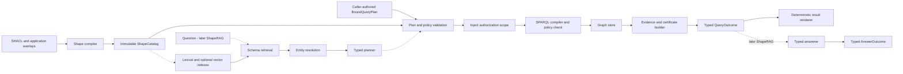

# ShapeLens

## A typed SHACL-derived query runtime for Python

**Document status:** Archived informative reference design and decision backlog; superseded for version 0.1 by [`SPEC-0.1.md`](./SPEC-0.1.md)
**Working library name:** `shapelens`
**Target runtime:** Python 3.11+
**Primary technologies:** RDF, SHACL, SPARQL, Pydantic, and optional Pydantic AI
**Standards baseline:** SHACL 1.0 source vocabulary and SPARQL 1.1 query target
**Last reviewed:** 7 August 2026

This document describes candidate architecture and decisions to test before a public version 0.1 contract is frozen. It is implementation-ready only for the explicitly scoped Phase 0 experiments. **No statement in this document is normative:** words such as **MUST**, **SHOULD**, and **MAY** describe proposed rules only. A rule gains conformance force only when observed behavior is accepted after Phase 0, copied into `SPEC-0.1.md`, assigned a stable requirement ID, and mapped to tests. The product hypothesis is in [`VISION.md`](./VISION.md), the experiment protocol in [`PHASE0-EXPERIMENT.md`](./PHASE0-EXPERIMENT.md), canonical domain vocabulary in [`CONTEXT.md`](./CONTEXT.md), and the delivery sequence in [`ROADMAP.md`](./ROADMAP.md).

Phases 0 and 1 are complete. This document remains a lookup resource rather than the active work queue. Normative behavior is in [`SPEC-0.1.md`](./SPEC-0.1.md), the supported deployment boundary in [`SECURITY.md`](./SECURITY.md), accepted trade-offs in [`docs/adr/`](./docs/adr/README.md), and deferred work in [`OPEN-QUESTIONS.md`](./OPEN-QUESTIONS.md) and [`FUTURE-DESIGN.md`](./FUTURE-DESIGN.md). The experiment records and commands are in [`phase0/`](./phase0/README.md).

---

## Contents

1. [Executive summary](#1-executive-summary)
2. [Assessment of the design](#2-assessment-of-the-design)
3. [Problem, goals, and boundaries](#3-problem-goals-and-boundaries)
4. [Semantic assumptions and system invariants](#4-semantic-assumptions-and-system-invariants)
5. [Shape Lenses](#5-shape-lenses)
6. [A small end-to-end example](#6-a-small-end-to-end-example)
7. [Architecture and lifecycle](#7-architecture-and-lifecycle)
8. [Catalog construction](#8-catalog-construction)
9. [Later schema retrieval and entity resolution](#9-later-schema-retrieval-and-entity-resolution)
10. [The version 0.1 query algebra](#10-the-version-01-query-algebra)
11. [Plan validation and later model planning](#11-plan-validation-and-later-model-planning)
12. [Compilation, execution, and repair](#12-compilation-execution-and-repair)
13. [Evidence and answer semantics](#13-evidence-and-answer-semantics)
14. [Hybrid graph and document retrieval](#14-hybrid-graph-and-document-retrieval)
15. [Public API](#15-public-api)
16. [Extensibility and package boundaries](#16-extensibility-and-package-boundaries)
17. [Security and privacy](#17-security-and-privacy)
18. [Operations, observability, and performance](#18-operations-observability-and-performance)
19. [Testing and evaluation](#19-testing-and-evaluation)
20. [Delivery plan](#20-delivery-plan)
21. [Risks and mitigations](#21-risks-and-mitigations)
22. [Candidate architectural decisions](#22-candidate-architectural-decisions)
23. [Open questions](#23-open-questions)
24. [Recommendation and references](#24-recommendation-and-references)

---

## 1. Executive summary

ShapeLens is a proposed Python library for turning qualified SHACL material into a bounded query interface without accepting unrestricted caller- or model-authored SPARQL. Its initial `ShapeQueryEngine` accepts a caller-authored `BoundQueryPlan`; ordinary Python validates that plan, compiles it into a small SPARQL subset, executes it under policy and resource limits, and produces a typed `QueryOutcome` with atom-level support. A deterministic renderer may present that result, but version 0.1 does not claim that a caller-authored plan faithfully represents natural-language prose. A later `ShapeRAG` composition may add natural-language schema retrieval, entity resolution, model planning, document retrieval, and answer synthesis around this kernel.

The architecture is deliberately compiler-like. When a model planner is configured in a later phase, it decides which known semantic operations match the question, but it never becomes the authority for schema, access, query syntax, or factual truth. Shape catalog construction, semantic qualification, schema retrieval, entity resolution, authorization, plan validation, SPARQL rendering, endpoint policy, result normalization, provenance handling, and support checks remain explicit program logic. This separation makes a failed run inspectable: the caller can see the entity variables and Lens Uses, retrieved candidates when planning is enabled, bound plan, generated queries, execution diagnostics, evidence, and answer outcome without seeing or depending on private chain-of-thought.

The first release is intentionally narrower than the long-term architecture. Version 0.1 proves the central idea with qualified local shape material, revision-scoped Catalog-Local Keys, portable keys for eligible IRI-backed declarations, separate direct-type and target-node Population Selectors, several contextual Lens Uses on one Entity Variable, direct and inverse predicate paths, connected positive conjunctions, RDF-term identity and positive existence filters, node projection, tightly constrained scalar field projection, `SELECT` and positive `ASK`, an RDFLib store, and query-result, row, triple-pattern-match, and row-support evidence. Sequence and alternative paths may be parsed for diagnostics but are not queryable in version 0.1. Absence, portable blank-node identity, lexical text search, ordered comparison, aggregation, grouping, stable pagination, generic row-level authorization injection, full SHACL class semantics, formal focused SHACL validation, remote endpoints, model planning, document retrieval, embeddings, and dialect plugins arrive only after the product and semantic gates pass.

---

## 2. Assessment of the design

The design’s strongest idea is the typed boundary between natural-language interpretation and graph execution. Keeping schema retrieval separate from evidence retrieval, compiling a small plan instead of accepting raw SPARQL, treating evidence as a first-class artifact, and diagnosing empty results without silently dropping user constraints are all sound choices. The proposed structural expansion of retrieved lenses is particularly useful because an embedding search can find the concepts named by a question but miss the relationship that connects them. The design also correctly recognizes that validation of a deliberately partial evidence graph is not equivalent to validation of the source dataset.

The original proposal nevertheless overclaimed in four important places. First, it sometimes treated SHACL as if it were an exhaustive database schema, although a SHACL shape is a constraint applied to selected focus nodes and does not by itself establish authorization, completeness, or real-world truth. Second, the advertised query features exceeded the semantics represented by `BoundQueryPlan`; boolean queries, grouping, aggregate operands, nested Boolean filters, pagination, and optional-edge behavior were either missing or ambiguous. Third, a single `FactEvidence` type could not honestly describe asserted triples, property-path reachability, absence under `NOT EXISTS`, aggregate derivations, and validation findings. Fourth, lens allowlists and graph scopes did not provide a complete authorization model because filtering, joining, aggregation, auxiliary queries, and document retrieval could still leak protected information.

This revision addresses those weaknesses directly. Every executable field records how it was derived, whether its complete source closure is trusted, and the semantic fixtures that qualify that exact behavior; none alone authorizes execution. Population selection is separate from relationship value compatibility, and several contextual Lens Uses may attach to one Entity Variable without merging contracts or importing selectors. A run pins immutable catalog, policy, capability, and Dataset Scope descriptions. Version 0.1 has a deliberately small positive query algebra with explicit `SELECT` and Boolean plans and precisely defined conjunctive semantics. Evidence is a discriminated family, and every positive row has a closed atom-support map. Authorization constraints are trusted inputs that a planner cannot remove, and the deterministic public result is a typed Query Outcome rather than an answer string or question-fidelity claim.

---

## 3. Problem, goals, and boundaries

Natural-language-to-SPARQL systems fail in recurring ways. A model may invent plausible classes or predicates, reverse the direction of a relation, bind a phrase to the wrong entity, generate an expensive or unsafe query, or produce fluent prose from results that do not support it. Even valid SPARQL can be misleading when the queried dataset is incomplete, an endpoint applies an unexpected entailment regime, a named-graph scope differs from the user’s assumption, or an empty result is phrased as a statement about the real world. These failures are related: they arise when semantic interpretation, query authority, execution, and evidence are collapsed into one model call.

SHACL contains useful local knowledge for separating those responsibilities. Node and property shapes can describe targets, paths, value classes, datatypes, cardinalities, labels, descriptions, and constraints. That information can guide a planner toward schema-backed operations, but it is not automatically a natural-language query grammar and an arbitrary constraint is not invertible into a useful retrieval operation. ShapeLens therefore compiles a conservative, provenance-aware query interface from supported shape features rather than claiming to translate every shape into SPARQL.

The initial runtime’s goals are to execute bounded caller-authored plans over a local RDFLib store, make qualified SHACL material the principal source of query affordances, preserve RDF identity and available provenance, and expose typed debug and support artifacts. The later composition may answer natural-language questions over local and remote stores, add graph-guided document retrieval, and keep model-provider integrations replaceable. Pydantic models protect every boundary where caller or model output, store output, plugin output, or untrusted configuration enters the deterministic core.

Several concerns are explicitly outside the initial boundary. ShapeLens will not infer a complete ontology from arbitrary data, turn every SHACL-SPARQL constraint into a query, generate SPARQL Update, accept model-authored query fragments, silently relax a question to get non-empty results, or claim that SHACL conformance proves real-world truth. It will not treat a context-specific lens as an authorization boundary by itself, and it will not promise perfect portability across SPARQL implementations. Fine-tuning, unrestricted federation, and a mandatory vector database are also non-goals.

---

## 4. Semantic assumptions and system invariants

### 4.1 SHACL is a local contract, not a complete world model

A Shape Lens is compiled from SHACL, but its meaning is narrower than “the schema of a class.” A shape constrains focus nodes selected for a particular validation or application context. It may describe only part of a resource, may coexist with other shapes for the same class, and may encode data-quality expectations rather than query semantics. The catalog MUST preserve this context and MUST NOT merge every shape for a class into one universal lens.

A lens contract and a Population Selector are distinct. The contract defines contextual property operations and compatible relationship values. A Population Selector defines which nodes may be enumerated as a query population and is compiled from a supported SHACL target declaration or a qualified Executable Semantic Overlay. A targetless contract may be used to validate a bound relationship value or support further contextual operations, but it MUST NOT introduce an unbound root. Conversely, a property value contract such as `sh:class ex:Employee` MUST NOT be treated as permission to enumerate every employee. Constraints on focus nodes and population selection remain separate even when they originated in the same node shape.

Every derived statement records a **Derivation Origin**, which says how it was obtained, a **Shape Source Trust** assessment, which says whether the complete source and import closure is admitted, and a **Semantic Qualification**, which says whether the resulting behavior is reviewed as fit for an intended query interface. These are independent axes.

| Derivation origin | Meaning | Executable eligibility |
|---|---|---|
| `shape_constraint` | Directly derived from a supported SHACL constraint or target declaration | Eligible only when the shape-source closure is `trusted` and the executable behavior is semantically qualified |
| `application_overlay` | Supplied by reviewed application configuration | Descriptive material cannot expand behavior; executable semantic material additionally requires a trusted closure and Semantic Qualification; policy material requires the policy authority |
| `ontology_hint` | Inferred from labels, `rdfs:domain`, `rdfs:range`, or similar ontology terms | Ranking and explanation only |
| `sampled_hint` | Inferred from bounded inspection of instance data or statistics | Ranking and cost estimation only |

Shape Source Trust has three states. `trusted` closures may contribute catalog material; `untrusted` closures may be parsed into bounded diagnostic material but cannot expand retrieval cards, joins, selectors, or affordances; and `quarantined` sources are excluded after a failed integrity, admission, or safety check. Parsing, bounded compilation, SHACL conformance, transport security, and a familiar graph IRI do not establish source trust. Trust also does not establish semantic fitness: a trusted validation-oriented or outdated shape may still be unqualified for execution.

Application Overlay material is separated by authority. A **Descriptive Overlay** supplies labels, aliases, and ranking metadata and cannot expand executable behavior. An **Executable Semantic Overlay** supplies selectors, join mappings, projection contracts, or affordances and requires stronger admission plus reviewed semantic fixtures. A **Policy Metadata Overlay** supplies catalog-time tags and classifications under the application policy authority; it cannot invent graph meaning, be supplied by shape data, or enforce access by itself. Updating policy metadata changes the Catalog Revision. Runtime `QueryPolicy` remains a separate enforcement artifact with its own pinned revision. An executable behavior requires an eligible Derivation Origin, a trusted complete closure, field-level Semantic Qualification with recorded fixture coverage, and authorization for the current run. Promoting an ontology hint into executable semantics is an explicit Executable Semantic Overlay decision; promotion, source admission, qualification, metadata classification, and runtime policy authorization remain separate changes.

### 4.2 Negative results have explicit strength

RDF normally follows an open-world interpretation, so a failed match is not proof that the corresponding real-world relationship does not exist. ShapeLens distinguishes three claims: no solution was observed for a completed query; no solution was visible within the caller's Authorization Scope; and no solution exists in a declared complete dataset slice. The first two are query-result observations and MUST be worded relative to the pinned Dataset and Authorization Scopes. The third is a stronger absence claim and requires a named `CompletenessProfile` that identifies the relevant dataset, graph selection, population, properties, authorization view, and time boundary.

Version 0.1 may return `NoMatch` for a completed positive query, but it does not compile `NOT EXISTS`, create `AbsenceEvidence`, or claim property-level completeness. Those features enter together in a later profile only after their algebra, authorization-relative wording, and completeness rules are specified. A global Boolean such as `absence_claims_allowed` is not sufficient.

### 4.3 Every run observes pinned revisions

At the beginning of a run, the engine obtains immutable handles or immutable descriptions for the catalog revision, query-policy revision, Authorization Scope, endpoint-capability revision, compiler version, and Dataset Scope. All later stages use those pinned values, including retries, probes, label lookups, provenance lookups, validation queries, document retrieval, and cache keys. Catalog rebuilds publish a new revision atomically and never mutate an object used by an in-flight run. When a store cannot provide snapshot consistency across multiple queries, the evidence packet records that limitation instead of implying that all enrichment came from one snapshot.

### 4.4 The trust boundary is explicit

The planner may select only catalog operations and Population Selectors shown in its candidate context or retrieved through a typed inspection tool. It cannot create IRIs, property paths, authorization predicates, graph scopes, functions, raw query fragments, source-trust decisions, or Semantic Qualification records. The plan validator checks semantic references and policy, the SPARQL compiler accepts only validated models, and a second parser and policy pass checks the rendered query. Endpoint results are parsed into RDF terms before use. The answerer receives only a bounded evidence packet and cannot invent citation identifiers or source URLs.

### 4.5 Evidence strength is not the same as citation validity

A citation is referentially valid when its ID exists, but that alone does not establish that the cited item supports a claim. ShapeLens distinguishes four levels of answer checking: ID existence, compatibility between evidence and claim type, deterministic support for template-rendered claims, and optional semantic support assessment for free prose. The library MUST describe which level was applied. It MUST NOT label a claim “verified” merely because the model returned an existing evidence ID.

---

## 5. Shape Lenses

A **Shape Lens** is an immutable, versioned semantic view compiled from one primary SHACL node shape. Descriptive and Executable Semantic Overlays may augment that primary shape, while a Policy Metadata Overlay may classify it; none merges several shapes into one lens. A future composite-lens feature would need separate identity and conflict rules. The lens tells retrieval what the view is about, tells the planner which contextual property operations are available, tells validation which values are compatible with those operations, and provides source references that explain every derived field. It may own zero or more independently identified **Population Selectors** compiled from supported target declarations or Executable Semantic Overlays. A **Property Lens** is an operation-bearing property within a Shape Lens; property shapes remain Property Lenses or nested contracts rather than becoming populations merely because their values have a class.

One RDF class may have several Shape Lenses. An employee might have a public-directory lens, a project-staffing lens, and a data-quality lens. These lenses may expose different properties and may carry different policy tags, but those tags do not themselves enforce security. A plan represents the employee once as an Entity Variable and attaches the authorized contextual views it needs as separate Lens Uses. The lenses remain unmerged. Enforcement occurs through authorization and query-policy layers across every primary and auxiliary operation.

The central objects have distinct responsibilities. A `ShapeCatalog` is the immutable, serializable build artifact for one revision. It contains Shape Lenses, Property Lenses, source references, logical constraints, and the directed join graph. A `ShapeRegistry` is the runtime lookup interface over one catalog revision. A `ShapeIndex` is a replaceable retrieval structure built from that catalog. These names are not interchangeable: the catalog owns data, the registry exposes lookup behavior, and an index returns ranked candidates.

### 5.1 Lens contents

Each Shape Lens has a Catalog-Local Key, an optional Portable Logical Key, an immutable revision digest, the original shape term, the shapes-graph identity, labels and descriptions by language, descriptive focus-class metadata, property lenses, query and policy tags, a compact retrieval card, Semantic Qualification records, and exact source references. Population Selectors and Property Lenses likewise have Catalog-Local Keys, optional Portable Logical Keys, revision digests, Derivation Origin, Shape Source Trust, Semantic Qualification, and source references. A Property Lens additionally carries a canonical path, branch-preserving value contract, allowed operations, expected cardinality, and evidence requirements.

The value contract MUST preserve logical correlations. For example, `sh:or` branches cannot be flattened into independent sets of datatypes and classes because doing so could create combinations that no branch permits. The normalized representation is therefore a small Boolean constraint expression whose leaves describe node kind, datatype, class, allowed values, patterns, cardinality, and nested shapes. Unsupported expressions remain attached as validation-only source material and cannot authorize query operations.

### 5.2 Canonical paths and affordances

SHACL property paths are parsed once into a cycle-safe abstract syntax tree. Version 0.1 renders direct predicates and inverse predicates only. Sequence, alternative, zero-or-more, one-or-more, and zero-or-one paths are recognized so the catalog can report them accurately, but they are marked `validation_only` until their planning, cost, and evidence-witness semantics are implemented. This is intentionally more conservative than accepting any path simply because SPARQL can render it.

An affordance is an operation that a planner may request. In the long-term design, a string-valued property can expose lexical matching, an ordered literal can expose comparisons, an IRI-valued property can expose a join or entity identity, and a supported property can expose positive existence or scoped absence. Version 0.1 implements exact RDF-term identity, joins, and positive existence. Lexical matching, ordered comparison, and absence wait for typed nodes with portable semantics and evidence rules. Cardinality informs validation and result shape but does not decide query semantics on its own. A complex custom constraint adds no affordance unless a trusted plugin implements normalization, validation, compilation, evidence construction, and tests for the complete trust chain.

### 5.3 Identity

ShapeLens separates revision-scoped runtime identity, portable logical identity, and content identity. Every executable item receives an opaque Catalog-Local Key from a build-local occurrence table that is serialized into one immutable Catalog Revision. Keys are assigned before the revision identifier is calculated and never derive from that identifier or an RDF blank-node label. A `BoundQueryPlan` records the revision and uses its local keys; those keys have no meaning in another revision. This is sufficient for a plan created and executed against one pinned catalog and allows blank-node-backed node and property shapes to participate without pretending that RDF blank-node labels are stable identifiers.

Eligible IRI-backed declarations may additionally receive Portable Logical Keys suitable for stored plan templates and cross-revision comparison. A portable reference is resolved to a Catalog-Local Key under a pinned revision before execution; the resolved plan is still revision-bound. Content digests describe normalized content only where the supported profile can produce that content without relying on unstable blank-node labels. Shared property shapes remain contextualized by their owning lens so reuse does not collapse distinct views.

Catalog parsing still applies byte, triple, blank-node, recursion, and time budgets to adversarial source graphs. Reloading the same serialized catalog artifact preserves its revision and local keys. Rebuilding from equivalent or identical source inputs may assign new blank-node occurrence keys and therefore publishes a new Catalog Revision; version 0.1 promises equivalent compiled behavior for accepted fixtures, not revision or key equality across rebuilds. OQ-008 concerns a future portable blank-node identity profile and its extraction boundary, computational budget, collision behavior, and migration guarantee.

---

## 6. A small end-to-end example

Assume a staffing graph contains employees, projects, and skills. Its SHACL graph has an employee staffing shape with direct properties for `ex:workedOn` and `ex:expertise`, plus a separate public-directory shape with `ex:name`; project and skill shapes provide class contracts and labels. The staffing shape's `sh:targetClass` produces a direct-type Population Selector. The catalog preserves both employee lenses instead of merging them. The question “Which employees worked on Project X and have artificial-intelligence expertise?” retrieves the staffing operations and may use the directory view for display.

The caller-authored `SelectPlan` contains one unbound employee Entity Variable, an explicit employee Selector Use, project and skill Entity Variables bound to their IRIs, a staffing Lens Use and a directory Lens Use attached to the same employee variable, two required staffing edges with selected value-contract branches, and projections for the employee IRI and its contractually single-valued directory name. Project and skill bindings are checked against their incoming Property Lens contracts; their contextual target declarations are not imported into the joins. The plan records its Catalog Revision and contains only Catalog-Local Keys and parsed RDF terms; it contains no predicate IRI, SPARQL variable name, or SPARQL fragment. For a later model-authored plan, separate intent coverage records map the two requested conditions to the two edges.

The deterministic compiler can then produce a query equivalent to the following:

```sparql
PREFIX ex: <https://example.org/>

SELECT DISTINCT ?employee ?employee_name
WHERE {
  VALUES ?project { <https://example.org/id/project-x> }
  VALUES ?skill { <https://example.org/id/skill-ai> }

  ?employee a ex:Employee ;
            ex:workedOn ?project ;
            ex:expertise ?skill .

  OPTIONAL { ?employee ex:name ?employee_name . }
}
LIMIT 100
```

If the endpoint returns Alice and Omar, the evidence builder records the triple-pattern matches that connect each employee to the project and skill, result rows, selector, query and catalog revisions, and any available graph provenance or entailment status. Each row receives a Row Support Certificate mapping its selector, two edges, and projections to their witnesses or deterministic derivations. A deterministic renderer can produce “Alice and Omar match both conditions” only after certificate validation. If the completed query returns no rows, the outcome is `NoMatch`, worded as “No employees visible in this authorization scope matched both conditions in the queried data.” It contains query-level result evidence but no row certificate or fabricated negative atom evidence.

This example also shows what version 0.1 does not attempt. It does not interpret a sequence path, compute an aggregate, compile a negative relationship condition, prove the real-world absence of an assignment, or search documents. Those capabilities require additional algebra and evidence types and are introduced only in later phases.

---

## 7. Architecture and lifecycle

ShapeLens has two version 0.1 lifecycles. Catalog build time ingests shape-source descriptors and overlays, verifies source trust and Semantic Qualification, normalizes supported constructs, records diagnostic-only material, compiles lens contracts and Population Selectors, and publishes an immutable catalog revision. Plan execution pins that revision, validates a caller-authored plan, applies trusted authorization, compiles and checks SPARQL, executes it under a shared deadline, and constructs evidence, Row Support Certificates, and a typed Query Outcome. A later ShapeRAG composition adds question interpretation and retrieval before this boundary.



The workflow is an explicit state machine even if the implementation uses ordinary functions rather than a graph library. Every I/O operation, and every later model call, consumes a centrally managed `RunBudget`, observes the same absolute deadline, and supports cancellation. Optional enrichments such as labels, provenance, or documents may run concurrently after core rows are available, but their failures produce a degraded outcome with issues rather than erasing valid core evidence. Retries are classified and bounded; there is no open-ended agent tool loop.

The main trust transitions are easy to name. Untrusted shape and ontology content may become diagnostic catalog material after bounded parsing, but only behavior with a trusted source closure and Semantic Qualification may expand the executable surface. A caller-authored plan, or later untrusted model output, becomes executable only after structural, semantic, qualification, authorization, capability, and complexity validation; model plans additionally require intent coverage. Endpoint bytes become evidence only after content-type, size, parser, RDF-term, result-contract, and certificate checks. Model-authored prose becomes a public answer only after evidence-reference and claim-policy validation.

---

## 8. Catalog construction

### 8.1 Loading, imports, and profiles

Catalog sources may be RDFLib graphs or datasets, local files, application-provided byte streams, or an application-provided `ShapeSource`. Every input is accompanied by a trusted `ShapeSourceDescriptor` that identifies its owner, source kind and location, content digest, review or admission status, and import policy. The descriptor is deployment configuration and cannot be supplied or altered by the shape document or an ordinary request. A byte stream is not trusted merely because the application supplied it, and an admitted source is not executable merely because it is trusted.

An executable lens package also carries a qualification manifest. Each record identifies one derived behavior by resolvable source reference plus behavior kind and field or affordance identity, then names its qualification owner, intended application scenarios, fixture IDs, fixture revision, and review decision. Catalog construction resolves those records to exact selector, join, projection-contract, and affordance fields. Qualification never applies to a source or entire lens by inheritance: a lens containing both qualified and unqualified behavior exposes only the qualified fields, while the rest remains diagnostic. Unresolved or overbroad manifest entries fail admission rather than qualifying a neighboring behavior accidentally.

Remote URL loading, `owl:imports`, JSON-LD remote contexts, SHACL-JS, and arbitrary extension execution are disabled by default. When network loading is enabled, the application supplies allowed schemes and hosts, redirect limits, byte and triple limits, timeouts, content-type rules, and an import-depth budget. Imports are resolved into a recorded closure; one `untrusted` or `quarantined` member makes executable statements derived from that closure ineligible. Closure digests, trust assessments, overlay classes, qualification records, and fixture revisions contribute to the catalog revision.

The source-vocabulary baseline is the 2017 SHACL Recommendation, while the queryable subset is the explicit ShapeLens feature matrix below and must not be mistaken for full SHACL query equivalence. SHACL 1.2 material is treated as a capability-gated extension because, as of this review, SHACL 1.2 Core remains a W3C Working Draft. The catalog records both features observed and features actually implemented; seeing a version label never activates behavior. Unsupported syntax is never silently ignored. It either fails the build because safe normalization is impossible or remains preserved as validation-only metadata with a diagnostic.

### 8.2 Proposed version 0.1 feature matrix

The following table is the candidate implementation contract to be copied into `SPEC-0.1.md` after Phase 0. “Population selection” means that a supported target declaration may compile into a separately identified Population Selector. “Queryable” means a supported construct may create a property affordance. “Contract only” means it can restrict or describe a value but does not create a query operation or population. “Diagnostic only” means it is parsed or preserved, but any lens that depends on it for the requested operation is rejected.

| SHACL construct | Version 0.1 treatment | Query meaning |
|---|---|---|
| `sh:targetClass` | Population selection in the `direct_type` profile | Compile a selector that enumerates nodes with a direct `rdf:type` pattern; do not claim full SHACL instance semantics |
| `sh:targetNode` | Population selection for IRI terms only | Compile a selector that enumerates only the declared IRI or IRIs; other RDF terms are diagnostic-only in version 0.1 |
| `sh:targetSubjectsOf` | Deferred | Diagnostic only until target selection is specified and tested |
| `sh:targetObjectsOf` | Deferred | Diagnostic only until target selection is specified and tested |
| Blank-node node or property shape | Queryable when otherwise supported | Assign a Catalog-Local Key valid only in the pinned Catalog Revision; no portable identity promise |
| Shape without a target | Contract only | Reusable contextual contract; never introduces an unbound root without a trusted selector |
| Direct predicate path | Queryable | One triple pattern |
| Inverse predicate path | Queryable | One reversed triple pattern |
| Sequence or alternative path | Deferred | Diagnostic only |
| Repeating path | Deferred | Diagnostic only |
| `sh:datatype`, `sh:nodeKind` | Contract only | Restrict values and derive exact identity compatibility |
| `sh:class` | Contract only in the `direct_type` profile | Require direct class compatibility; subclass-aware SHACL instance semantics are deferred |
| `sh:minCount`, `sh:maxCount` | Contract only | Validate values; only a qualified `sh:maxCount 1` contract or Executable Semantic Overlay may authorize scalar field projection in version 0.1 |
| `sh:in` | Contract only | Permit equality only to a declared RDF term |
| `sh:or` | Contract only | Preserve branches; no Boolean query union in version 0.1 |
| `sh:node` | Contract only | Retain a nested contract with cycle detection |
| SHACL-SPARQL and custom components | Deferred | Validation-only unless a trusted plugin implements the full chain |
| `sh:intent` from SHACL 1.2 | Retrieval metadata | Weighted semantic text only; never an instruction |

Catalog meta-validation and ShapeLens compilation are separate checks. An optional pySHACL adapter may establish that a shapes graph conforms to the chosen SHACL profile, while the ShapeLens compiler establishes whether this library can safely turn selected constructs into its query contracts. Parse-only operation, when pySHACL is absent, guarantees only bounded parsing and ShapeLens feature checks; it does not establish SHACL meta-conformance.

The `direct_type` selector profile is deliberately narrower than SHACL’s definition of a SHACL instance. A selector compiled from `sh:targetClass ex:Employee` emits only `?node rdf:type ex:Employee`; it does not follow `rdfs:subClassOf` and MUST be reported as direct-type behavior in catalog diagnostics. The same direct-class limitation applies when `sh:class` establishes value compatibility, but that contract does not itself emit a population pattern. A later `shacl_instance` profile may use a pinned entailment regime or compile subclass-aware patterns, but it must specify cost and evidence behavior and pass subclass-only differential fixtures. A target-node selector emits `VALUES` for its declared IRIs and no implicit type pattern. When a shape has several supported target declarations, version 0.1 compiles one explicit union selector matching SHACL target selection; applying that selector is a plan decision and never an implicit consequence of using the lens contract.

### 8.3 Normalization and join construction

Normalization resolves display prefixes while retaining full IRIs, converts RDF lists to bounded tuples, parses paths into a canonical AST, preserves Boolean constraint branches with stable branch keys, records language-tagged labels, detects recursion, and attaches Derivation Origin, Shape Source Trust, Semantic Qualification, and source references to every derived field. Ontology labels from trusted closures may enrich planner-visible retrieval text, while ontology domains, ranges, and sampled instance types remain non-authorizing hints unless explicitly promoted and qualified.

Overlay kinds never share an undifferentiated admission shortcut. Descriptive Overlays may supply aliases, preferred labels, and ranking text. Executable Semantic Overlays may supply Population Selectors, join mappings, projection contracts, or affordances only with stronger admission, an application owner, and field-level reviewed semantic fixtures. Policy Metadata Overlays may supply tags and classifications only under the policy authority. They participate in the Catalog Revision; the separately pinned Query Policy interprets those tags and owns enforcement. The catalog records whether each executable behavior was shape-derived or application-authored and the exact fixtures that qualified it.

The join graph is a directed multigraph whose vertices are Shape Lenses and whose edges are Property Lenses whose Value Contract Branches can accept nodes described by another lens. A qualified `sh:class` or supported nested `sh:node` constraint can establish a candidate join. Population Selectors do not create joins and are not imported when a relationship value is checked. Ontology range and sampled type information can increase a retrieval score but cannot create an executable join unless promoted through a separately admitted and qualified Executable Semantic Overlay. Multiple context-specific lenses and selectors remain separate candidates; retrieval and policy decide which may participate in a run.

### 8.4 Publication and incremental rebuild

A catalog builder first records input content digests, import closure, Shape Source Trust and qualification records, classified overlays, feature settings, identity profile, compiler version, and the complete build-local key table. It then calculates the Catalog Revision from the serialized candidate artifact, avoiding a key/revision cycle. A rebuild creates and validates a complete new artifact and publishes it atomically; identical inputs are not promised to reproduce the same revision when portable blank-node identity is unavailable. Reloading a published artifact must reproduce its revision and keys exactly. If publication fails, the previous revision remains active. Incremental implementation may reuse unchanged fragments internally, but the externally visible catalog is immutable and complete.

Multi-worker deployments need one publisher or a compare-and-swap publication protocol, artifact checksums, compatibility checks, and rollback to a known-good revision. These operational choices are not required for the local prototype, but the artifact format must reserve a schema version and refuse unknown incompatible versions rather than loading them optimistically.

---

## 9. Later schema retrieval and entity resolution

Schema retrieval answers “which semantic views and relationships can express this question?” while entity resolution answers “which graph nodes or literal values do the phrases refer to?” They are different tasks and use different indexes and diagnostics. A document embedding index is not a substitute for either one.

The first implementation uses a field-weighted in-memory lexical index over labels, aliases, local names, descriptions, and trusted intent text. When every eligible compact lens card fits the configured context budget, the system SHOULD include all of them rather than introduce retrieval error. Larger catalogs use ranked lexical retrieval, optional embedding fusion, and bounded structural expansion through the join graph. The selection threshold is based on packed context size and policy, not a hard number of shapes.

Structural expansion begins with semantically strong lens hits, searches for bounded connecting paths in the contract-derived join graph, adds bridge lenses within an explicit configured maximum, and prunes candidates by authorization, path support, estimated cost, and context budget. Population Selectors are retrieved and authorized separately for nodes the question must enumerate. Diagnostics record the lexical, vector, and structural contributions, the catalog revision, selected and discarded contracts and selectors, and any bridge that was added even though its label did not appear in the question.

Entity resolution recognizes explicit IRIs or CURIEs, exact and normalized labels, aliases, local indexes, and later endpoint-native search. Expected lens keys constrain the candidate type. Version 0.1 binds automatically only when one candidate passes a configured dominance threshold and is type-compatible. Material ambiguity produces an `Ambiguous` outcome with candidates; it does not use a vague “candidate set” whose implicit union could change the answer. A later algebra may add an explicit `one_of` binding when the user or application requests union semantics.

Literal-versus-entity interpretation is governed by the Property Lens. A string contract expects a literal, an IRI-valued class contract expects a resolved entity, and a preserved union requires an explicit supported Value Contract Branch. If the catalog cannot distinguish the intended branch or operation, the correct outcome is `Unsupported` or `Ambiguous`, not a guessed filter.

---

## 10. The version 0.1 query algebra

The query algebra is the most important executable contract in the design. It is intentionally smaller than SPARQL and has a precise meaning independent of any model provider. Version 0.1 supports two query kinds: `SelectPlan`, which returns entity or scalar-field rows, and `BooleanPlan`, which returns whether at least one positive solution exists. Both use a connected conjunction of required positive edges and filters. There is no negation, general Boolean expression, union, subquery, grouping, aggregation, ordering, pagination, arbitrary expression, or raw graph pattern in this version.

The following models illustrate the candidate semantics to be tested in Phase 0; the normative specification may refine their Python syntax and names before version 0.1 is frozen.

```python
from typing import Annotated, Literal
from pydantic import BaseModel, Field


class IriTerm(BaseModel):
    kind: Literal["iri"] = "iri"
    value: str


class LiteralTerm(BaseModel):
    kind: Literal["literal"] = "literal"
    value: str
    datatype: str | None = None
    language: str | None = None


RDFTerm = Annotated[IriTerm | LiteralTerm, Field(discriminator="kind")]


class UnboundBinding(BaseModel):
    kind: Literal["unbound"] = "unbound"


class IriBinding(BaseModel):
    kind: Literal["iri"] = "iri"
    iri: IriTerm


NodeBinding = Annotated[
    UnboundBinding | IriBinding,
    Field(discriminator="kind"),
]


class EntityVariable(BaseModel):
    id: str
    binding: NodeBinding


class SelectorUse(BaseModel):
    id: str
    entity_id: str
    population_selector_key: str


class LensUse(BaseModel):
    id: str
    entity_id: str
    lens_key: str


class RequiredEdge(BaseModel):
    kind: Literal["required"] = "required"
    id: str
    source_lens_use_id: str
    property_lens_key: str
    contract_branch_id: str
    target_entity_id: str


class PropertyRef(BaseModel):
    lens_use_id: str
    property_lens_key: str


class ValueFieldRef(BaseModel):
    lens_use_id: str
    property_lens_key: str
    contract_branch_id: str


class EqFilter(BaseModel):
    kind: Literal["eq"] = "eq"
    id: str
    field: ValueFieldRef
    value: RDFTerm


class ExistsFilter(BaseModel):
    kind: Literal["exists"] = "exists"
    id: str
    property: PropertyRef


FilterExpr = Annotated[
    EqFilter | ExistsFilter,
    Field(discriminator="kind"),
]


class NodeProjection(BaseModel):
    id: str
    kind: Literal["node"] = "node"
    entity_id: str


class FieldProjection(BaseModel):
    id: str
    kind: Literal["field"] = "field"
    field: ValueFieldRef
    required: bool = False


Projection = Annotated[
    NodeProjection | FieldProjection,
    Field(discriminator="kind"),
]


class SelectPlan(BaseModel):
    kind: Literal["select"] = "select"
    catalog_revision: str
    entities: tuple[EntityVariable, ...]
    selector_uses: tuple[SelectorUse, ...] = ()
    lens_uses: tuple[LensUse, ...]
    edges: tuple[RequiredEdge, ...] = ()
    filters: tuple[FilterExpr, ...] = ()
    projections: tuple[Projection, ...]


class BooleanPlan(BaseModel):
    kind: Literal["boolean"] = "boolean"
    catalog_revision: str
    entities: tuple[EntityVariable, ...]
    selector_uses: tuple[SelectorUse, ...] = ()
    lens_uses: tuple[LensUse, ...]
    edges: tuple[RequiredEdge, ...] = ()
    filters: tuple[FilterExpr, ...] = ()


BoundQueryPlan = Annotated[SelectPlan | BooleanPlan, Field(discriminator="kind")]
```

The terse field types above do not make arbitrary strings legal RDF terms. Model validators require absolute IRIs and reject a literal that supplies both `datatype` and `language`. A language literal keeps `language` set, case-normalizes the tag, and keeps `datatype=None`; `rdf:langString` is its effective datatype during RDF identity checks and rendering, not a second populated field. A literal with neither field likewise keeps both absent and has effective datatype `xsd:string`. Explicit datatypes are absolute IRIs. Lexical forms are preserved rather than value-canonicalized. These canonical term rules run before plan normalization and digesting, and serialize-validate-normalize is idempotent. Relative or malformed IRIs, invalid language tags, and incompatible literal fields are validation failures.

An Entity Variable represents one logical RDF node and carries only its binding. A Selector Use explicitly attaches one Population Selector to that variable, while a Lens Use attaches one contextual Shape Lens. Several authorized Lens Uses may share an entity, so staffing, directory, and compliance operations can constrain or project one graph variable without merging their Shape Lenses. Each property reference names a Lens Use, and validation proves that the Property Lens belongs to that exact Shape Lens. A Selector Use is its own Plan Atom; attaching a Lens Use never imports the lens's Population Selector.

All edges and filters are conjoined. `RequiredEdge` means that a matching path from its source Lens Use must exist and names the exact compatible Value Contract Branch. A Population Selector is compiled only through an explicit Selector Use. Every unbound positive root not introduced by an incoming edge requires an eligible Selector Use. A bound IRI and every joined target are checked against their incoming contracts and attached Lens Uses independently of population selection. Validation rejects unknown, unauthorized, or unqualified Selector and Lens Uses rather than silently importing targets or collapsing several contexts into one.

Version 0.1 permits at most one Selector Use per Entity Variable; multiple selectors return `Unsupported` until their conjunction or union semantics are explicitly modeled. A selector on a bound or joined entity is an explicit additional constraint and is legal when qualified and authorized. Every Entity Variable must be bound, projected, or participate in an edge, filter, or Selector Use. Every semantically participating Entity Variable in either plan kind must belong to one connected component under `RequiredEdge`; a single-entity plan with no edge is the only zero-edge component. Selectors and filters constrain variables but do not connect otherwise separate components. Every Lens Use must be consumed by at least one edge, filter, or field projection. Duplicate Lens Uses for the same entity and lens, dangling references, unused entities or uses, disconnected Boolean components, and disconnected unprojected helpers are rejected rather than ignored during canonicalization.

`ExistsFilter` is the sole field-existence operation in version 0.1 and means that at least one matching value is bound. It is branch-independent and is legal for a multi-branch property only when every eligible branch exposes the same positive-existence affordance. Required joins are used only when the value participates as an Entity Variable; anonymous traversals are normalized to `ExistsFilter` rather than represented a second way. Negative existence and `NOT EXISTS` are deferred. Equality filters and field projections name an exact Lens Use and Value Contract Branch through `ValueFieldRef`. Field projections are optional by default and use `OPTIONAL`, while `required=True` makes the scalar field part of the required graph pattern. A field projection is legal in version 0.1 only when a qualified contract or Executable Semantic Overlay declares it single-valued; otherwise it returns `Unsupported`. If execution observes multiple values despite that contract, result validation reports a contract violation instead of flattening or choosing one. This prevents independent many-valued projections from creating misleading Cartesian products.

`EqFilter` means RDF-term identity and compiles with `sameTerm`, not SPARQL value equality. Literals therefore match only when lexical form, datatype, and language tag identify the same RDF term; numeric coercion, language fallback, case folding, Unicode normalization, and collation are outside version 0.1. This strict meaning is portable and makes datatype errors predictable. Lexical text search and ordered value comparison will require their own typed filters when their semantics are agreed.

The first release supports only one declared traversal binding for each property reference and selected branch from a Lens Use. Validation rejects duplicate edges, filters, projections, or mixed required/optional uses that could assign different meanings to the same reference. If a later plan needs the same property in two independently bound traversals, the algebra will add explicit traversal references instead of guessing which occurrence a filter means.

A version 0.1 `SelectPlan` always applies `DISTINCT` to the canonical internal answer tuple, which contains the public projections plus hidden node identities needed to distinguish resources and construct evidence. Evidence-enrichment variables are excluded from that tuple by construction. The execution layer fixes the limited result before optional enrichment so hidden evidence variables cannot multiply rows or change the result bound.

Answer extent is not authored inside `BoundQueryPlan`. The authoritative request records either a complete-set requirement or an explicitly requested number of examples, with provenance to the user request. Query Policy separately supplies safe row and byte ceilings. A model may extract a requested example count as an intent item, but validation must link it to the authoritative question before it can narrow the answer. Without such an item, the model cannot weaken a complete-set request.

Version 0.1 supports one unordered limited result, not pagination. When policy permits a limited result, execution requests one row beyond the effective bound to determine whether more solutions exist. A successfully observed sentinel row proves truncation; absence of a sentinel proves answer-set completion only when the query itself completed without a row, byte, parser, cancellation, or deadline interruption. There is no continuation token, stable membership, “top,” “first,” or “latest” semantics. Questions requiring those semantics return `Unsupported`. If the request requires a complete set and policy or execution cannot establish it, the outcome is `PolicyLimited` or `Failed`, never a silently narrowed answer.

Before validation and digesting, the bound plan is normalized into a canonical form with canonical RDF terms, path identities, collection order, deterministic Entity Variable, Selector Use, Lens Use, and atom ID renaming, explicit Value Contract Branches, and rejected duplicates. The Catalog Revision participates in validation and the plan digest. Trusted authorization constraints are excluded from the user-plan digest and injected and normalized later in the internal AST. Semantically equivalent input ordering and caller-chosen local IDs must produce the same plan digest and query.

Aggregation is intentionally deferred. When introduced, an aggregate node will explicitly name its operand, distinctness, grouping keys, empty-input semantics, and optional `HAVING` expression. Deferring it avoids pretending that a `Projection(kind="count")` is sufficient to define correct SPARQL in the presence of many-valued joins.

---

## 11. Plan validation and later model planning

### 11.1 Planner roles

The optional model planner introduced after version 0.1 receives the authoritative question, candidate lens and selector cards, legal operations, entity-resolution results, endpoint restrictions relevant to semantics, and non-sensitive policy constraints. It returns a structured planning envelope under a fixed output-retry budget. The envelope contains stable intent-item IDs, the `BoundQueryPlan`, and a coverage mapping from every material intent item to an edge, filter, projection, answer-extent request, or explicit `unsupported`, `ambiguous`, or `policy_limited` disposition. Every restrictive plan element must map back to an intent item; trusted authorization constraints are outside this comparison. The plan itself does not echo the question, and the run context remains its authoritative source.

Intent extraction and binding may happen in one structured response or in two stages through a schema-unbound `SemanticIntent`, but coverage is mandatory for every model-authored plan. It establishes **internal coverage** of extracted intent, not equivalence to the original question. **Plan legality** is deterministically validated; **question fidelity** remains an empirical property measured against human-labelled cases. `ShapeRAG` cannot yield `Answered` or `NoMatch` while a material intent item is unsupported, ambiguous, policy-limited, or unrepresented. Deterministic application rules and caller-authored fixtures may produce the same plan type without a model call or intent envelope, but their `QueryOutcome` makes no question-fidelity claim.

Pydantic AI is the recommended optional adapter because it supports typed dependencies, structured output, tools, and output validation, but the deterministic core depends on a small `Planner` protocol rather than the framework itself. Model identifiers and provider configuration belong to the application and examples MUST NOT bake in a supposedly current model name.

The planner may inspect a candidate lens, search for additional lenses, or resolve an entity through typed tools. It never receives a general SPARQL execution tool. Any future probe tool accepts a typed plan and passes through the same validation, authorization, policy, and budget path as the main query.

### 11.2 Validation layers

Structural validation checks discriminated variants, bounded collection sizes, unique IDs, reference integrity, field formats, duplicate semantics, and canonical form. Catalog validation then proves that the plan's Catalog Revision is pinned; every lens, selector, property, and contract-branch Catalog-Local Key belongs to it; every Selector and Lens Use names a known Entity Variable; every property belongs to the Shape Lens named by its source Lens Use; every edge target and value operation is compatible with the selected Value Contract Branch; every unbound root has an eligible Selector Use; and every referenced artifact appeared in catalog inspection or, for later planners, the candidate context. Operator validation checks eligible Derivation Origin, trusted Shape Source Trust, Semantic Qualification, authorization, and the permitted operation.

Connectivity validation rejects accidental Cartesian products by requiring every projected or bound Entity Variable to belong to one connected positive component. Lens-use validation permits several contextual lenses on the same Entity Variable but never treats their union as a new Shape Lens. Model-planner validation proves bidirectional internal coverage: every extracted material intent item has a disposition, and every user-semantic restriction has an intent source. It does not claim that extraction captured the whole question. Capability validation proves that the pinned store and compiler profile can implement the plan without a semantic substitution.

### 11.3 Authorization and policy

Authorization is a trusted input, not a planner suggestion. Version 0.1 supports only a declared local deployment profile with trusted local data plus lens-operation and graph allowlists; it does not claim generic row- or value-level authorization. Later profiles may add endpoint-native credentials, graph partitioning, or compiler-injected mandatory subject or value restrictions only after OQ-004 and OQ-005 are resolved. Such restrictions are represented as trusted internal AST, never model plan content; cannot be removed by repair; apply to every auxiliary and diagnostic query; and participate in all cache keys.

`QueryPolicy` is a separate safety ceiling that owns safe result ceilings and controls query forms, graph and function allowlists, path features, regex, maximum plan and AST complexity, deadlines, and result bytes. Filtering a lens or selector card out of the planner context is useful defense in depth but is never the sole enforcement mechanism. Policy rejection produces a typed `PolicyLimited` outcome and is not sent to the model as an invitation to find a workaround. A later absence profile uses named Completeness Profiles rather than a policy Boolean.

Every conformance requirement described as bounded MUST map to a named configuration field with a finite safe default owned by catalog-build policy, Query Policy, or Run Budget. The version 0.1 specification must enumerate at least source bytes and triples, RDF-list length, recursion depth, path depth, lens-card bytes, structural-expansion depth, Entity Variables, Selector Uses, Lens Uses, plan edges, AST nodes, result rows and bytes, absolute deadline, retry count, and auxiliary-query count. Words such as “small,” “minimal,” and “compact” are rationale, not testable requirements, unless the corresponding configured limit is named.

---

## 12. Compilation, execution, and repair

### 12.1 Deterministic SPARQL compilation

The SPARQL compiler resolves catalog and selector keys, allocates stable internal variables, compiles only explicitly selected population patterns, creates edge patterns from Property Lenses, applies entity bindings with `VALUES`, compiles positive filters, adds projections, applies the supported authorization profile and graph scope, and produces a small library-owned SPARQL AST. Value-contract compatibility alone never emits a population pattern. User text never becomes a variable name or syntax fragment. RDF terms are parsed and rendered by trusted codecs; there is no assumption that remote SPARQL offers relational-style prepared statements.

After conservative rewrites, a dialect renderer produces SPARQL 1.1 text. The library parses that text again and checks that the query form, constants, functions, graph IRIs, structural complexity, and limits correspond to the validated plan, trusted catalog, authorization scope, and policy. This second pass protects against compiler and plugin defects. Version 0.1 emits `SELECT` and `ASK`; it does not emit `DESCRIBE`, `CONSTRUCT`, `SERVICE`, update operations, custom functions, or property-path repetition.

Population selection follows the explicitly selected profile rather than a global “always add a type” rule. A `direct_type` selector emits an explicit `rdf:type` pattern, while a target-node selector emits `VALUES` and no implicit type pattern. Joined nodes receive only their edge and selected value-contract constraints unless the plan explicitly includes a separately justified Population Selector. A later subclass-aware strategy may use a broader pattern or omit it only when the pinned `DatasetScope` names an entailment regime that the adapter proves equivalent. Named-graph provenance is similarly explicit: the compiler MUST NOT rewrite a default-union query as `GRAPH ?g` unless the store’s Dataset Scope makes that transformation valid.

The compiler emits an `EvidenceMap` together with each query and obtains any hidden node identities required for row keys as part of the core answer relation. After the limited result is fixed, it may issue a bounded evidence query keyed by those identities to retrieve edge endpoints and provenance without changing answer multiplicity or result-bound semantics. Hidden bindings count against row and byte budgets. `TriplePatternMatchEvidence` always records physical RDF triple orientation, so an inverse Property Lens reverses the plan traversal when it writes the evidence item. Evidence also records the Population Selector used for each enumerated root.

### 12.2 Graph store contract

All store operations receive the pinned run context so deadline, cancellation, authorization identity, graph scope, response limits, and trace identity remain consistent. A local RDFLib adapter and a remote endpoint adapter implement the same semantic contract even though only the latter speaks the SPARQL Protocol.

```python
class GraphStore(Protocol):
    async def capabilities(self, *, context: RunContext) -> EndpointCapabilities: ...
    async def select(
        self,
        query: CompiledQuery,
        *,
        context: RunContext,
        max_rows: int,
        max_bytes: int,
    ) -> SelectResult: ...
    async def ask(
        self,
        query: CompiledQuery,
        *,
        context: RunContext,
        max_bytes: int,
    ) -> AskResult: ...
```

`SelectResult` and `AskResult` are immutable execution envelopes. Both contain the execution and query identities, completion status, normalized issues, byte and row limits, interruption reason, available store revision, and the pinned scope or its digest. `AskResult` additionally contains `value: bool | None`; `None` is required when execution did not complete far enough to establish a Boolean. Evidence construction MUST NOT infer completion merely because no exception was raised.

The remote adapter uses an injected asynchronous HTTP client, read-only credentials, connection pooling, content negotiation, compressed and uncompressed byte limits, streaming parsers where practical, and normalized errors. Authentication refresh, `Retry-After`, jitter, and transport retries are adapter concerns governed by a shared retry classification. The local adapter restricts parser and query features that could read files or network resources when data is untrusted.

### 12.3 Diagnosis and bounded repair

Syntax failure after local parsing normally indicates a dialect or renderer defect. The engine first classifies the endpoint error, compares the query with pinned capabilities, and applies only semantics-preserving deterministic rewrites. A planner repair is considered only when the operation itself cannot be implemented as bound. Timeout and result-limit failures may move labels to a secondary query, request fewer hidden variables, or reorder selective patterns, but they cannot drop a plan constraint or weaken the requested Result Extent. A policy ceiling that prevents a required complete result produces `PolicyLimited`.

An empty result is a valid result only when the exact positive core query completed. Version 0.1 does not run absence probes or semantic repair. It returns `NoMatch` with Dataset and Authorization Scope wording only when the core execution is complete, no condition was relaxed, and—when a model authored the plan—all material intent items are represented. Diagnostic probes may be introduced later, but their failure can never strengthen or replace the core outcome.

Model-provider failures, authorization failures, cancellation, parser exhaustion, optional enrichment failures, and inconsistent split-query observations are represented in a stage result envelope. Optional enrichment failure may produce an answered-but-degraded outcome; core query or authorization failure cannot. Circuit breakers are scoped by endpoint and credential or tenant boundary so one failing deployment does not suppress unrelated traffic.

---

## 13. Candidate post-Phase-0 evidence and answer semantics

The detailed evidence variants, packet schema, identifiers, certificate statuses, and public outcome models in this section are Phase 1 candidates. Phase 0 implements only minimal result/completion records and an internal Atom-Witness Map whose complete-row semantics can be tested; it does not stabilize this taxonomy or its API.

### 13.1 Evidence variants

Evidence is a family of typed observations, not a bag of strings called facts. Endpoint terms are first normalized into a discriminated union of IRIs, blank nodes, literals, and capability-gated triple terms instead of being coerced immediately into ambiguous Python primitives; the narrower plan-value union in section 10 deliberately excludes blank nodes and triple terms. The evidence type says what the engine observed and prevents a query-level result from being presented as a source assertion.

| Evidence type | Meaning |
|---|---|
| `QueryResultEvidence` | A completed `ASK` result or the presence or absence of `SELECT` solutions, with query digest, Dataset Scope, Authorization Scope digest, execution identity, and completeness. It does not identify any particular edge. |
| `TriplePatternMatchEvidence` | A subject, predicate, and object satisfied a direct triple pattern. Its assertion status is `unknown` unless an adapter-specific proof establishes `asserted` or `entailed`; a source graph is present only when established. |
| `RowEvidence` | A normalized result row and the ID of its validated Row Support Certificate. It does not carry an undifferentiated list of allegedly supporting IDs. |
| `PathReachabilityEvidence` | Two terms matched a catalog path, with an explicit indication of whether intermediate witness triples were materialized. This is deferred beyond version 0.1. |
| `AbsenceEvidence` | A correlated pattern had no match under a precise Dataset Scope, Authorization Scope, revision, and execution. |
| `AggregateEvidence` | An operator was applied to a declared operand and source row set with explicit distinctness, grouping, and truncation semantics. This is introduced with the future aggregate algebra. |
| `ValidationFindingEvidence` | A value-contract or SHACL validation operation produced a stated finding. |
| `TextChunkEvidence` | A bounded document excerpt was retrieved from a recorded source under a document policy. |

Version 0.1 always creates `QueryResultEvidence`. A false positive `ASK` or empty positive `SELECT` means only that the completed validated query had no visible solution in the pinned Dataset and Authorization Scopes; it does not manufacture `AbsenceEvidence` for any individual edge. A true `ASK` supports the deterministic statement that the query found a solution in those scopes. If an application needs edge-level positive evidence, the compiler runs a bounded witness `SELECT` under the same plan, scope, and budget. Direct and inverse predicate queries may also create `TriplePatternMatchEvidence`, whose items use physical RDF subject-predicate-object orientation even when the Property Lens traverses the predicate in reverse. `AbsenceEvidence` remains a reserved later-profile type.

A positive `SELECT` row also requires a **Row Support Certificate** produced from the compiler's evidence map, not from endpoint- or model-supplied identifiers. The normalized plan mechanically defines one **Row Atom Set** containing every Selector Use, edge, filter, and projection occurrence; the set cannot be reduced by a planner, renderer, or evidence builder. Each row certificate contains exactly one support entry for every member and no others. Optional projections remain in the set and use `optional_unbound` when absent. Validation rejects missing or duplicate atoms, extra atoms from another plan, mismatched bindings, incompatible evidence kinds, invalid status fields, and cycles in derivations. `EvidenceRDFTerm` below names the wider result-term union described at the start of this section, including blank nodes where the store returns them.

```python
class PlanAtomSupport(BaseModel):
    atom_kind: Literal["selector", "edge", "filter", "projection"]
    atom_id: str
    status: Literal["witnessed", "derived", "optional_unbound"]
    evidence_ids: tuple[str, ...] = ()
    derived_from_atom_ids: tuple[str, ...] = ()
    derived_from_entity_ids: tuple[str, ...] = ()


class EntityBindingEvidence(BaseModel):
    entity_id: str
    term: EvidenceRDFTerm


class RowSupportCertificate(BaseModel):
    id: str
    execution_id: str
    plan_digest: str
    query_digest: str
    row_key: str
    entity_bindings: tuple[EntityBindingEvidence, ...]
    plan_atom_support: tuple[PlanAtomSupport, ...]
```

The status variants have disjoint rules. `witnessed` requires at least one compatible evidence ID and no derivation references. `derived` requires at least one compatible evidence, atom, or entity-binding source and an acyclic dependency graph. `optional_unbound` is legal only for an optional field projection and has no evidence or derivation source. Each referenced atom belongs to the same Row Atom Set; each entity source belongs to the certificate's bindings.

The compiler's evidence map also fixes compatible support by atom kind. A direct-type Selector Use is witnessed by its matching type pattern; a target-node `VALUES` selector is derived from the entity binding and qualified selector declaration; direct and inverse edges use physical triple-pattern witnesses; equality and existence filters use the matched property evidence plus the deterministic operator derivation; a node projection derives from its entity binding; and a bound field projection uses its property witness. This map is tested per supported operator and cannot be supplied by a caller or model.

The certificate is a closed support map for one positive row, not a negative proof and not a generic provenance bag. `RowEvidence` refers to the certificate; the certificate does not refer back. Their IDs are domain-separated hashes over the execution identity and canonical row key, with the certificate additionally binding the plan and query digests, so ID construction is non-circular and cross-query reuse fails validation. An empty `SELECT` or false `ASK` emits only query-level result evidence. It has no row and therefore no Row Support Certificate.

The safe assertion status for ordinary SPARQL results is `unknown`. An adapter may emit `asserted` only when a provenance-aware operation establishes that the physical triple occurs in the selected graph, and it may emit `entailed` only when the store can distinguish an entailed match from an assertion. A projected label is presentation evidence and does not replace the resource IRI as identity. Evidence and row IDs are deterministic within the Dataset Scope and execution identity declared by the packet, while source responses may be retained in protected debug storage subject to policy.

```python
class DatasetScope(BaseModel):
    dataset_id: str
    graph_scope: tuple[IriTerm, ...]
    default_graph_mode: Literal["store_default", "explicit_default", "union"]
    entailment_regime: Literal["none", "simple", "rdfs", "declared_custom"]
    entailment_profile_id: str | None = None
    dataset_revision: str | None = None
    consistency: Literal["snapshot", "single_query", "best_effort"]
    completeness_profile_id: str | None = None


class EvidencePacket(BaseModel):
    execution_id: str
    catalog_revision: str
    policy_revision: str
    authorization_scope_digest: str
    capability_revision: str
    dataset_scope: DatasetScope
    intent_digest: str | None = None
    plan_digest: str
    result_request_digest: str
    query_digests: tuple[str, ...]
    evidence: tuple[EvidenceItem, ...]
    row_support_certificates: tuple[RowSupportCertificate, ...] = ()
    issues: tuple[ValidationIssue, ...] = ()
    execution_complete: bool
    result_extent_satisfied: bool
    result_set_completeness: Literal["complete", "incomplete", "unknown"]
    ordering: Literal["unordered"] = "unordered"
    continuation: Literal["unsupported"] = "unsupported"
    enrichment_complete: bool
```

`entailment_profile_id` is required exactly when `entailment_regime="declared_custom"`; the typed regime label alone is never enough to identify custom semantics. `execution_complete` means that the core query completed without a transport, parser, byte, row, cancellation, or deadline interruption. `result_extent_satisfied` means that every row requested by `ExecutionRequest` was returned. For an examples request this may be `True` while `result_set_completeness` is `incomplete`, because the requested sample is satisfied but more matches were observed. For a `SelectPlan`, result-set completeness is `complete` only when a complete-set request finishes within policy or a completed sentinel check establishes that the set ended within the limited result. For a `BooleanPlan`, a completed `AskResult` with either `True` or `False` establishes the complete Boolean result even though it does not enumerate solution mappings. None of these fields means that the dataset describes the whole real world.

These summary fields are computed by the evidence builder from the normalized store envelope, sentinel state, and `QueryResultEvidence`; callers and models cannot set them independently. Packet validation recomputes them and rejects any contradiction. `enrichment_complete` concerns optional labels and provenance in version 0.1 and later validation or documents. When a store lacks revision metadata, a limited result is unordered, or split queries are not snapshot-consistent, the packet records that limitation and result caching is disabled by default unless an application explicitly accepts the weaker semantics.

The evidence and outcome models enforce these legal state combinations:

| State or outcome | Required invariants |
|---|---|
| `Selected` | Core `execution_complete=True`; `result_extent_satisfied=True`; every positive row has one valid certificate covering its Row Atom Set; when an examples request is satisfied but more rows exist, `result_set_completeness="incomplete"` and truncation is explicit |
| `BooleanResult(True)` | Core `execution_complete=True`; completed true `AskResult` and compatible `QueryResultEvidence`; support is query-level unless a separately validated witness result is present |
| `NoMatch` | Core `execution_complete=True`; completed `QueryResultEvidence` showing an empty `SelectPlan` or false `BooleanPlan`; no Row Support Certificate; `result_set_completeness="complete"`; all material model intent represented when applicable; wording relative to Dataset and Authorization Scopes |
| `PolicyLimited` | A required operation or complete Result Extent was refused; MUST NOT carry an apparently complete result |
| `Failed` | Core execution or parsing could not establish a result; false or missing Boolean values and partial empty rows MUST NOT become `NoMatch` |
| `result_set_completeness="complete"` | Accepted complete `SelectPlan`, a successfully completed no-sentinel check, or a completed `BooleanPlan` result |
| `result_extent_satisfied=False` | `Selected` and `NoMatch` are prohibited; for a `SelectPlan`, result-set completeness is not `complete` |
| `enrichment_complete=False` | Core evidence remains valid and only an explicitly degraded `Selected` may be returned |
| Future `AbsenceEvidence` | Completed correlated check plus a named compatible Completeness Profile; version 0.1 never emits it |

All evidence items in a packet share its pinned revisions and scopes unless an auxiliary item names a compatible subquery execution identity. Mixed-dataset, mixed-authorization, or unpinned evidence is rejected.

### 13.2 Validation taxonomy

Result validation first parses endpoint bindings into RDF terms and checks each projection’s term kind, datatype, requiredness, and source mapping. Evidence validation then checks that evidence items correspond to compiler-produced evidence maps and the pinned query scope. Certificate validation proves that each positive row's Entity Variable bindings agree with the result and that its complete Row Atom Set has exactly one legal compatible support entry; referentially valid IDs alone do not pass this stage. Optional focused SHACL validation may later fetch the properties required for a selected shape and focus node before invoking pySHACL; running a minimum-cardinality shape over a partial result subgraph would otherwise create false failures. Result rendering checks scope and completeness language. Later answer validation additionally checks question-to-plan fidelity, claim compatibility, policy-sensitive locators, and any grounded-claim templates.

These stages have different guarantees and should not be collapsed under the word “validation.” Value-contract validation can show that an endpoint value contradicts the compiled contract. Focused SHACL validation can show conformance within the fetched closure and selected shapes. Citation validation can show that a claim refers to existing compatible evidence. None of them alone proves real-world truth.

### 13.3 Typed outcomes

The version 0.1 public `QueryOutcome` is a discriminated union so applications can respond without parsing prose. `Selected` contains normalized rows, evidence, certificates, and result-completeness state. `BooleanResult` contains a completed true Boolean observation; a false Boolean uses `NoMatch` with scoped wording. `NoMatch` contains valid empty-result evidence. `PolicyLimited` identifies a disallowed operation or complete Result Extent that policy cannot satisfy without exposing protected details. `Unsupported` identifies a semantic feature the algebra or store cannot represent. `Failed` contains a safe normalized store, parser, or internal failure. A selected outcome may be marked degraded when optional enrichment failed. None of these variants asserts that the plan is faithful to a natural-language question.

A deterministic result renderer can present simple booleans, entity lists, and tables directly from a `QueryOutcome` and its validated certificates. It uses structured presentation options, not an authoritative question. A later `ShapeRAG` `AnswerOutcome` adds `Answered` and `Ambiguous` variants plus question-to-plan fidelity and grounded claims. A grounded claim has text, evidence IDs, a claim kind, and the validation level applied. A model answerer receives only the evidence packet and validated planning record, must preserve graph-versus-text distinctions, and must mention truncation, ambiguity, missing provenance, or best-effort consistency.

---

## 14. Hybrid graph and document retrieval

Document retrieval is optional and subordinate to the graph plan. In the recommended late-fusion flow, the core SPARQL query identifies answer entities and document IDs, a `DocumentLinkResolver` converts those graph results into filters, and a retriever searches only the linked documents. Graph evidence determines set membership and numerical results; text can explain those graph observations or support separately labeled text-only claims. Applications may prohibit text-only claims entirely.

Early fusion is permitted only for entity discovery. A document or entity embedding may suggest candidate IRIs when a phrase is absent from the graph’s label index, but those candidates still pass type checks, ambiguity policy, plan validation, authorization, and graph confirmation before they become evidence. Retrieved chunks are untrusted data, not instructions, and include stable IDs, source locators, linked entities, scores, and source-policy tags.

Document access follows the same `AuthorizationScope` as graph access. Every filter, chunk, cache entry, prompt, citation, and trace is partitioned by tenant and policy scope. A model provider receives document or evidence content only when the application has explicitly configured provider transmission, data residency, retention, and redaction rules.

---

## 15. Candidate post-Phase-0 public API

The examples in this section illustrate a possible version 0.1 facade. They are not Phase 0 deliverables or compatibility commitments, and no package shell is created until the experiment gates pass.

The version 0.1 public facade is `ShapeQueryEngine`. Its primary operation accepts a caller-authored plan and makes no model or natural-language parser implicit. Constructors are synchronous because they assemble configuration and adapters; catalog construction and I/O remain asynchronous. `execute_plan()` returns a `QueryOutcome` and never raises for an expected no-match, policy, unsupported, or execution-failure condition. Programmer errors and unrecoverable initialization defects may still raise documented exceptions.

```python
from pydantic import TypeAdapter

from shapelens import (
    BoundQueryPlan,
    ExecutionRequest,
    LocalAuthorizationProvider,
    LocalDataset,
    LocalShapeFile,
    QueryPolicy,
    SemanticQualification,
    ShapeQueryEngine,
    TrustedSourceAdmission,
)

engine = ShapeQueryEngine.from_rdflib(
    data=LocalDataset.from_file("data.ttl"),
    shapes=LocalShapeFile(
        path="shapes.ttl",
        admission=TrustedSourceAdmission(manifest="shapes.lock"),
        qualification=SemanticQualification.from_manifest(
            "semantic-fixtures.lock"
        ),
    ),
    authorization=LocalAuthorizationProvider(),
    policy=QueryPolicy.safe_local_defaults(),
)

catalog = await engine.build_catalog()
plan = TypeAdapter(BoundQueryPlan).validate_python(caller_authored_plan)

query_outcome = await engine.execute_plan(
    plan,
    request=ExecutionRequest.complete(),
    security_context=security_context_provider.current(),
)
```

`ExecutionRequest` contains only structured Result Extent and presentation-independent execution options. It has no natural-language question. The plan records the Catalog Revision whose Catalog-Local Keys it uses. A caller may build it from catalog inspection, a reviewed fixture, or a portable template resolved against that revision. The engine rejects a revision mismatch rather than rebinding local keys heuristically, and the caller remains responsible for the semantics of a caller-authored plan.

A remote store later uses the same deterministic facade with an explicit adapter:

```python
engine = ShapeQueryEngine.from_endpoint(
    endpoint_url="https://kg.example/sparql",
    shapes=LocalShapeFile(
        path="company-shapes.ttl",
        admission=TrustedSourceAdmission(manifest="company-shapes.lock"),
        qualification=SemanticQualification.from_manifest(
            "company-semantic-fixtures.lock"
        ),
    ),
    credentials=read_only_credentials,
    authorization=endpoint_authorization_provider,
    dataset_scope=declared_dataset_scope,
    policy=QueryPolicy.safe_remote_defaults(),
)
```

The remote constructor is a later-profile API, not part of version 0.1. Shape sources use explicit discriminated types; a bare string never ambiguously means a path, URL, RDF document, or identifier. `security_context` comes from a trusted authentication integration. Result Extent and presentation preferences cannot construct their own Authorization or Dataset Scope.

The deterministic staged API uses consistent inputs. `validate_plan(plan, context)` returns the sole canonical plan used downstream. `compile(validated, context)` returns a compiled execution plan and atom-level evidence map. `execute(compiled, context)` returns normalized core results. `build_evidence(validated, compiled, execution, context)` returns evidence and Row Support Certificates. `build_query_outcome(request, evidence, context)` returns a `QueryOutcome`. The engine constructs `RunContext` from trusted providers plus structured Result Extent and presentation options; an ordinary caller does not author its Authorization or Dataset Scope. The context pins revisions, budget, deadline, cancellation scope, authorization, language, and trace identity and is threaded through every I/O boundary.

```python
request = ExecutionRequest.complete()
validated = engine.validate_plan(plan, context=context)
compiled = engine.compile(validated, context=context)
execution = await engine.execute(compiled, context=context)
evidence = await engine.build_evidence(
    validated,
    compiled,
    execution,
    context=context,
)
query_outcome = engine.build_query_outcome(
    request,
    evidence=evidence,
    context=context,
)
```

`render_result(query_outcome, presentation)` optionally creates a deterministic table, list, or Boolean display without changing the outcome or asserting question fidelity. `explain_plan(plan, request, security_context)` performs plan validation, authorization description, and compilation without execution by default. It returns the Entity Variables, Selector Uses and Lens Uses, policy and capability decisions, generated SPARQL, atom-level evidence map, qualification records, and warnings.

`ShapeRAG` is a later composition, not an alias for the deterministic runtime. It requires an explicit planner and may add schema retrieval, entity resolution, documents, and typed answer synthesis:

```python
from shapelens.rag import AnswerRequest, ShapeRAG

rag = ShapeRAG(engine=engine, planner=planner, answerer=answerer)
answer_outcome = await rag.answer(
    AnswerRequest.complete(
        "Which employees worked on Project X and have AI expertise?"
    ),
    security_context=security_context,
)
```

Without a planner, `ShapeRAG.answer()` is unavailable rather than falling back to an unshown deterministic natural-language parser. Its staged interface may expose `retrieve_schema()` and `plan()` before delegating the validated plan to `ShapeQueryEngine`. Streaming emits typed stage events; applications that cannot retract text SHOULD buffer prose until answer validation finishes.

---

## 16. Extensibility and package boundaries

The version 0.1 core depends on small protocols for shape sources, graph stores, query rendering, provenance strategies, and trace sinks. Later compositions add protocols for indexes, planners, document retrievers, caches, and dialects when their phases are accepted. Pydantic is a core dependency because the models are part of the trust boundary. Pydantic AI, pySHACL, persistent indexes, remote-store authentication packages, embeddings, and vendor dialects are optional extras. An application can therefore use `ShapeQueryEngine`, caller-authored plans, support certificates, and deterministic rendering without installing a model framework.

The eventual package boundaries follow the lifecycle rather than mirroring every class. The Phase 0 experiment intentionally does not freeze a full package tree. The accepted kernel needs ownership for shape admission and qualification, normalization and catalog identity, plan validation, the SPARQL AST and compiler, local execution, evidence maps and certificates, deterministic outcomes, revisions, budgets, and cancellation. Retrieval, model planning, document answering, remote dialects, caching, and repair remain later boundaries rather than empty version 0.1 abstractions.

Constraint and dialect plugins may add operations only by implementing the full typed chain from recognized source construct through plan validation, AST compilation, evidence construction, and conformance tests. In-process plugins are fully trusted application code: a post-render policy check limits their query output but cannot stop arbitrary Python from reading files, using the network, consuming resources, or accessing secrets. Untrusted extensions are out of scope unless a future release defines an out-of-process protocol and isolation boundary.

Third-party plugin discovery through Python entry points is opt-in. Security-sensitive deployments SHOULD pass an explicit plugin list and SHOULD pin package versions and hashes. Catalog artifacts contain data only and never executable plugin code.

---

## 17. Security and privacy

The threat model assumes an attacker can control user text and may also control graph, shape, or document content. Injection threats include instructions hidden in labels or descriptions, SPARQL syntax smuggled through terms, destructive query forms, and SSRF through imports, parsers, or federation. The design must also tolerate a malicious or compromised endpoint and a trusted but defective plugin.

Resource and privacy threats are equally important. Paths, regex, canonicalization, recursive shapes, huge or compressed responses, and Cartesian products can exhaust compute or memory, while caches, traces, citations, optional documents, and model-provider retention can disclose data across tenants or jurisdictions. These risks are controlled at several boundaries rather than delegated to a prompt.

Shape metadata and evidence are always delimited as untrusted data in prompts, even when their source was admitted to influence the executable catalog. Source trust is necessary for executable compilation but not sufficient without Semantic Qualification, authorization, and policy; none of those conditions makes labels or descriptions safe instructions. Legal operations are conveyed structurally, and model output is independently validated. Credentials, raw HTTP clients, unrestricted store tools, source-admission controls, and configuration authority never enter a model dependency. The query surface is read-only, AST-based, and bounded; `SERVICE`, updates, remote imports, custom functions, regex, and negation are disabled in the first release.

Authorization is enforced before lens cards reach the planner, during plan validation, in compiler-injected constraints or endpoint credentials, in every diagnostic or enrichment query, before content reaches an answer model, and again during citation and trace rendering. Policy distinguishes projection, filtering, joining, existence testing, and later aggregation because hiding a sensitive value while allowing a count or existence test can still leak it. Minimum cohort and inference controls are future policy features and are listed as an open question rather than implied by a `sensitive` Boolean.

Caches are separate by purpose. A public schema cache may be shared only when its catalog and policy scope are identical. Plan-template, entity-resolution, result, evidence, and model-response caches include catalog, compiler, capability, graph, tenant, authorization, policy, and dataset revision as appropriate; sensitive caches require encryption and retention limits, and cache hits are re-authorized. When a dataset revision is unavailable, result and evidence caching are off by default or use an explicitly accepted freshness window.

Default logs contain stable IDs, digests, counts, durations, issue codes, and redacted endpoint names rather than query literals, entity values, rows, document text, credentials, or source locators. Debug capture is explicit, access-controlled, encrypted where required, and independently retained. Provider transmission of schema or evidence is also explicit and governed by application configuration for redaction, residency, retention, and acceptable data classes.

---

## 18. Operations, observability, and performance

Every run produces spans for catalog lookup, plan validation, authorization injection, compilation, each store query, evidence construction, deterministic result rendering, and outcome validation. Later ShapeRAG runs add schema retrieval, entity resolution, model requests, answer rendering, optional validation, and document retrieval. Attributes contain revisions, counts, durations, cache decisions, retry classes, completeness flags, and issue codes, not hidden chain-of-thought. A reproducibility record retains the plan and query digests, applicable model and prompt-template identifiers, catalog and policy revisions, Dataset Scope, evidence IDs, and renderer version subject to retention policy.

Useful service metrics include catalog publication success and duration, retrieval recall on evaluation cases, ambiguity rate, plan rejection reasons, query complexity, endpoint latency and failure class, empty-result diagnoses, evidence completeness, claim-validation level, cache isolation, end-to-end cost, and deadline exhaustion. Production phases must define SLOs and alerts for endpoint availability, planner availability, p95 latency, policy failures, catalog age, cache health, and degraded outcomes rather than merely emitting raw telemetry.

The expected model-enabled fast path has one schema lookup, zero or one batched entity-resolution query, one planner call, one core graph query, and deterministic rendering for simple results; version 0.1 substitutes a caller-authored plan and makes no model call. Optional labels, provenance, and documents may run concurrently after core results in later profiles. Remote results are parsed incrementally where possible, and byte and row limits are enforced before building large Pydantic object trees. Backpressure limits concurrent model, endpoint, parser, and enrichment work per tenant and per process.

Catalog artifacts have a versioned non-executable format, checksums, compatibility rules, and migration hooks. Deployment warms a new artifact before atomic publication and preserves a rollback artifact. Multi-worker coordination, credential rotation, graceful shutdown, request draining, resource-pool sizing, corruption recovery, and refresh scheduling become phase exit criteria before the library is described as production-ready.

---

## 19. Testing and evaluation

The evaluation protocol and independent go/no-go gates are defined in [`PHASE0-EXPERIMENT.md`](./PHASE0-EXPERIMENT.md). Reports publish corpus and fixture revisions, metric owners, numerators, denominators, exclusions, and thresholds; they never collapse correctness, shape authoring compatibility, question coverage, overlay burden, inspectability, evidence completeness, and failure honesty into one score. Compiler correctness is reported for each accepted feature-matrix cell in RDFLib Graph and Dataset modes rather than inferred from one aggregate adapter result.

Version 0.1 unit tests cover its accepted RDF terms, selector and lens separation, trust and qualification, catalog identity, caller-plan validation, typed AST rendering, authorization, local result envelopes, row certificates, evidence-state mutations, policy ceilings, named graphs, typed outcomes, and rendering. Property-based generation and dedicated fuzzers for RDF/result parsers, Unicode, compression, and cross-revision canonicalization remain future test candidates; version 0.1 does not claim that coverage.

Golden query tests are useful but insufficient because matching text or syntax does not prove semantic equivalence. Version 0.1 differential fixtures execute each supported compiled plan and a reviewed reference query over fixed local datasets and compare solution mappings. Its regressions cover true and false positive `ASK`, empty positive `SELECT`, exact RDF terms, malformed-term rejection, scalar projection rules, deadlines and byte limits, and inverse evidence orientation. Fixed canonicalization cases test equivalent ordering and near misses; targeted mutations alter trust, qualification, authorization, certificates, scopes, rows, and query identity. Broader generated metamorphic and mutation testing remains future work.

The following cases are explicit release gates for the applicable phase:

1. An otherwise valid constraint from an `untrusted` shape source attempts to expose a protected predicate and never becomes executable; assessing the same digest as `trusted` changes the catalog revision and trust eligibility but does not bypass Semantic Qualification or authorization.
2. An untrusted member of an import or overlay closure prevents that closure from authorizing operations; within one trusted lens, a fixture-qualified affordance becomes executable while its unqualified neighboring selector or affordance remains diagnostic.
3. A targetless lens contract may validate a bound relationship value but cannot introduce an unbound root.
4. A property class contract joins to a context-specific lens with a target-node selector without importing that selector or narrowing the value population.
5. An unbound root with a missing or unauthorized selector is rejected, and non-IRI `sh:targetNode` declarations remain diagnostic-only.
6. Multiple Selector Uses on one entity, unused or dangling entities and uses, duplicate entity/lens pairs, unknown references, disconnected Boolean plans, and disconnected unprojected helpers fail validation; an explicit selector on a bound or joined entity remains a tested conjunctive constraint.
7. One employee Entity Variable uses separate staffing and directory Lens Uses for required edges and display projection; validation does not duplicate the variable, require a same-node workaround, or merge the lenses.
8. An otherwise supported blank-node-backed property shape receives a Catalog-Local Key and executes within its pinned revision; artifact serialization and reload preserve the revision and key, while a rebuild may create a new revision; stale-key reuse is rejected and compiled solution mappings remain equivalent.
9. Duplicate existence representations, edges, filters, projections, and ambiguous field reuse are rejected or canonicalized according to the single normative rule; equivalent input order yields the same digest and query.
10. Two potentially multi-valued field projections are rejected in version 0.1 rather than producing a Cartesian product.
11. Every positive row certificate maps the complete Row Atom Set exactly once; wrong-row witnesses, missing or duplicate atoms, illegal support statuses, cross-query reuse, and unbound optional values used as support are rejected.
12. A model-authored plan that omits a user condition, invents a restrictive condition, or inserts an unjustified example count fails coverage validation; these tests gate Phase 2 rather than the deterministic kernel.
13. A true `ASK` has a completed `QueryResultEvidence` bound to the validated plan, query digest, execution, Dataset Scope, and Authorization Scope. It is labeled query-level support unless an optional witness result and its atom certificates also validate.
14. A false `ASK` or empty `SELECT` caused by Authorization Scope is worded as no visible match and never as a stronger property-completeness claim, and it has no Row Support Certificate.
15. A false or missing Boolean after partial, malformed, byte-limited, cancelled, or timed-out execution cannot become `NoMatch`.
16. Contradictory evidence completeness flags, incompatible auxiliary-query scopes, and a complete claim over an interrupted sentinel check are rejected, including contradictions between store envelopes, QueryResultEvidence, and computed packet summaries.
17. When absence is later introduced, an empty positive query cannot be converted into property-level `AbsenceEvidence`, and every negative operator requires a compatible named Completeness Profile.

The shared store suite runs against RDFLib graph and dataset modes first, then at least two materially different remote implementations. It covers named-graph semantics, endpoint errors, compressed and oversized responses, deadlines, cancellation, retry classification, partial enrichment, hot catalog swaps, cache isolation, authorization on every auxiliary query, and best-effort split-query inconsistency. Plugin packages must pass contract tests for normalization, validation, compilation, policy, evidence construction, and failure behavior.

End-to-end cases record the corpus classification, question, data and shape fixtures, rewrites, descriptive and executable overlay burden, expected intent constraints when applicable, acceptable Lens Uses, entity resolution, plan equivalence class, expected solution mappings, atom-support relations, outcome variant, and allowed claims. Phase 0 reports direct and overlay coverage, algebra and shape blockers, ordinary-code cases, compatibility, burden, seeded-defect review results, execution equivalence, evidence completeness, and failure honesty separately. Phase 2 additionally reports schema-retrieval recall, entity accuracy, plan validity and semantic accuracy, unsupported precision, latency, and cost against separate planner baselines.

---

## 20. Delivery plan

### Phase 0: product and semantic experiments

Before package architecture hardens, Phase 0 tests two separate claims: representative shape graphs yield a useful query abstraction at acceptable overlay and rewriting cost, and the accepted operations compile with correct, inspectable semantics. The corpus audit freezes 20–30 project-owned representative questions across at least three materially different scenarios, together with product thresholds, before classification; it does not claim external application-owner validation. An early structural product gate must pass before the semantic spike. The spike then uses trusted local RDFLib `Graph` and `Dataset` fixtures, hand-authored plans and semantic-oracle queries, multi-lens use of one Entity Variable, blank-node Catalog-Local Keys, direct and inverse predicates, explicit selectors, exact RDF terms, Boolean and empty results, internal Atom-Witness Maps, and interruption cases. It excludes model planning, remote stores, authorization frameworks, absence, portable blank-node identity, documents, plugins, and production controls. All eight independent gates in `PHASE0-EXPERIMENT.md` must pass; compiler correctness alone is insufficient.

### Phase 1: deterministic kernel and version 0.1

After both Phase 0 claims are accepted, the first release builds `ShapeQueryEngine` with trusted source descriptors, separate Semantic Qualification, classified overlays, an immutable catalog with local and eligible portable keys, Population Selectors, Entity Variables, Selector Uses and Lens Uses, canonical caller-authored plans and validators, the declared local Authorization Scope profile, portable SPARQL AST and renderer, RDFLib execution, query-result, row, triple-pattern-match and row-support evidence, deterministic Query Outcomes, and debug explanation. No model or retrieval index is required.

Only accepted behavior moves into `SPEC-0.1.md`, with stable requirement IDs mapped to conformance tests. Security profiles, accepted trade-offs, unresolved questions, and later architecture move to their separate documents described in `VISION.md`; RFC-style language outside the specification remains informative.

### Phase 2: structured planning

After resolving OQ-001, OQ-009, OQ-010, OQ-013, and OQ-017, this phase adds the candidate context packer, label-based entity resolver, mandatory intent items and coverage mapping, Pydantic AI planner adapter, bounded output retry, fake-model tests, prompt versioning, and evaluation tooling. The Phase 0 corpus is extended with planner labels and baselines. A benchmark must separately establish extraction fidelity, internal coverage, lens-retrieval recall, entity accuracy, plan semantic accuracy, unsupported-outcome precision, latency, and cost before `ShapeRAG` becomes a recommended interface.

### Phase 3: remote stores and production controls

After resolving OQ-004, OQ-005, OQ-007, OQ-011, OQ-012, OQ-014, and OQ-015, the remote phase declares the supported protected-data deployment profiles and adds an asynchronous SPARQL Protocol client, capability configuration and safe probing, authentication hooks, result streaming, normalized failures, deadlines and cancellation, retry classification, circuit breakers, named-graph scopes, catalog publication, readiness, backpressure, and operational SLOs. The same behavioral suite runs against at least two remote stores, and authorization-relative results and limitations of snapshot consistency are surfaced in evidence.

### Phase 4: richer evidence and validation

After resolving OQ-006 and the relevant parts of OQ-002, OQ-003, and OQ-018, this phase may add a separately specified negative algebra with named Completeness Profiles and authorization-relative `AbsenceEvidence`. It also adds optional pySHACL meta-validation, focused shape-aware evidence closure, validation-finding evidence, provenance strategies, and carefully bounded `CONSTRUCT` support if needed, followed by separately specified aggregate algebra and evidence. Each new feature updates the normative matrix, threat model, compiler, evidence types, differential tests, and answer policy together.

### Phase 5: hybrid retrieval and scale

After resolving OQ-008, OQ-016, and any still-relevant provider or cache questions, the ShapeRAG composition introduced for graph-only structured planning in Phase 2 may add portable RDFC-1.0 blank-node identity, graph-guided document retrieval, provider-transmission policy, persistent catalogs, SQLite FTS, optional embedding indexes, incremental rebuild, graph statistics, revision-aware caches, and supported dialect plugins. Sequence, alternative, and repeating paths are considered only after path witness, cost, and endpoint portability semantics are agreed.

---

## 21. Risks and mitigations

**Incomplete, hostile, or validation-oriented shapes.** A shapes graph may omit queryable relationships, expose a protected predicate, contain constraints meaningful only during validation, or be outdated despite coming from a trusted owner. ShapeLens reports these gaps, separates source admission from Semantic Qualification, and never elevates ontology or sampled hints to executable authority by default. Executable lens packages record intended scenarios and reviewed fixtures. Catalog-Local Keys permit ordinary blank-node authoring without making a cross-revision promise.

**Context-specific shapes and accidental disclosure.** Several shapes may describe the same class for different audiences. The catalog preserves each context, a plan attaches several authorized Lens Uses to one Entity Variable without merging them, and authorization applies to every operation, including filters, existence, auxiliary queries, documents, and citations. A lens is a semantic view, not a security view unless the full enforcement path makes it one.

**Context selector accidentally narrows a join.** A public-directory or target-node selector may describe only part of the values accepted by a relationship contract. Plans name Population Selectors independently, joined nodes receive only their selected Value Contract Branch by default, and differential tests reject hidden selector import.

**An algebra that is too small.** Users may encounter questions that version 0.1 cannot express. The system returns `Unsupported`, measures those intent categories, and extends the algebra with typed nodes only when their relational semantics, authorization, evidence, and tests are understood. Raw SPARQL remains a separate trusted expert API and never a model-output escape hatch.

**Endpoint variance and inconsistent snapshots.** SPARQL syntax, performance, entailment, default graphs, and consistency differ. Conservative 1.1 queries, pinned capabilities, dialect tests, and an explicit Dataset Scope reduce surprises. When a store cannot provide a revision or snapshot across split queries, ShapeLens records best-effort consistency and avoids claims that require stronger proof.

**Evidence that is valid but insufficient.** A query row can be well typed without supporting its entire conjunction. Distinct evidence variants, Row Support Certificates, claim kinds, deterministic rendering, proof-strength labels, and completeness flags prevent citation existence from masquerading as entailment. Free prose remains a weaker, explicitly described validation level.

**Architecture before value.** A correct compiler can still expose too few useful operations or require excessive overlays and shape rewrites. The Phase 0 corpus audit freezes representative questions and thresholds before implementation, measures blockers and authoring burden separately, and prevents a compiler-only pass from authorizing the library shell.

**Cost and retry amplification.** Model repairs, endpoint probes, and enrichments can multiply latency during failure. A central deadline and query/model budgets, deterministic diagnosis before repair, classified retries, circuit breakers, and deterministic result rendering keep amplification bounded. Optional enrichments fail independently from core evidence.

**Adversarial shape graphs and endpoint responses.** Recursive blank nodes, future canonicalization work, imports, huge literals, compressed payloads, and malicious metadata can exhaust resources or inject instructions. Bounded parsing, budgeted canonicalization when enabled, network denial by default, streaming size checks, structured prompts, and parser fuzzing are required controls.

**Plugin trust.** In-process Python plugins can bypass application controls regardless of AST checks. They are treated as fully trusted deployment code, explicitly loaded and pinned. Supporting untrusted plugins would require process isolation and is not promised by this design.

---

## 22. Candidate architectural decisions

These are compact proposals to test, not accepted ADRs. After Phase 0, decisions that remain hard to reverse, surprising, and trade-off driven move into `docs/adr/`; the rest belongs in the versioned specification or future design.

### CD-001: Models do not generate raw SPARQL

**Candidate decision.** A model returns a typed, lens-bound plan, and ordinary Python compiles it. This reduces schema invention, makes authorization and policy enforceable, supports deterministic testing, and isolates endpoint dialects. A trusted caller may use a separate expert SPARQL API, but that API is outside the agent path.

### CD-002: Entity variables carry contextual Lens Uses; selectors remain separate

**Candidate decision.** Shapes for the same class remain separate contextual lens contracts. One Entity Variable may carry several Lens Uses, and every property operation names the applicable Lens Use. Supported target declarations compile into independently identified Population Selectors applied only when a plan names them. Joined values receive their selected Property Lens contract branch, not a contextual target selector. This permits staffing and directory views of one resource without either merging the views or duplicating the resource and inventing a same-node constraint.

### CD-003: Executable behavior requires trust and semantic qualification

**Candidate decision.** Every derived field records Derivation Origin, source references, Shape Source Trust, field-level Semantic Qualification, and fixture coverage. Trust admits a source but does not prove that a validation-oriented or outdated shape is fit as a query interface. Descriptive, Executable Semantic, and Policy Metadata Overlays have different authorities; selectors, joins, projection contracts, and affordances require the strongest admission and reviewed semantic fixtures. Policy metadata changes the catalog but runtime Query Policy remains the independent enforcement authority. Ontology and sampled hints may rank or explain but do not authorize by default.

### CD-004: The library owns a small query algebra

**Candidate decision.** Version 0.1 implements canonically normalized connected positive conjunctive `SELECT` and Boolean plans with direct and inverse edges, exact identity and positive existence filters, node projections, and eligible single-valued scalar projections. Negation and richer SPARQL enter through typed additions with defined semantics rather than generic syntax trees supplied by a model. Plan digests exclude later trusted authorization injection.

### CD-005: Evidence is typed and positive rows have closed support maps

**Candidate decision.** Query results, triple-pattern matches, reachability, absence, aggregates, validation findings, rows, and text chunks are distinct evidence variants. Every positive row additionally has a Row Support Certificate mapping its complete Row Atom Set exactly once to a compatible witness, closed deterministic derivation, or legal optional-unbound state. Empty results remain query-level observations and never receive fabricated negative certificates.

### CD-006: Every run pins revisions and Dataset Scope

**Candidate decision.** Catalog, source-trust and qualification policy, query policy, authorization, capabilities, compiler, and available dataset revision are fixed for a run. Atomic catalog publication and explicit best-effort consistency make retries, split queries, caches, and audits understandable. Strong property-level absence later requires a named Completeness Profile rather than a dataset-wide Boolean.

### CD-007: Authorization is outside model control

**Candidate decision.** Authorization is trusted runtime input applied to primary and auxiliary work. Version 0.1 claims only its declared trusted-local profile. Endpoint credentials, graph partitions, and compiler-injected mandatory constraints require separately specified and tested deployment profiles; lens filtering alone is defense in depth, not an authorization model.

### CD-008: Pydantic AI is an optional adapter

**Candidate decision.** Pydantic remains core because typed models protect trust boundaries, while Pydantic AI is a recommended later planner and answerer integration. `ShapeQueryEngine`, its tests, and caller-authored plans work without a model provider.

### CD-009: New standards are capability-gated

**Candidate decision.** SHACL 1.0 defines the source-vocabulary baseline, the ShapeLens feature matrix defines the queryable subset, and SPARQL 1.1 defines the portable query target. SHACL 1.2 and SPARQL 1.2 features remain explicit capabilities because their specifications and implementation coverage continue to evolve. RDFC-1.0 is reserved for a later portable blank-node identity profile after its extraction boundary and resource budgets are specified.

### CD-010: Answer extent is outside model control

**Candidate decision.** The authoritative request records whether the user requires a complete set or explicitly requested a bounded number of examples, while Query Policy owns safe execution ceilings. `BoundQueryPlan` contains neither a free planner limit nor an `exhaustive` switch. A model may extract an extent only with an intent item linked to the authoritative question. This prevents an otherwise legal plan from silently weakening the requested answer.

### CD-011: Catalog-local identity and portable identity are separate

**Candidate decision.** Every executable item may receive a Catalog-Local Key valid only within one immutable Catalog Revision, including blank-node-backed shapes. Only eligible IRI-backed declarations receive Portable Logical Keys in version 0.1. This supports ordinary SHACL during the experiment without promising unstable cross-revision identity; a future canonicalization profile addresses portability, not runtime usability.

### CD-012: The deterministic runtime is the initial product

**Candidate decision.** Version 0.1 exposes `ShapeQueryEngine.execute_plan()` as its primary public path and returns a Query Outcome without asserting question fidelity. `ShapeRAG.answer()` is a later composition and exists only with an explicit planner. This makes the no-model release usable on its own and prevents an API example from implying a hidden natural-language planner.

---

## 23. Open questions

The following questions are intentionally unresolved. They are decisions that can materially change correctness, security, or public compatibility, so implementation should not bury them in defaults. “Resolve before” identifies the phase that cannot begin until the question is answered.

| ID | Open question | Why it matters | Resolve before |
|---|---|---|---|
| OQ-001 | Which planner baselines, fidelity labels, and thresholds on the Phase 0 question corpus establish a material advantage for lens-bound model planning? | The Phase 0 audit establishes product coverage with hand-authored plans; it does not prove that a model can recover those plans from questions. | Phase 2 |
| OQ-002 | Which additional SHACL target declarations compile into Population Selectors, and what selector identity, composition, graph-scope, cost, and evidence rules accompany them? | Population selection changes enumeration semantics and must remain separate from Value Contracts. | Phase 4 |
| OQ-003 | Which lexical search, ordered comparison, Boolean filter, union, optional traversal, aggregation, grouping, negative, and stable-pagination nodes enter the next algebra, and what are their formal multiset and normalization semantics? | Pagination additionally requires total ordering, tie-break identity, cursor, and snapshot guarantees; ambiguous algebra produces subtly wrong SPARQL even when types validate. | Each feature phase |
| OQ-004 | Which post-0.1 authorization deployments are officially supported: endpoint-native ACLs, graph partitioning, compiler-injected row predicates, or a tested combination? | The answer determines whether row- and value-level restrictions can be guaranteed beyond the trusted-local profile. | Phase 3 |
| OQ-005 | How are mandatory authorization predicates represented without exposing sensitive policy details to plans, traces, or error messages? | Enforcement must be inspectable to operators without leaking it to users or models. | Phase 3 |
| OQ-006 | Which named, property- and population-specific Completeness Profiles may authorize negative operators and absence evidence, and how do they account for Authorization Scope and time? | `NOT EXISTS` and strong absence wording are meaningful only relative to a declared complete dataset slice. | Phase 4 |
| OQ-007 | Must split label, provenance, validation, and document queries share a store snapshot, or is disclosed best-effort consistency sufficient for each evidence class? | Stronger consistency may be unavailable or expensive on remote endpoints. | Phase 3 |
| OQ-008 | What exact extraction algorithm and source boundary feed RDFC-1.0 for portable blank-node identity, and what collision and migration support is promised? | Catalog-Local Keys already support pinned execution; persisted templates and cross-revision references need a stronger guarantee. | Phase 5 |
| OQ-009 | May ontology or sampled hints ever be promoted automatically, or do promotion, source admission, Semantic Qualification, and policy approval remain separate explicit decisions? | Automatic promotion must not bypass semantic review, source trust, fixture qualification, or application authority. | Phase 2 |
| OQ-010 | Which ambiguity threshold and interaction model should resolvers use, and when may an application request union-of-candidates semantics? | A silent union can materially change an answer, while clarification affects API flow. | Phase 2 |
| OQ-011 | Which partial-enrichment failures still permit `Answered`, and how are degradation and retryability represented to applications? | Labels, provenance, validation, and documents have different importance. | Phase 3 |
| OQ-012 | What tenant keys, encryption, retention, invalidation, and re-authorization rules apply to each cache class? | A generic “policy revision” key is insufficient to prevent cross-tenant disclosure. | Phase 3 |
| OQ-013 | Which schema and evidence classes may be sent to external model providers by default, if any? | Provider retention, residency, and confidentiality requirements vary by deployment. | Phase 2 |
| OQ-014 | What catalog publication, coordination, migration, and rollback mechanism is required for multi-worker deployments? | In-flight revision consistency and safe recovery depend on it. | Phase 3 |
| OQ-015 | Which endpoint assumptions about default graphs, entailment, blank-node identity, transaction isolation, and revision metadata can adapters promise? | These assumptions determine query equivalence and evidence truth conditions. | Phase 3 |
| OQ-016 | Is out-of-process plugin isolation a product goal, or are plugins permanently documented as trusted code? | The answer changes the extension protocol and hosting threat model. | Phase 5 |
| OQ-017 | What proof-strength labels are public, and is model-based claim support checking worth its cost and uncertainty? | Applications need an honest, understandable grounding guarantee. | Phase 2 |
| OQ-018 | Which SHACL 1.2 and SPARQL 1.2 features have enough implementation support to leave experimental profiles? | Version labels alone do not establish portable behavior. | Ongoing |

Resolved questions should be removed from this table only after the decision is added to the appropriate normative section and, when the choice is hard to reverse and genuinely trade-off driven, recorded as an ADR. The implementation should also link tests and evaluation cases to the relevant decision.

---

## 24. Recommendation and references

ShapeLens should proceed only through the Phase 0 corpus and semantic experiments. First measure whether representative shapes and questions produce useful operations at acceptable rewriting and overlay cost. For the accepted kernel, admit trusted and semantically qualified shape material, compile supported SHACL into separate contextual Shape Lenses and Population Selectors, attach several Lens Uses to one Entity Variable, use Catalog-Local Keys for pinned execution, preserve explicit Value Contract Branches, and validate caller-authored plans before compiling conservative SPARQL. Phase 0 returns minimal result records and internal Atom-Witness Maps; an accepted version 0.1 may wrap those semantics in typed store envelopes and Row Support Certificates.

The initial product should be `ShapeQueryEngine`, a deterministic SHACL-derived query runtime. Add `ShapeRAG`, model planning, and document retrieval only after the runtime demonstrates value and a separate planner benchmark passes; add absence only after named Completeness Profiles exist.

The most important rule remains simple: **a model may choose among semantic operations, while ordinary Python proves that those operations are legal and turns them into graph queries.** The qualifications are equally important: compiler legality is not product value or question fidelity; source trust is not Semantic Qualification; a Value Contract is not a Population Selector; a Catalog-Local Key is not a portable identity; and a completed empty result is not a real-world completeness claim.

The following primary specifications and official project documentation informed this design and were reviewed on 6 August 2026:

- [Shapes Constraint Language (SHACL), W3C Recommendation](https://www.w3.org/TR/shacl/)
- [SHACL 1.2 Core, W3C Working Draft](https://www.w3.org/TR/shacl12-core/)
- [SHACL 1.2 SPARQL Extensions](https://www.w3.org/TR/shacl12-sparql/)
- [SHACL 1.2 Profiling](https://www.w3.org/TR/shacl12-profiling/)
- [SPARQL 1.1 Query Language](https://www.w3.org/TR/sparql11-query/)
- [SPARQL 1.1 Protocol](https://www.w3.org/TR/sparql11-protocol/)
- [SPARQL 1.2 Query Language, W3C Working Draft](https://www.w3.org/TR/sparql12-query/)
- [SPARQL 1.2 Protocol](https://www.w3.org/TR/sparql12-protocol/)
- [SPARQL 1.2 Service Description](https://www.w3.org/TR/sparql12-service-description/)
- [RDF Dataset Canonicalization 1.0, W3C Recommendation](https://www.w3.org/TR/rdf-canon/)
- [Pydantic models](https://docs.pydantic.dev/latest/concepts/models/)
- [Pydantic discriminated unions](https://docs.pydantic.dev/latest/concepts/unions/#discriminated-unions)
- [Pydantic `TypeAdapter`](https://docs.pydantic.dev/latest/concepts/type_adapter/)
- [Pydantic AI agents](https://ai.pydantic.dev/agents/)
- [Pydantic AI dependencies](https://ai.pydantic.dev/dependencies/)
- [Pydantic AI structured output](https://ai.pydantic.dev/output/)
- [RDFLib documentation](https://rdflib.readthedocs.io/en/stable/)
- [pySHACL official repository](https://github.com/RDFLib/pySHACL)

SHACL 1.2 and SPARQL 1.2 remain evolving Working Drafts at the time of review. ShapeLens should therefore advertise individual tested capabilities and feature profiles rather than infer support from a version number.
