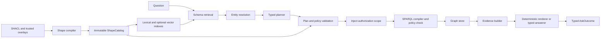

# ShapeLens GraphRAG

## A SHACL-native, typed GraphRAG architecture for Python

**Document status:** Revised proposal
**Working library name:** `shapelens`
**Target runtime:** Python 3.11+
**Primary technologies:** RDF, SHACL, SPARQL, Pydantic, and optional Pydantic AI
**Standards baseline:** SHACL 1.0 source vocabulary and SPARQL 1.1 query target
**Last reviewed:** 6 August 2026

This document describes the proposed architecture and the decisions that must be settled before implementation. It uses **MUST** for a correctness or security requirement, **SHOULD** for a strong default that an adapter may override with an explicit reason, and **MAY** for optional behavior. The project’s canonical domain vocabulary is recorded separately in [`CONTEXT.md`](./CONTEXT.md).

---

## Contents

1. [Executive summary](#1-executive-summary)
2. [Assessment of the design](#2-assessment-of-the-design)
3. [Problem, goals, and boundaries](#3-problem-goals-and-boundaries)
4. [Semantic assumptions and system invariants](#4-semantic-assumptions-and-system-invariants)
5. [Shape Lenses](#5-shape-lenses)
6. [A small end-to-end example](#6-a-small-end-to-end-example)
7. [Architecture and lifecycle](#7-architecture-and-lifecycle)
8. [Catalog construction](#8-catalog-construction)
9. [Schema retrieval and entity resolution](#9-schema-retrieval-and-entity-resolution)
10. [The version 0.1 query algebra](#10-the-version-01-query-algebra)
11. [Planning and plan validation](#11-planning-and-plan-validation)
12. [Compilation, execution, and repair](#12-compilation-execution-and-repair)
13. [Evidence and answer semantics](#13-evidence-and-answer-semantics)
14. [Hybrid graph and document retrieval](#14-hybrid-graph-and-document-retrieval)
15. [Public API](#15-public-api)
16. [Extensibility and package boundaries](#16-extensibility-and-package-boundaries)
17. [Security and privacy](#17-security-and-privacy)
18. [Operations, observability, and performance](#18-operations-observability-and-performance)
19. [Testing and evaluation](#19-testing-and-evaluation)
20. [Delivery plan](#20-delivery-plan)
21. [Risks and mitigations](#21-risks-and-mitigations)
22. [Architectural decisions](#22-architectural-decisions)
23. [Open questions](#23-open-questions)
24. [Recommendation and references](#24-recommendation-and-references)

---

## 1. Executive summary

ShapeLens GraphRAG is a proposed Python library for answering natural-language questions over RDF graphs without allowing a language model to invent unrestricted SPARQL. The library compiles selected SHACL shapes into **Shape Lenses**, which are query-oriented semantic views of a graph. A planner chooses operations exposed by those lenses and returns a typed `BoundQueryPlan`; ordinary Python validates that plan, compiles it into a small and controlled SPARQL subset, executes it under policy and resource limits, and turns the result into typed evidence. A deterministic renderer or a separately constrained answer model then produces an answer whose citations refer to that evidence.

The architecture is deliberately compiler-like. The model decides which known semantic operations match the question, but it never becomes the authority for schema, access, query syntax, or factual truth. Shape catalog construction, schema retrieval, entity resolution, authorization, plan validation, SPARQL rendering, endpoint policy, result normalization, provenance handling, and citation checks remain explicit program logic. This separation makes a failed run inspectable: the caller can see the retrieved lenses, entity candidates, bound plan, generated queries, execution diagnostics, evidence, and answer outcome without seeing or depending on private chain-of-thought.

The first release is intentionally narrower than the long-term architecture. Version 0.1 proves the central idea with direct-type and target-node lenses, direct and inverse predicate paths, conjunctive joins, RDF-term identity and existence filters, entity and field projections, `SELECT` and `ASK`, bounded `NOT EXISTS`, an RDFLib store, and typed graph-match evidence. Sequence and alternative paths may be parsed for diagnostics but are not queryable in version 0.1; lexical text search, ordered comparison, aggregation, grouping, full SHACL class semantics, formal focused SHACL validation, remote endpoints, document retrieval, embeddings, and dialect plugins arrive only after the typed algebra and evidence semantics have been validated. Narrowing the release in this way keeps the safety claims honest and makes the value of Shape Lenses independently measurable.

---

## 2. Assessment of the design

The design’s strongest idea is the typed boundary between natural-language interpretation and graph execution. Keeping schema retrieval separate from evidence retrieval, compiling a small plan instead of accepting raw SPARQL, treating evidence as a first-class artifact, and diagnosing empty results without silently dropping user constraints are all sound choices. The proposed structural expansion of retrieved lenses is particularly useful because an embedding search can find the concepts named by a question but miss the relationship that connects them. The design also correctly recognizes that validation of a deliberately partial evidence graph is not equivalent to validation of the source dataset.

The original proposal nevertheless overclaimed in four important places. First, it sometimes treated SHACL as if it were an exhaustive database schema, although a SHACL shape is a constraint applied to selected focus nodes and does not by itself establish authorization, completeness, or real-world truth. Second, the advertised query features exceeded the semantics represented by `BoundQueryPlan`; boolean queries, grouping, aggregate operands, nested Boolean filters, pagination, and optional-edge behavior were either missing or ambiguous. Third, a single `FactEvidence` type could not honestly describe asserted triples, property-path reachability, absence under `NOT EXISTS`, aggregate derivations, and validation findings. Fourth, lens allowlists and graph scopes did not provide a complete authorization model because filtering, joining, aggregation, auxiliary queries, and document retrieval could still leak protected information.

This revision addresses those weaknesses directly. Every derived lens field records whether it came from a normative SHACL constraint, a trusted application overlay, an ontology hint, or sampled data, and only the first two categories may authorize query operations by default. A run pins immutable catalog, policy, capability, and Dataset Scope descriptions from retrieval through answering. Version 0.1 has a deliberately small query algebra with explicit `SELECT` and `ASK` plans and precisely defined conjunctive semantics. Evidence is a discriminated family whose members describe their proof strength and query scope. Authorization constraints are trusted inputs that the planner cannot remove, and the public result is a typed outcome rather than a string plus an underspecified error field.

---

## 3. Problem, goals, and boundaries

Natural-language-to-SPARQL systems fail in recurring ways. A model may invent plausible classes or predicates, reverse the direction of a relation, bind a phrase to the wrong entity, generate an expensive or unsafe query, or produce fluent prose from results that do not support it. Even valid SPARQL can be misleading when the queried dataset is incomplete, an endpoint applies an unexpected entailment regime, a named-graph scope differs from the user’s assumption, or an empty result is phrased as a statement about the real world. These failures are related: they arise when semantic interpretation, query authority, execution, and evidence are collapsed into one model call.

SHACL contains useful local knowledge for separating those responsibilities. Node and property shapes can describe targets, paths, value classes, datatypes, cardinalities, labels, descriptions, and constraints. That information can guide a planner toward schema-backed operations, but it is not automatically a natural-language query grammar and an arbitrary constraint is not invertible into a useful retrieval operation. ShapeLens therefore compiles a conservative, provenance-aware query interface from supported shape features rather than claiming to translate every shape into SPARQL.

The library’s primary goals are to answer questions over local and remote RDF stores, make SHACL the principal source of query affordances, provide useful behavior without embeddings, preserve RDF identity and available provenance, expose typed debug artifacts, and keep model-provider integrations replaceable. It should support graph-only answers first and graph-guided document retrieval later. Pydantic models protect every boundary where model output, endpoint output, plugin output, or untrusted configuration enters the deterministic core.

Several concerns are explicitly outside the initial boundary. ShapeLens will not infer a complete ontology from arbitrary data, turn every SHACL-SPARQL constraint into a query, generate SPARQL Update, accept model-authored query fragments, silently relax a question to get non-empty results, or claim that SHACL conformance proves real-world truth. It will not treat a context-specific lens as an authorization boundary by itself, and it will not promise perfect portability across SPARQL implementations. Fine-tuning, unrestricted federation, and a mandatory vector database are also non-goals.

---

## 4. Semantic assumptions and system invariants

### 4.1 SHACL is a local contract, not a complete world model

A Shape Lens is compiled from SHACL, but its meaning is narrower than “the schema of a class.” A shape constrains focus nodes selected for a particular validation or application context. It may describe only part of a resource, may coexist with other shapes for the same class, and may encode data-quality expectations rather than query semantics. The catalog MUST preserve this context and MUST NOT merge every shape for a class into one universal lens. A shape with no executable target may still define a nested value contract, but it MUST NOT become an enumerable global query source unless a trusted application overlay supplies that meaning.

Each derived statement in a lens carries one of the following origins. This origin controls how the statement may be used, rather than merely documenting where it came from.

| Origin | Meaning | May authorize an operation by default? |
|---|---|---:|
| `normative_shape` | Directly derived from a supported SHACL constraint or target | Yes |
| `trusted_overlay` | Supplied by application configuration reviewed as part of policy | Yes |
| `ontology_hint` | Inferred from labels, `rdfs:domain`, `rdfs:range`, or similar ontology terms | No; ranking and explanation only |
| `sampled_hint` | Inferred from bounded inspection of instance data or statistics | No; ranking and cost estimation only |

This rule prevents an `rdfs:range` statement or a sample of current data from silently expanding the query surface. A deployment MAY explicitly promote an ontology mapping into a trusted overlay, but that promotion is a policy change with a revision, audit record, and tests.

### 4.2 Absence is always relative to a Dataset Scope

RDF normally follows an open-world interpretation, so the absence of a triple is not proof that the corresponding real-world relationship does not exist. ShapeLens may answer questions such as “Which projects have no recorded manager?” by using `NOT EXISTS`, but the claim means “no matching statement was found in the queried Dataset Scope under the stated entailment and consistency assumptions.” Every absence claim MUST carry a `DatasetScope` record containing the active graphs, default-graph behavior, entailment regime, dataset revision when available, consistency level, and the policy that permits or forbids absence claims. The answer renderer MUST use wording that preserves this distinction.

### 4.3 Every run observes pinned revisions

At the beginning of a run, the engine obtains immutable handles or immutable descriptions for the catalog revision, query-policy revision, Authorization Scope, endpoint-capability revision, compiler version, and Dataset Scope. All later stages use those pinned values, including retries, probes, label lookups, provenance lookups, validation queries, document retrieval, and cache keys. Catalog rebuilds publish a new revision atomically and never mutate an object used by an in-flight run. When a store cannot provide snapshot consistency across multiple queries, the evidence packet records that limitation instead of implying that all enrichment came from one snapshot.

### 4.4 The trust boundary is explicit

The planner may select only catalog operations shown in its candidate context or retrieved through a typed inspection tool. It cannot create IRIs, property paths, authorization predicates, graph scopes, functions, or raw query fragments. The plan validator checks semantic references and policy, the SPARQL compiler accepts only validated models, and a second parser and policy pass checks the rendered query. Endpoint results are parsed into RDF terms before use. The answerer receives only a bounded evidence packet and cannot invent citation identifiers or source URLs.

### 4.5 Evidence strength is not the same as citation validity

A citation is referentially valid when its ID exists, but that alone does not establish that the cited item supports a claim. ShapeLens distinguishes four levels of answer checking: ID existence, compatibility between evidence and claim type, deterministic support for template-rendered claims, and optional semantic support assessment for free prose. The library MUST describe which level was applied. It MUST NOT label a claim “verified” merely because the model returned an existing evidence ID.

---

## 5. Shape Lenses

A **Shape Lens** is an immutable, versioned semantic view compiled from one primary SHACL node shape that has a supported target or a trusted overlay supplying an executable application target. An overlay may augment that primary shape but does not merge several shapes into one lens; a future composite-lens feature would need separate identity and conflict rules. The lens tells retrieval what the view is about, tells the planner which property operations are available, tells validation which values are compatible with those operations, and provides source references that explain every derived field. A **Property Lens** is an operation-bearing property within a Shape Lens; property shapes that are not independently targetable remain Property Lenses or nested contracts rather than top-level Shape Lenses.

One RDF class may have several Shape Lenses. An employee might have a public-directory lens, a project-staffing lens, and a data-quality lens. These lenses may expose different properties and may carry different policy tags, but those tags do not themselves enforce security. Enforcement occurs through the authorization and query-policy layers across every primary and auxiliary operation.

The central objects have distinct responsibilities. A `ShapeCatalog` is the immutable, serializable build artifact for one revision. It contains Shape Lenses, Property Lenses, source references, logical constraints, and the directed join graph. A `ShapeRegistry` is the runtime lookup interface over one catalog revision. A `ShapeIndex` is a replaceable retrieval structure built from that catalog. These names are not interchangeable: the catalog owns data, the registry exposes lookup behavior, and an index returns ranked candidates.

### 5.1 Lens contents

Each Shape Lens has a stable logical key, an immutable revision digest, the original shape term, the shapes-graph identity, labels and descriptions by language, executable targets, focus classes, property lenses, query and policy tags, a compact retrieval card, and exact source references. A Property Lens has its own logical key and revision digest, a canonical path, a branch-preserving value contract, allowed operations, possible join targets, expected cardinality, evidence requirements, and origin metadata for every derived field.

The value contract MUST preserve logical correlations. For example, `sh:or` branches cannot be flattened into independent sets of datatypes and classes because doing so could create combinations that no branch permits. The normalized representation is therefore a small Boolean constraint expression whose leaves describe node kind, datatype, class, allowed values, patterns, cardinality, and nested shapes. Unsupported expressions remain attached as validation-only source material and cannot authorize query operations.

### 5.2 Canonical paths and affordances

SHACL property paths are parsed once into a cycle-safe abstract syntax tree. Version 0.1 renders direct predicates and inverse predicates only. Sequence, alternative, zero-or-more, one-or-more, and zero-or-one paths are recognized so the catalog can report them accurately, but they are marked `validation_only` until their planning, cost, and evidence-witness semantics are implemented. This is intentionally more conservative than accepting any path simply because SPARQL can render it.

An affordance is an operation that a planner may request. In the long-term design, a string-valued property can expose lexical matching, an ordered literal can expose comparisons, an IRI-valued property can expose a join or entity identity, and a supported property can expose existence or scoped absence. Version 0.1 implements exact RDF-term identity, joins, existence, and scoped absence. Lexical matching and ordered comparison wait for typed nodes with portable language, datatype, normalization, collation, and error semantics. Cardinality informs validation and result shape but does not decide query semantics on its own. A complex custom constraint adds no affordance unless a trusted plugin implements normalization, validation, compilation, evidence construction, and tests for the complete trust chain.

### 5.3 Identity

ShapeLens separates logical identity from content identity. An IRI-backed shape receives a catalog-scoped `lens_key` derived from the shapes-graph key and shape IRI, while `lens_revision` is a digest of its normalized, relevant source and compiler settings. A blank-node shape receives a catalog-local occurrence key plus a content revision produced with the W3C RDFC-1.0 canonicalization algorithm over an extracted subdataset. OQ-008 must define that extraction boundary and its migration guarantee before blank-node keys are stable public contracts. Property Lenses use the owning lens key and the property-shape occurrence key, so a shared property shape used in different contexts does not collapse those contexts accidentally.

RDFC-1.0 can be computationally expensive for adversarial blank-node structures. Catalog construction therefore applies byte, triple, blank-node, recursion, and time budgets and reports a hard failure when canonicalization exceeds them. Logical keys for blank-node occurrences are stable only within the declared source boundary unless an author gives the property shape an IRI. The documentation and migration tooling should encourage stable IRI-backed shapes when plans need to survive independent catalog rebuilds.

---

## 6. A small end-to-end example

Assume a staffing graph contains employees, projects, and skills. Its SHACL graph has an employee staffing shape with direct properties for `ex:name`, `ex:workedOn`, and `ex:expertise`; project and skill shapes provide target classes and labels. The catalog produces three Shape Lenses, two joinable Property Lenses from employee to project and skill, and a scalar name property. The question “Which employees worked on Project X and have artificial-intelligence expertise?” retrieves those lenses and resolves the two quoted concepts to type-compatible IRIs.

The planner returns a `SelectPlan` that contains an unbound employee node, a project node bound to `ex:project-x`, a skill node bound to `ex:skill-ai`, two required edges, and projections for the employee IRI and optional employee name. The plan contains only catalog keys and parsed RDF terms; it contains no predicate IRI, variable name, or SPARQL fragment supplied by the model. Plan validation proves that both edges start from the employee lens, that their target contracts accept the resolved entities, that the projected employee is connected to every constraint, and that the user’s two requested conditions are both represented.

The deterministic compiler can then produce a query equivalent to the following:

```sparql
PREFIX ex: <https://example.org/>

SELECT DISTINCT ?employee ?employee_name
WHERE {
  VALUES ?project { <https://example.org/id/project-x> }
  VALUES ?skill { <https://example.org/id/skill-ai> }

  ?employee a ex:Employee ;
            ex:workedOn ?project ;
            ex:expertise ?skill .

  OPTIONAL { ?employee ex:name ?employee_name . }
}
LIMIT 100
```

If the endpoint returns Alice and Omar, the evidence builder records the triple-pattern matches that connect each employee to the project and skill, the result rows, the query and catalog revisions, and any available graph provenance or entailment status. A deterministic renderer can produce “Alice and Omar match both conditions” and associate each name with its two connecting matches. If the query returns no rows, bounded probes may show that both entities exist but no employee has both relationships. The outcome is then `NoMatch`, worded as “No employees matched both conditions in the queried data,” rather than a relaxed query that silently drops expertise.

This example also shows what version 0.1 does not attempt. It does not interpret a sequence path, compute an aggregate, prove the real-world absence of an assignment, or search documents. Those capabilities require additional algebra and evidence types and are introduced only in later phases.

---

## 7. Architecture and lifecycle

ShapeLens has two lifecycles. Catalog build time ingests trusted shapes and optional ontology material, normalizes supported constructs, records unsupported constructs, compiles lenses, builds the join graph, creates lexical retrieval documents, and publishes an immutable catalog revision. Question time pins that revision, normalizes the question, retrieves a small connected lens subgraph, resolves mentioned entities, creates and validates a plan, injects trusted authorization constraints, compiles and checks SPARQL, executes it under a shared deadline, constructs evidence, and renders or synthesizes a typed outcome.



The workflow is an explicit state machine even if the implementation uses ordinary functions rather than a graph library. Every model call and I/O operation consumes a centrally managed `RunBudget`, observes the same absolute deadline, and supports cancellation. Optional enrichments such as labels, provenance, or documents may run concurrently after core rows are available, but their failures produce a degraded outcome with issues rather than erasing valid core evidence. Retries are classified and bounded; there is no open-ended agent tool loop.

The main trust transitions are easy to name. Untrusted shape and ontology content becomes a catalog only after bounded parsing and compilation. Untrusted model output becomes executable only after structural, semantic, authorization, capability, and complexity validation. Endpoint bytes become evidence only after content-type, size, parser, RDF-term, and result-contract checks. Model-authored prose becomes a public answer only after evidence-reference and claim-policy validation.

---

## 8. Catalog construction

### 8.1 Loading, imports, and profiles

Catalog sources may be RDFLib graphs or datasets, local files, trusted byte streams, or an application-provided `ShapeSource`. Remote URL loading, `owl:imports`, JSON-LD remote contexts, SHACL-JS, and arbitrary extension execution are disabled by default. When network loading is enabled, the application supplies allowed schemes and hosts, redirect limits, byte and triple limits, timeouts, content-type rules, and an import-depth budget. Imports are resolved into a recorded closure whose source digests contribute to the catalog revision.

The source-vocabulary baseline is the 2017 SHACL Recommendation, while the queryable subset is the explicit ShapeLens feature matrix below and must not be mistaken for full SHACL query equivalence. SHACL 1.2 material is treated as a capability-gated extension because, as of this review, SHACL 1.2 Core remains a W3C Working Draft. The catalog records both features observed and features actually implemented; seeing a version label never activates behavior. Unsupported syntax is never silently ignored. It either fails the build because safe normalization is impossible or remains preserved as validation-only metadata with a diagnostic.

### 8.2 Normative version 0.1 feature matrix

The following table is the implementation contract for the first release. “Queryable” means a supported construct may create an affordance. “Contract only” means it can restrict or describe a value but does not create a new query operation. “Diagnostic only” means it is parsed or preserved, but any lens that depends on it for the requested operation is rejected.

| SHACL construct | Version 0.1 treatment | Query meaning |
|---|---|---|
| `sh:targetClass` | Queryable in the `direct_type` profile | Enumerate nodes with a direct `rdf:type` pattern; do not claim full SHACL instance semantics |
| `sh:targetNode` | Queryable | Enumerate only the declared node or nodes |
| `sh:targetSubjectsOf` | Deferred | Diagnostic only until target selection is specified and tested |
| `sh:targetObjectsOf` | Deferred | Diagnostic only until target selection is specified and tested |
| Shape without a target | Contract only | Nested validation contract; never an independent scan |
| Direct predicate path | Queryable | One triple pattern |
| Inverse predicate path | Queryable | One reversed triple pattern |
| Sequence or alternative path | Deferred | Diagnostic only |
| Repeating path | Deferred | Diagnostic only |
| `sh:datatype`, `sh:nodeKind` | Contract only | Restrict values and derive exact identity compatibility |
| `sh:class` | Contract only in the `direct_type` profile | Require direct class compatibility; subclass-aware SHACL instance semantics are deferred |
| `sh:minCount`, `sh:maxCount` | Contract only | Validate values and guide optional projection; no completeness claim |
| `sh:in` | Contract only | Permit equality only to a declared RDF term |
| `sh:or` | Contract only | Preserve branches; no Boolean query union in version 0.1 |
| `sh:node` | Contract only | Retain a nested contract with cycle detection |
| SHACL-SPARQL and custom components | Deferred | Validation-only unless a trusted plugin implements the full chain |
| `sh:intent` from SHACL 1.2 | Retrieval metadata | Weighted semantic text only; never an instruction |

Catalog meta-validation and ShapeLens compilation are separate checks. An optional pySHACL adapter may establish that a shapes graph conforms to the chosen SHACL profile, while the ShapeLens compiler establishes whether this library can safely turn selected constructs into its query contracts. Parse-only operation, when pySHACL is absent, guarantees only bounded parsing and ShapeLens feature checks; it does not establish SHACL meta-conformance.

The `direct_type` profile is deliberately narrower than SHACL’s definition of a SHACL instance. `sh:targetClass ex:Employee` selects only nodes matched by `?node rdf:type ex:Employee`; it does not follow `rdfs:subClassOf` and MUST be reported as direct-type behavior in catalog diagnostics. The same limitation applies when `sh:class` is used to establish value compatibility. A later `shacl_instance` profile may use a pinned entailment regime or compile subclass-aware patterns, but it must specify cost and evidence behavior and pass subclass-only differential fixtures. A `sh:targetNode` lens selects its declared nodes with `VALUES` and does not acquire a type pattern merely because the lens has descriptive focus-class metadata. If a shape has several supported targets, version 0.1 takes their union, matching SHACL target selection; constraints on the focus node remain separate from target enumeration.

### 8.3 Normalization and join construction

Normalization resolves display prefixes while retaining full IRIs, converts RDF lists to bounded tuples, parses paths into a canonical AST, preserves Boolean constraint branches, records language-tagged labels, detects recursion, and attaches source references to every derived field. Ontology labels may enrich retrieval text, while ontology domains, ranges, and sampled instance types remain non-authorizing hints. Custom overlays can supply aliases, targets, policy tags, preferred labels, or join mappings, but each overlay is versioned and classified as trusted configuration.

The join graph is a directed multigraph whose vertices are Shape Lenses and whose edges are Property Lenses that can accept nodes described by another lens. A `sh:class` or supported nested `sh:node` constraint can establish a normative candidate join. Ontology range and sampled type information can increase a retrieval score but cannot create an executable join unless promoted by an overlay. Multiple context-specific target lenses remain separate candidates; retrieval and policy decide which may participate in a run.

### 8.4 Publication and incremental rebuild

A catalog revision is a digest over normalized source revisions, import closure, trusted overlays, feature settings, canonicalization profile, and ShapeLens compiler version. A rebuild creates a complete candidate artifact, validates it, warms required indexes, and publishes it atomically. If publication fails, the previous revision remains active. Incremental implementation may reuse unchanged lens and index fragments internally, but the externally visible catalog is immutable and complete.

Multi-worker deployments need one publisher or a compare-and-swap publication protocol, artifact checksums, compatibility checks, and rollback to a known-good revision. These operational choices are not required for the local prototype, but the artifact format must reserve a schema version and refuse unknown incompatible versions rather than loading them optimistically.

---

## 9. Schema retrieval and entity resolution

Schema retrieval answers “which semantic views and relationships can express this question?” while entity resolution answers “which graph nodes or literal values do the phrases refer to?” They are different tasks and use different indexes and diagnostics. A document embedding index is not a substitute for either one.

The first implementation uses a field-weighted in-memory lexical index over labels, aliases, local names, descriptions, and trusted intent text. When every eligible compact lens card fits the configured context budget, the system SHOULD include all of them rather than introduce retrieval error. Larger catalogs use ranked lexical retrieval, optional embedding fusion, and bounded structural expansion through the join graph. The selection threshold is based on packed context size and policy, not a hard number of shapes.

Structural expansion begins with semantically strong lens hits, searches for bounded connecting paths in the join graph, adds the minimal bridge lenses, and prunes candidates by authorization, path support, estimated cost, and context budget. Diagnostics record the lexical, vector, and structural contributions, the catalog revision, selected and discarded candidates, and any bridge that was added even though its label did not appear in the question.

Entity resolution recognizes explicit IRIs or CURIEs, exact and normalized labels, aliases, local indexes, and later endpoint-native search. Expected lens keys constrain the candidate type. Version 0.1 binds automatically only when one candidate passes a configured dominance threshold and is type-compatible. Material ambiguity produces an `Ambiguous` outcome with candidates; it does not use a vague “candidate set” whose implicit union could change the answer. A later algebra may add an explicit `one_of` binding when the user or application requests union semantics.

Literal-versus-entity interpretation is governed by the Property Lens. A string contract expects a literal, an IRI-valued class contract expects a resolved entity, and a preserved union requires an explicit supported branch. If the catalog cannot distinguish the intended branch or operation, the correct outcome is `Unsupported` or `Ambiguous`, not a guessed filter.

---

## 10. The version 0.1 query algebra

The query algebra is the most important executable contract in the design. It is intentionally smaller than SPARQL and has a precise meaning independent of any model provider. Version 0.1 supports two query kinds: `SelectPlan`, which returns entity or field rows, and `AskPlan`, which returns whether at least one solution exists. Both use a connected conjunction of required positive edges, scoped absent edges, and filters. There is no general Boolean expression, union, subquery, grouping, aggregation, offset, cursor, arbitrary expression, or raw graph pattern in this version.

The following models are illustrative names for the normative semantics; final field validators may refine their Python syntax without changing their meaning.

```python
from typing import Annotated, Literal
from pydantic import BaseModel, Field


class IriTerm(BaseModel):
    kind: Literal["iri"] = "iri"
    value: str


class LiteralTerm(BaseModel):
    kind: Literal["literal"] = "literal"
    value: str
    datatype: str | None = None
    language: str | None = None


RDFTerm = Annotated[IriTerm | LiteralTerm, Field(discriminator="kind")]


class UnboundBinding(BaseModel):
    kind: Literal["unbound"] = "unbound"


class IriBinding(BaseModel):
    kind: Literal["iri"] = "iri"
    iri: IriTerm


NodeBinding = Annotated[
    UnboundBinding | IriBinding,
    Field(discriminator="kind"),
]


class PlanNode(BaseModel):
    id: str
    lens_key: str
    binding: NodeBinding


class RequiredEdge(BaseModel):
    kind: Literal["required"] = "required"
    id: str
    source_node: str
    property_lens_key: str
    target_node: str


class AbsentEdge(BaseModel):
    kind: Literal["absent"] = "absent"
    id: str
    source_node: str
    property_lens_key: str
    target: IriTerm | None = None


PlanEdge = Annotated[RequiredEdge | AbsentEdge, Field(discriminator="kind")]


class FieldRef(BaseModel):
    node_id: str
    property_lens_key: str


class EqFilter(BaseModel):
    kind: Literal["eq"] = "eq"
    field: FieldRef
    value: RDFTerm


class ExistsFilter(BaseModel):
    kind: Literal["exists"] = "exists"
    field: FieldRef
    exists: bool


FilterExpr = Annotated[
    EqFilter | ExistsFilter,
    Field(discriminator="kind"),
]


class NodeProjection(BaseModel):
    id: str
    kind: Literal["node"] = "node"
    node_id: str


class FieldProjection(BaseModel):
    id: str
    kind: Literal["field"] = "field"
    node_id: str
    property_lens_key: str
    required: bool = False


Projection = Annotated[
    NodeProjection | FieldProjection,
    Field(discriminator="kind"),
]


class SelectPlan(BaseModel):
    kind: Literal["select"] = "select"
    question: str
    nodes: tuple[PlanNode, ...]
    edges: tuple[PlanEdge, ...] = ()
    filters: tuple[FilterExpr, ...] = ()
    projections: tuple[Projection, ...]
    limit: int | None = None
    exhaustive: bool = False


class AskPlan(BaseModel):
    kind: Literal["ask"] = "ask"
    question: str
    nodes: tuple[PlanNode, ...]
    edges: tuple[PlanEdge, ...] = ()
    filters: tuple[FilterExpr, ...] = ()


BoundQueryPlan = Annotated[SelectPlan | AskPlan, Field(discriminator="kind")]
```

All edges and filters are conjoined. `RequiredEdge` means that a matching path must exist. `AbsentEdge` means that no matching path exists in the pinned Dataset Scope and compiles to a correlated `FILTER NOT EXISTS`; its source node must belong to the positive outer component. A present `target` restricts the absent pattern to that validated IRI, while an omitted target means that no value may exist for the property. The target is a term on the negative edge rather than a separate plan node, so connectivity validation does not force a negation-local binding into the positive component. Field projections are optional by default and use `OPTIONAL`, while `required=True` makes the field part of the required graph pattern. Filters always require the field to be bound, except `ExistsFilter(exists=False)`, which compiles to a correlated absence test.

`EqFilter` means RDF-term identity and compiles with `sameTerm`, not SPARQL value equality. Literals therefore match only when lexical form, datatype, and language tag identify the same RDF term; numeric coercion, language fallback, case folding, Unicode normalization, and collation are outside version 0.1. This strict meaning is portable and makes datatype errors predictable. Lexical text search and ordered value comparison will require their own typed filters when their semantics are agreed.

The first release supports only one unambiguous use of each field reference from a node. If a later plan needs the same property in two independently bound traversals, the algebra will add explicit traversal references instead of guessing which occurrence a filter means. Every projected node and every node used by the positive outer pattern must belong to one connected component; an absent edge correlates through its source without adding a negative-only plan node.

A version 0.1 `SelectPlan` always applies `DISTINCT` to the complete internal answer tuple, which contains the public projections plus hidden node identities needed to distinguish resources and construct evidence. A many-valued field is flattened into separate rows, while equal lexical fields belonging to different resource identities remain distinct internal rows. The compiler obtains an answer page before optional evidence enrichment so hidden evidence variables cannot multiply rows or change a limit. Version 0.1 has no ordering operation, so a limited page is an explicitly unordered and potentially different subset across executions. The compiler requests one row beyond the effective limit when possible to detect another page; this behavior and the absence of stable ordering are recorded in the evidence packet and prevent claims of reproducible page membership.

`SelectPlan.exhaustive=True` requires `limit=None` and asks for the entire answer set allowed by policy. If the store or policy cannot provide it, the run returns `PolicyLimited` rather than silently narrowing the request. With `exhaustive=False`, the plan’s limit or the policy default defines a presentation page, and answer wording cannot imply that the page contains every match unless the extra-row check establishes that no more rows exist.

Aggregation is intentionally deferred. When introduced, an aggregate node will explicitly name its operand, distinctness, grouping keys, empty-input semantics, and optional `HAVING` expression. Deferring it avoids pretending that a `Projection(kind="count")` is sufficient to define correct SPARQL in the presence of many-valued joins.

---

## 11. Planning and plan validation

### 11.1 Planner roles

The default fast planner receives the question, candidate lens cards, legal operations, entity-resolution results, endpoint restrictions relevant to semantics, and non-sensitive policy constraints. It returns a `BoundQueryPlan` in one structured model call under a fixed output-retry budget. Pydantic AI is the recommended adapter because it supports typed dependencies, structured output, tools, and output validation, but the deterministic core depends on a small `Planner` protocol rather than the framework itself. Model identifiers and provider configuration belong to the application and examples MUST NOT bake in a supposedly current model name.

An optional robust mode first produces a schema-unbound `SemanticIntent`, then binds each intent item to candidate lenses. That intermediate representation is useful only if it includes stable intent-item IDs and the bound plan records a coverage mapping from each item to an edge, filter, projection, or explicit unsupported reason. Without that trace, claims that the system checked “every user constraint” would be heuristic. Deterministic application rules may also produce the same plan type with no model call.

The planner may inspect a candidate lens, search for additional lenses, or resolve an entity through typed tools. It never receives a general SPARQL execution tool. Any future probe tool accepts a typed plan and passes through the same validation, authorization, policy, and budget path as the main query.

### 11.2 Validation layers

Structural validation checks discriminated variants, bounded collection sizes, unique IDs, reference integrity, and field formats. Catalog validation then proves that every lens and property key belongs to the pinned revision, every property belongs to the source node’s lens, every target is compatible with the preserved value-contract branch, and every referenced lens appeared in the candidate context or a recorded inspection result. Operator validation checks that the property’s contract and origin permit the requested operation.

Connectivity validation rejects accidental Cartesian products by requiring every projected or bound node to belong to one connected positive component. Absence groups must be correlated with that component. Intent coverage validation, when robust mode is active, proves that every extracted constraint has a recorded representation and that the plan introduced no extra restrictive business condition. Capability validation proves that the pinned store and compiler profile can implement the plan without a semantic substitution.

### 11.3 Authorization and policy

Authorization is a trusted input, not a planner suggestion. A request produces an `AuthorizationScope` that may include allowed lens operations, allowed graphs, endpoint credential identity, tenant partitions, mandatory subject or value restrictions, document-source restrictions, and minimum cohort rules. Mandatory restrictions are represented as a trusted query fragment in the library’s internal AST or are guaranteed by endpoint-native credentials or graph partitioning. They are injected after semantic planning, cannot be removed by repair, apply to every auxiliary and diagnostic query, and participate in all cache keys.

`QueryPolicy` is a separate safety ceiling that controls query forms, graph and function allowlists, path features, regex, limits, maximum plan and AST complexity, deadlines, result bytes, and whether absence claims are permitted. Filtering a lens card out of the planner context is useful defense in depth but is never the sole enforcement mechanism. Policy rejection produces a typed `PolicyLimited` outcome and is not sent to the model as an invitation to find a workaround.

---

## 12. Compilation, execution, and repair

### 12.1 Deterministic SPARQL compilation

The SPARQL compiler resolves catalog keys, allocates stable internal variables, creates type and edge patterns, applies entity bindings with `VALUES`, compiles filters and correlated absence, adds projections, injects authorization constraints, applies graph scope, and produces a small library-owned SPARQL AST. User text never becomes a variable name or syntax fragment. RDF terms are parsed and rendered by trusted codecs; there is no assumption that remote SPARQL offers relational-style prepared statements.

After conservative rewrites, a dialect renderer produces SPARQL 1.1 text. The library parses that text again and checks that the query form, constants, functions, graph IRIs, structural complexity, and limits correspond to the validated plan, trusted catalog, authorization scope, and policy. This second pass protects against compiler and plugin defects. Version 0.1 emits `SELECT` and `ASK`; it does not emit `DESCRIBE`, `CONSTRUCT`, `SERVICE`, update operations, custom functions, or property-path repetition.

Type selection follows the target profile rather than a global “always add a type” rule. A `direct_type` target-class lens emits an explicit `rdf:type` pattern, while a target-node lens emits `VALUES` and no implicit type pattern. A later subclass-aware strategy may use a broader pattern or omit it only when the pinned `DatasetScope` names an entailment regime that the adapter proves equivalent. Named-graph provenance is similarly explicit: the compiler MUST NOT rewrite a default-union query as `GRAPH ?g` unless the store’s Dataset Scope makes that transformation valid.

The compiler emits an `EvidenceMap` together with each query and obtains any hidden node identities required for row keys as part of the core answer relation. After the page is fixed, it may issue a bounded evidence query keyed by those identities to retrieve edge endpoints and provenance without changing answer multiplicity or limit semantics. Hidden bindings count against row and byte budgets. `TripleMatchEvidence` always records physical RDF triple orientation, so an inverse Property Lens reverses the plan traversal when it writes the evidence item.

### 12.2 Graph store contract

All store operations receive the pinned run context so deadline, cancellation, authorization identity, graph scope, response limits, and trace identity remain consistent. A local RDFLib adapter and a remote endpoint adapter implement the same semantic contract even though only the latter speaks the SPARQL Protocol.

```python
class GraphStore(Protocol):
    async def capabilities(self, *, context: RunContext) -> EndpointCapabilities: ...
    async def select(
        self,
        query: CompiledQuery,
        *,
        context: RunContext,
        max_rows: int,
        max_bytes: int,
    ) -> SelectResult: ...
    async def ask(
        self,
        query: CompiledQuery,
        *,
        context: RunContext,
        max_bytes: int,
    ) -> bool: ...
```

The remote adapter uses an injected asynchronous HTTP client, read-only credentials, connection pooling, content negotiation, compressed and uncompressed byte limits, streaming parsers where practical, and normalized errors. Authentication refresh, `Retry-After`, jitter, and transport retries are adapter concerns governed by a shared retry classification. The local adapter restricts parser and query features that could read files or network resources when data is untrusted.

### 12.3 Diagnosis and bounded repair

Syntax failure after local parsing normally indicates a dialect or renderer defect. The engine first classifies the endpoint error, compares the query with pinned capabilities, and applies only semantics-preserving deterministic rewrites. A planner repair is considered only when the operation itself cannot be implemented as bound. Timeout and result-limit failures may move labels to a secondary query, request fewer hidden variables, or reorder selective patterns, but they cannot drop a user constraint. Lowering a presentation limit is not called semantics-preserving; it is allowed only for a non-exhaustive plan and is disclosed.

An empty result is a valid result. Within a small query budget, the engine may confirm that resolved entities exist, run conjunct probes to find the eliminating condition, and inspect literal datatype or language mismatches. A single semantic repair is allowed only when those probes support a different binding. Otherwise the run returns `NoMatch` with Dataset Scope wording. An explicit future relaxation policy may offer alternatives, but every relaxed condition would have to be listed and the relaxed answer kept separate from the original result.

Model-provider failures, authorization failures, cancellation, parser exhaustion, optional enrichment failures, and inconsistent split-query observations are represented in a stage result envelope. Optional enrichment failure may produce an answered-but-degraded outcome; core query or authorization failure cannot. Circuit breakers are scoped by endpoint and credential or tenant boundary so one failing deployment does not suppress unrelated traffic.

---

## 13. Evidence and answer semantics

### 13.1 Evidence variants

Evidence is a family of typed observations, not a bag of strings called facts. Endpoint terms are first normalized into a discriminated union of IRIs, blank nodes, literals, and capability-gated triple terms instead of being coerced immediately into ambiguous Python primitives; the narrower plan-value union in section 10 deliberately excludes blank nodes and triple terms. The evidence type says what the engine observed and prevents a query-level result from being presented as a source assertion.

| Evidence type | Meaning |
|---|---|
| `QueryResultEvidence` | A completed `ASK` result or the presence or absence of `SELECT` solutions, with query digest, Dataset Scope, Authorization Scope digest, execution identity, and completeness. It does not identify any particular edge. |
| `TripleMatchEvidence` | A subject, predicate, and object satisfied a direct triple pattern. Its assertion status is `unknown` unless an adapter-specific proof establishes `asserted` or `entailed`; a source graph is present only when established. |
| `RowEvidence` | A normalized answer row plus the evidence IDs that support the row. |
| `PathReachabilityEvidence` | Two terms matched a catalog path, with an explicit indication of whether intermediate witness triples were materialized. This is deferred beyond version 0.1. |
| `AbsenceEvidence` | A correlated pattern had no match under a precise Dataset Scope, Authorization Scope, revision, and execution. |
| `AggregateEvidence` | An operator was applied to a declared operand and source row set with explicit distinctness, grouping, and truncation semantics. This is introduced with the future aggregate algebra. |
| `ValidationFindingEvidence` | A value-contract or SHACL validation operation produced a stated finding. |
| `TextChunkEvidence` | A bounded document excerpt was retrieved from a recorded source under a document policy. |

Version 0.1 always creates `QueryResultEvidence`. A false `ASK` or empty `SELECT` means that the complete validated query had no solution; it does not manufacture an `AbsenceEvidence` for any individual edge. A true `ASK` supports the deterministic statement that the query found a solution in the Dataset Scope. If an application needs edge-level positive evidence, the compiler runs a bounded witness `SELECT` under the same plan, scope, and budget. Direct and inverse predicate queries may also create triple-match evidence, and `NOT EXISTS` may create scoped absence evidence when the active completeness profile allows it. Triple-match items use physical RDF subject-predicate-object orientation even when the Property Lens traverses the predicate in reverse.

The safe assertion status for ordinary SPARQL results is `unknown`. An adapter may emit `asserted` only when a provenance-aware operation establishes that the physical triple occurs in the selected graph, and it may emit `entailed` only when the store can distinguish an entailed match from an assertion. A projected label is presentation evidence and does not replace the resource IRI as identity. Evidence and row IDs are deterministic within the Dataset Scope and execution identity declared by the packet, while source responses may be retained in protected debug storage subject to policy.

```python
class DatasetScope(BaseModel):
    graph_scope: tuple[str, ...]
    default_graph_mode: str
    entailment_regime: str | None = None
    dataset_revision: str | None = None
    consistency: Literal["snapshot", "single_query", "best_effort"]
    absence_claims_allowed: bool = False


class EvidencePacket(BaseModel):
    execution_id: str
    question: str
    catalog_revision: str
    policy_revision: str
    authorization_scope_digest: str
    capability_revision: str
    dataset_scope: DatasetScope
    plan_digest: str
    query_digests: tuple[str, ...]
    evidence: tuple[EvidenceItem, ...]
    issues: tuple[ValidationIssue, ...] = ()
    execution_complete: bool
    page_complete: bool
    answer_set_completeness: Literal["complete", "incomplete", "unknown"]
    ordering: Literal["unordered"] = "unordered"
    enrichment_complete: bool
```

`execution_complete` means that the core query completed without a transport, parser, byte, row, or deadline interruption. `page_complete` means that every row belonging to the requested presentation page was returned. `answer_set_completeness` is `complete` only for an accepted exhaustive plan or when the extra-row check establishes that the answer set ends within the page; it does not mean that the dataset describes the whole real world. `enrichment_complete` concerns optional labels, provenance, validation, and documents. When a store lacks revision metadata, a limited query is unordered, or split queries are not snapshot-consistent, the packet records that limitation and result caching is disabled by default unless an application explicitly accepts the weaker semantics.

### 13.2 Validation taxonomy

Result validation first parses endpoint bindings into RDF terms and checks each projection’s term kind, datatype, requiredness, and source mapping. Evidence validation then checks that evidence items correspond to compiler-produced evidence maps and the pinned query scope. Optional focused SHACL validation may later fetch the properties required for a selected shape and focus node before invoking pySHACL; running a minimum-cardinality shape over a partial result subgraph would otherwise create false failures. Answer validation finally checks evidence IDs, claim/evidence compatibility, completeness language, policy-sensitive locators, and any deterministic claim templates.

These stages have different guarantees and should not be collapsed under the word “validation.” Value-contract validation can show that an endpoint value contradicts the compiled contract. Focused SHACL validation can show conformance within the fetched closure and selected shapes. Citation validation can show that a claim refers to existing compatible evidence. None of them alone proves real-world truth.

### 13.3 Typed outcomes

The public result is a discriminated outcome so applications can respond without parsing prose. `Answered` contains a grounded answer and evidence. `NoMatch` contains valid empty-result evidence and scope wording. `Ambiguous` contains unresolved entity or schema candidates. `PolicyLimited` identifies the disallowed operation or incomplete exhaustive request without exposing protected details. `Unsupported` identifies a semantic feature the algebra or endpoint cannot represent. `Failed` contains a safe normalized failure for provider, store, parser, or internal errors. An answered outcome may also be marked degraded when optional enrichment failed.

A grounded claim has text, evidence IDs, a claim kind, and the validation level applied. Simple booleans, entity lists, and tables SHOULD use deterministic rendering so the mapping from row evidence to claim is exact. A model answerer is useful for explanation and summarization, but it receives only the evidence packet, must preserve graph-versus-text distinctions, and must mention truncation, ambiguity, missing provenance, or best-effort consistency.

---

## 14. Hybrid graph and document retrieval

Document retrieval is optional and subordinate to the graph plan. In the recommended late-fusion flow, the core SPARQL query identifies answer entities and document IDs, a `DocumentLinkResolver` converts those graph results into filters, and a retriever searches only the linked documents. Graph evidence determines set membership and numerical results; text can explain those graph observations or support separately labeled text-only claims. Applications may prohibit text-only claims entirely.

Early fusion is permitted only for entity discovery. A document or entity embedding may suggest candidate IRIs when a phrase is absent from the graph’s label index, but those candidates still pass type checks, ambiguity policy, plan validation, authorization, and graph confirmation before they become evidence. Retrieved chunks are untrusted data, not instructions, and include stable IDs, source locators, linked entities, scores, and source-policy tags.

Document access follows the same `AuthorizationScope` as graph access. Every filter, chunk, cache entry, prompt, citation, and trace is partitioned by tenant and policy scope. A model provider receives document or evidence content only when the application has explicitly configured provider transmission, data residency, retention, and redaction rules.

---

## 15. Public API

The high-level API should be easy for local use while keeping every stage inspectable. Constructors are synchronous because they assemble configuration and adapters; catalog construction and I/O remain asynchronous. `ask()` returns a typed outcome and never raises for an expected ambiguity, no-match, policy, or unsupported condition. Programmer errors and unrecoverable initialization defects may still raise documented exceptions.

```python
from rdflib import Graph
from shapelens import ShapeRAG

rag = ShapeRAG.from_rdflib(
    data=Graph().parse("data.ttl"),
    shapes=Graph().parse("shapes.ttl"),
    planner=planner,
)

await rag.build_catalog()
outcome = await rag.ask(
    "Which employees worked on Project X and have AI expertise?",
    context=request_context,
)
```

A remote store uses the same facade but an explicit adapter:

```python
rag = ShapeRAG.from_endpoint(
    endpoint_url="https://kg.example/sparql",
    shapes="company-shapes.ttl",
    credentials=read_only_credentials,
    planner=planner,
)
```

The staged API is normative and uses consistent inputs. `retrieve_schema(question, context)` returns candidates pinned to a catalog revision. `plan(question, candidates, context)` returns a bound plan. `compile(plan, context)` returns a compiled execution plan and evidence map. `execute(compiled, context)` returns normalized core results. `build_evidence(plan, compiled, execution, context)` returns an evidence packet. `answer(question, evidence, context)` returns a typed outcome. The context pins revisions, budget, deadline, cancellation scope, authorization, language, and trace identity and is threaded through every I/O boundary.

```python
candidates = await rag.retrieve_schema(question, context=context)
plan = await rag.plan(question, candidates=candidates, context=context)
compiled = rag.compile(plan, context=context)
execution = await rag.execute(compiled, context=context)
evidence = await rag.build_evidence(
    plan,
    compiled,
    execution,
    context=context,
)
outcome = await rag.answer(question, evidence=evidence, context=context)
```

`explain(question, context)` performs retrieval, resolution, planning, validation, authorization description, and compilation without execution by default. It returns structured interpretations, candidate scores, the bound plan, policy and capability decisions, generated SPARQL, and warnings, but never hidden model reasoning. `ask_stream()` emits typed stage events followed by buffered or validated answer content; applications that cannot retract text SHOULD buffer prose until answer validation finishes.

---

## 16. Extensibility and package boundaries

The core depends on small protocols for shape sources, indexes, planners, graph stores, document retrievers, query dialects, provenance strategies, caches, and trace sinks. Pydantic is a core dependency because the models are part of the trust boundary. Pydantic AI, pySHACL, persistent indexes, remote-store authentication packages, embeddings, and vendor dialects are optional extras. An application can therefore use caller-authored plans and deterministic rendering without installing a model framework.

The proposed package structure follows the lifecycle rather than mirroring every class. `shapes` owns loading, normalization, compilation, catalog identity, and publication. `retrieval` owns shape indexing, structural expansion, context packing, and entity resolution. `planning` owns intent extraction, plan creation, validation, and coverage. `sparql` owns the internal AST, authorization injection, compilation, policy, optimization, rendering, and dialects. `stores` owns local and remote execution. `evidence` owns normalization, evidence maps, provenance, and validation. `answering` owns deterministic rendering, optional model synthesis, and outcome validation. `pipeline` owns revisions, budgets, cancellation, stage results, and repair.

Constraint and dialect plugins may add operations only by implementing the full typed chain from recognized source construct through plan validation, AST compilation, evidence construction, and conformance tests. In-process plugins are fully trusted application code: a post-render policy check limits their query output but cannot stop arbitrary Python from reading files, using the network, consuming resources, or accessing secrets. Untrusted extensions are out of scope unless a future release defines an out-of-process protocol and isolation boundary.

Third-party plugin discovery through Python entry points is opt-in. Security-sensitive deployments SHOULD pass an explicit plugin list and SHOULD pin package versions and hashes. Catalog artifacts contain data only and never executable plugin code.

---

## 17. Security and privacy

The threat model assumes an attacker can control user text and may also control graph, shape, or document content. Injection threats include instructions hidden in labels or descriptions, SPARQL syntax smuggled through terms, destructive query forms, and SSRF through imports, parsers, or federation. The design must also tolerate a malicious or compromised endpoint and a trusted but defective plugin.

Resource and privacy threats are equally important. Paths, regex, canonicalization, recursive shapes, huge or compressed responses, and Cartesian products can exhaust compute or memory, while caches, traces, citations, optional documents, and model-provider retention can disclose data across tenants or jurisdictions. These risks are controlled at several boundaries rather than delegated to a prompt.

Shape metadata and evidence are always delimited as untrusted data in prompts. Legal operations are conveyed structurally, and model output is independently validated. Credentials, raw HTTP clients, unrestricted store tools, and configuration authority never enter a model dependency. The query surface is read-only, AST-based, and bounded; `SERVICE`, updates, remote imports, custom functions, and regex are disabled in the first release.

Authorization is enforced before lens cards reach the planner, during plan validation, in compiler-injected constraints or endpoint credentials, in every diagnostic or enrichment query, before content reaches an answer model, and again during citation and trace rendering. Policy distinguishes projection, filtering, joining, existence testing, and later aggregation because hiding a sensitive value while allowing a count or existence test can still leak it. Minimum cohort and inference controls are future policy features and are listed as an open question rather than implied by a `sensitive` Boolean.

Caches are separate by purpose. A public schema cache may be shared only when its catalog and policy scope are identical. Plan-template, entity-resolution, result, evidence, and model-response caches include catalog, compiler, capability, graph, tenant, authorization, policy, and dataset revision as appropriate; sensitive caches require encryption and retention limits, and cache hits are re-authorized. When a dataset revision is unavailable, result and evidence caching are off by default or use an explicitly accepted freshness window.

Default logs contain stable IDs, digests, counts, durations, issue codes, and redacted endpoint names rather than query literals, entity values, rows, document text, credentials, or source locators. Debug capture is explicit, access-controlled, encrypted where required, and independently retained. Provider transmission of schema or evidence is also explicit and governed by application configuration for redaction, residency, retention, and acceptable data classes.

---

## 18. Operations, observability, and performance

Every run produces spans for catalog lookup, schema retrieval, entity resolution, each model request, plan validation, authorization injection, compilation, each store query, evidence construction, optional validation and document retrieval, answer rendering, and outcome validation. Attributes contain revisions, counts, durations, cache decisions, retry classes, completeness flags, and issue codes, not hidden chain-of-thought. A reproducibility record retains the plan and query digests, model and prompt-template identifiers, catalog and policy revisions, Dataset Scope, evidence IDs, and renderer version subject to retention policy.

Useful service metrics include catalog publication success and duration, retrieval recall on evaluation cases, ambiguity rate, plan rejection reasons, query complexity, endpoint latency and failure class, empty-result diagnoses, evidence completeness, claim-validation level, cache isolation, end-to-end cost, and deadline exhaustion. Production phases must define SLOs and alerts for endpoint availability, planner availability, p95 latency, policy failures, catalog age, cache health, and degraded outcomes rather than merely emitting raw telemetry.

The expected fast path has one schema lookup, zero or one batched entity-resolution query, one planner call, one core graph query, and deterministic rendering for simple results. Optional labels, provenance, and documents may run concurrently after core results. Remote results are parsed incrementally where possible, and byte and row limits are enforced before building large Pydantic object trees. Backpressure limits concurrent model, endpoint, parser, and enrichment work per tenant and per process.

Catalog artifacts have a versioned non-executable format, checksums, compatibility rules, and migration hooks. Deployment warms a new artifact before atomic publication and preserves a rollback artifact. Multi-worker coordination, credential rotation, graceful shutdown, request draining, resource-pool sizing, corruption recovery, and refresh scheduling become phase exit criteria before the library is described as production-ready.

---

## 19. Testing and evaluation

Unit tests cover RDF term parsing and rendering, path normalization and cycle limits, Boolean constraint preservation, target semantics, identity and canonicalization budgets, affordance origin rules, join construction, retrieval scoring, every validator rule, AST rendering and parse round trips, authorization injection, result parsing, evidence IDs, typed outcomes, and citation policy. Property-based tests generate RDF terms, safe path ASTs, connected plans, literal escapes, and bounded shape structures. Fuzzers target RDF parsers, SPARQL Results parsers, canonicalization, compressed responses, cyclic RDF lists, invalid Unicode, and oversized literals and IRIs.

Golden query tests are useful but insufficient because matching text or syntax does not prove semantic equivalence. Differential tests execute a compiled plan and a reviewed reference query over generated datasets and compare solution mappings. Normative regression fixtures cover subclass-only instances under the `direct_type` profile, true and false `ASK`, empty `SELECT`, RDF terms that differ under `sameTerm` and value equality, multi-valued projections, extra-row completeness checks, and inverse edges whose evidence must use physical RDF orientation. Metamorphic tests prove that optimizer rewrites and query splitting preserve results under their declared assumptions. Mutation tests alter authorization and validation rules to ensure the test suite detects weakened policy.

The shared store suite runs against RDFLib graph and dataset modes first, then at least two materially different remote implementations. It covers named-graph semantics, endpoint errors, compressed and oversized responses, deadlines, cancellation, retry classification, partial enrichment, hot catalog swaps, cache isolation, authorization on every auxiliary query, and best-effort split-query inconsistency. Plugin packages must pass contract tests for normalization, validation, compilation, policy, evidence construction, and failure behavior.

End-to-end cases record the question, data and shape fixtures, expected intent constraints, acceptable lens set, entity resolution, plan equivalence class, expected solution mappings, evidence relations, outcome variant, and allowed answer claims. Evaluation reports schema-retrieval recall, entity accuracy, plan validity and semantic accuracy, execution accuracy, evidence completeness, deterministic claim correctness, free-prose support, latency, and cost separately. A single end-answer score would hide which trust boundary failed.

---

## 20. Delivery plan

### Phase 0: semantic spikes

After resolving OQ-001, OQ-006, and OQ-008, the first phase validates the riskiest assumptions before a package architecture hardens around them. It implements direct and inverse path parsing, direct-type and target-node lens construction, a hand-authored version 0.1 plan, compilation to `SELECT` and `ASK`, exact result normalization, query-result, triple-match, and absence evidence, and the employee/project/skill example. It also compares full-catalog context with lexical retrieval on small catalogs and tests RDFC-1.0 identity budgets. The exit criterion is an executable specification with reviewed semantics and differential tests, not merely a successful demo.

### Phase 1: deterministic kernel and version 0.1

After resolving OQ-004 and OQ-005, the first release contains the catalog, in-memory lexical index, typed plan and validators, Authorization Scope interface, portable SPARQL AST and renderer, RDFLib store, typed evidence packet, deterministic answer renderer, typed outcomes, and debug explanation. Plans are fixtures or caller-authored; no model is required. The release passes the unit, property, differential, metamorphic, adversarial, and authorization tests for its feature matrix.

### Phase 2: structured planning

After resolving OQ-009, OQ-010, OQ-013, and OQ-017, this phase adds the candidate context packer, label-based entity resolver, Pydantic AI planner adapter, bounded output retry, fake-model tests, prompt versioning, and evaluation tooling. A benchmark must establish lens-retrieval recall, entity accuracy, plan semantic accuracy, and unsupported-outcome precision against declared thresholds before the planner becomes the recommended path.

### Phase 3: remote stores and production controls

After resolving OQ-007, OQ-011, OQ-012, OQ-014, and OQ-015, the remote phase adds an asynchronous SPARQL Protocol client, capability configuration and safe probing, authentication hooks, result streaming, normalized failures, deadlines and cancellation, retry classification, circuit breakers, named-graph scopes, catalog publication, readiness, backpressure, and operational SLOs. The same behavioral suite runs against at least two remote stores, and the limitations of snapshot consistency are surfaced in evidence.

### Phase 4: richer evidence and validation

After resolving the relevant parts of OQ-002, OQ-003, and OQ-018, this phase adds optional pySHACL meta-validation, focused shape-aware evidence closure, validation-finding evidence, provenance strategies, and carefully bounded `CONSTRUCT` support if needed. It then introduces a separately specified aggregate algebra and aggregate evidence. Each new feature updates the normative matrix, threat model, compiler, evidence types, differential tests, and answer policy together.

### Phase 5: hybrid retrieval and scale

After resolving OQ-016 and any still-relevant provider or cache questions, the final planned phase adds graph-guided document retrieval, provider-transmission policy, typed model answering, persistent catalogs, SQLite FTS, optional embedding indexes, incremental rebuild, graph statistics, revision-aware caches, and supported dialect plugins. Sequence, alternative, and repeating paths are considered only after path witness, cost, and endpoint portability semantics are agreed.

---

## 21. Risks and mitigations

**Incomplete or validation-oriented shapes.** A shapes graph may omit queryable relationships or contain constraints that are meaningful only during validation. ShapeLens reports these gaps, permits trusted overlays, and never elevates ontology or sampled hints to executable authority by default. The practical mitigation is better shape metadata and stable IRI-backed property shapes, not optimistic inference.

**Context-specific shapes and accidental disclosure.** Several shapes may describe the same class for different audiences. The catalog preserves each context and authorization applies to every operation, including filters, existence, auxiliary queries, documents, and citations. A lens is a semantic view, not a security view unless the full enforcement path makes it one.

**An algebra that is too small.** Users may encounter questions that version 0.1 cannot express. The system returns `Unsupported`, measures those intent categories, and extends the algebra with typed nodes only when their relational semantics, authorization, evidence, and tests are understood. Raw SPARQL remains a separate trusted expert API and never a model-output escape hatch.

**Endpoint variance and inconsistent snapshots.** SPARQL syntax, performance, entailment, default graphs, and consistency differ. Conservative 1.1 queries, pinned capabilities, dialect tests, and an explicit Dataset Scope reduce surprises. When a store cannot provide a revision or snapshot across split queries, ShapeLens records best-effort consistency and avoids claims that require stronger proof.

**Evidence that is valid but insufficient.** A query row can be well typed without supporting the wording of an answer. Distinct evidence variants, claim kinds, deterministic rendering, proof-strength labels, and completeness flags prevent citation existence from masquerading as entailment. Free prose remains a weaker, explicitly described validation level.

**Cost and retry amplification.** Model repairs, endpoint probes, and enrichments can multiply latency during failure. A central deadline and query/model budgets, deterministic diagnosis before repair, classified retries, circuit breakers, and deterministic answers keep amplification bounded. Optional enrichments fail independently from core evidence.

**Adversarial shape graphs and endpoint responses.** Recursive blank nodes, canonicalization poisoning, imports, huge literals, compressed payloads, and malicious metadata can exhaust resources or inject instructions. Bounded parsing and canonicalization, network denial by default, streaming size checks, structured prompts, and parser fuzzing are required controls.

**Plugin trust.** In-process Python plugins can bypass application controls regardless of AST checks. They are treated as fully trusted deployment code, explicitly loaded and pinned. Supporting untrusted plugins would require process isolation and is not promised by this design.

---

## 22. Architectural decisions

### ADR-001: Models do not generate raw SPARQL

**Decision.** A model returns a typed, lens-bound plan, and ordinary Python compiles it. This reduces schema invention, makes authorization and policy enforceable, supports deterministic testing, and isolates endpoint dialects. A trusted caller may use a separate expert SPARQL API, but that API is outside the agent path.

### ADR-002: SHACL compiles into context-specific lenses

**Decision.** Shapes for the same class remain separate. A trusted overlay may augment one primary shape or supply its application target, but it does not merge several primary shapes into one lens. SHACL is contextual, and implicit composition of validation, application, and access contexts would create misleading affordances and disclosure risks; an explicit composite lens is a future feature with its own identity and conflict rules.

### ADR-003: Derived lens fields carry authority origin

**Decision.** Normative shape statements and trusted overlays may authorize operations; ontology and sampled hints may rank or explain but do not authorize by default. The alternative—treating every inferred range or sampled type as schema—would make the executable surface unstable and difficult to audit.

### ADR-004: The library owns a small query algebra

**Decision.** Version 0.1 implements connected conjunctive `SELECT` and `ASK` plans with direct and inverse edges, scoped absence, simple filters, and projections. Richer SPARQL enters through typed additions with defined semantics rather than generic syntax trees supplied by a model.

### ADR-005: Evidence is typed by proof kind

**Decision.** Query results, triple matches, reachability, absence, aggregates, validation findings, rows, and text chunks are distinct evidence variants. A single generic fact type cannot state the truth conditions of all of them and would encourage answers stronger than the observations support.

### ADR-006: Every run pins revisions and Dataset Scope

**Decision.** Catalog, policy, authorization, capabilities, compiler, and available dataset revision are fixed for a run. Atomic catalog publication and explicit best-effort consistency make retries, split queries, caches, and audits understandable.

### ADR-007: Authorization is outside model control

**Decision.** Endpoint credentials, graph partitions, and compiler-injected mandatory constraints are trusted runtime inputs applied to primary and auxiliary work. Lens filtering alone is defense in depth, not an authorization model.

### ADR-008: Pydantic AI is an optional adapter

**Decision.** Pydantic remains core because typed models protect trust boundaries, while Pydantic AI is the recommended optional planner and answerer integration. The deterministic kernel, tests, and caller-authored plans work without a model provider.

### ADR-009: New standards are capability-gated

**Decision.** SHACL 1.0 defines the source-vocabulary baseline, the ShapeLens feature matrix defines the queryable subset, and SPARQL 1.1 defines the portable query target. SHACL 1.2 and SPARQL 1.2 features remain explicit capabilities because their specifications and implementation coverage continue to evolve. RDFC-1.0 is used for canonicalization because it is a W3C Recommendation.

---

## 23. Open questions

The following questions are intentionally unresolved. They are decisions that can materially change correctness, security, or public compatibility, so implementation should not bury them in defaults. “Resolve before” identifies the phase that cannot begin until the question is answered.

| ID | Open question | Why it matters | Resolve before |
|---|---|---|---|
| OQ-001 | What exact application scenarios and evaluation thresholds define success for version 0.1? | The architecture needs measurable evidence that lenses improve planning rather than merely producing valid queries. | Phase 0 |
| OQ-002 | Are `sh:targetSubjectsOf` and `sh:targetObjectsOf` part of the first post-0.1 profile, and what graph-scope, cost, and evidence rules accompany their direct target patterns? | Target selection changes enumeration and evidence semantics. | Phase 4 |
| OQ-003 | Which lexical search, ordered comparison, Boolean filter, union, optional traversal, aggregation, grouping, and pagination nodes enter the next algebra, and what are their formal multiset and normalization semantics? | Ambiguous algebra produces subtly wrong SPARQL even when types validate. | Each feature phase |
| OQ-004 | Which authorization deployments are officially supported: endpoint-native ACLs, graph partitioning, compiler-injected row predicates, or a tested combination? | The answer determines whether row- and value-level restrictions can be guaranteed. | Phase 1 |
| OQ-005 | How are mandatory authorization predicates represented without exposing sensitive policy details to plans, traces, or error messages? | Enforcement must be inspectable to operators without leaking it to users or models. | Phase 1 |
| OQ-006 | Which named completeness profiles may authorize absence evidence, and what is the default when no profile is configured? | `NOT EXISTS` is meaningful only relative to a declared Dataset Scope and an accepted completeness assumption. | Phase 0 |
| OQ-007 | Must split label, provenance, validation, and document queries share a store snapshot, or is disclosed best-effort consistency sufficient for each evidence class? | Stronger consistency may be unavailable or expensive on remote endpoints. | Phase 3 |
| OQ-008 | What exact extraction algorithm and source boundary feed RDFC-1.0 for blank-node occurrences, and what migration support is promised when those keys change? | Plans and external references need a clear stability guarantee. | Phase 0 |
| OQ-009 | May ontology or sampled hints ever be promoted automatically, or is promotion always an explicit trusted overlay? | Automatic promotion improves convenience but weakens auditability and safety. | Phase 2 |
| OQ-010 | Which ambiguity threshold and interaction model should resolvers use, and when may an application request union-of-candidates semantics? | A silent union can materially change an answer, while clarification affects API flow. | Phase 2 |
| OQ-011 | Which partial-enrichment failures still permit `Answered`, and how are degradation and retryability represented to applications? | Labels, provenance, validation, and documents have different importance. | Phase 3 |
| OQ-012 | What tenant keys, encryption, retention, invalidation, and re-authorization rules apply to each cache class? | A generic “policy revision” key is insufficient to prevent cross-tenant disclosure. | Phase 3 |
| OQ-013 | Which schema and evidence classes may be sent to external model providers by default, if any? | Provider retention, residency, and confidentiality requirements vary by deployment. | Phase 2 |
| OQ-014 | What catalog publication, coordination, migration, and rollback mechanism is required for multi-worker deployments? | In-flight revision consistency and safe recovery depend on it. | Phase 3 |
| OQ-015 | Which endpoint assumptions about default graphs, entailment, blank-node identity, transaction isolation, and revision metadata can adapters promise? | These assumptions determine query equivalence and evidence truth conditions. | Phase 3 |
| OQ-016 | Is out-of-process plugin isolation a product goal, or are plugins permanently documented as trusted code? | The answer changes the extension protocol and hosting threat model. | Phase 5 |
| OQ-017 | What proof-strength labels are public, and is model-based claim support checking worth its cost and uncertainty? | Applications need an honest, understandable grounding guarantee. | Phase 2 |
| OQ-018 | Which SHACL 1.2 and SPARQL 1.2 features have enough implementation support to leave experimental profiles? | Version labels alone do not establish portable behavior. | Ongoing |

Resolved questions should be removed from this table only after the decision is added to the appropriate normative section and, when the choice is hard to reverse and genuinely trade-off driven, recorded as an ADR. The implementation should also link tests and evaluation cases to the relevant decision.

---

## 24. Recommendation and references

ShapeLens should proceed as a compiler architecture with a narrow, executable first contract. Compile supported SHACL into context-specific, provenance-aware Shape Lenses; retrieve a small connected lens subgraph; resolve entities separately; ask a structured planner for a typed plan; validate it against catalog, authorization, policy, and endpoint capabilities; compile conservative SPARQL; execute within a pinned run context; construct evidence whose type states what was actually observed; and return a typed outcome whose wording does not exceed that evidence.

The most important rule remains simple: **the model chooses among semantic operations, while ordinary Python proves that those operations are legal and turns them into graph queries.** The equally important qualification added by this revision is that SHACL constrains a context; it does not by itself make the dataset complete, the operation authorized, or the answer true outside the queried scope.

The following primary specifications and official project documentation informed this design and were reviewed on 6 August 2026:

- [Shapes Constraint Language (SHACL), W3C Recommendation](https://www.w3.org/TR/shacl/)
- [SHACL 1.2 Core, W3C Working Draft](https://www.w3.org/TR/shacl12-core/)
- [SHACL 1.2 SPARQL Extensions](https://www.w3.org/TR/shacl12-sparql/)
- [SHACL 1.2 Profiling](https://www.w3.org/TR/shacl12-profiling/)
- [SPARQL 1.1 Query Language](https://www.w3.org/TR/sparql11-query/)
- [SPARQL 1.1 Protocol](https://www.w3.org/TR/sparql11-protocol/)
- [SPARQL 1.2 Query Language, W3C Working Draft](https://www.w3.org/TR/sparql12-query/)
- [SPARQL 1.2 Protocol](https://www.w3.org/TR/sparql12-protocol/)
- [SPARQL 1.2 Service Description](https://www.w3.org/TR/sparql12-service-description/)
- [RDF Dataset Canonicalization 1.0, W3C Recommendation](https://www.w3.org/TR/rdf-canon/)
- [Pydantic models](https://docs.pydantic.dev/latest/concepts/models/)
- [Pydantic discriminated unions](https://docs.pydantic.dev/latest/concepts/unions/#discriminated-unions)
- [Pydantic `TypeAdapter`](https://docs.pydantic.dev/latest/concepts/type_adapter/)
- [Pydantic AI agents](https://ai.pydantic.dev/agents/)
- [Pydantic AI dependencies](https://ai.pydantic.dev/dependencies/)
- [Pydantic AI structured output](https://ai.pydantic.dev/output/)
- [RDFLib documentation](https://rdflib.readthedocs.io/en/stable/)
- [pySHACL official repository](https://github.com/RDFLib/pySHACL)

SHACL 1.2 and SPARQL 1.2 remain evolving Working Drafts at the time of review. ShapeLens should therefore advertise individual tested capabilities and feature profiles rather than infer support from a version number.
