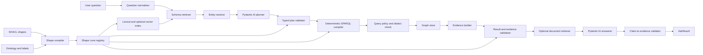
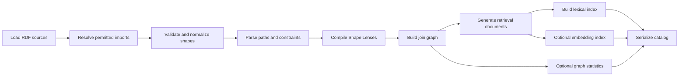
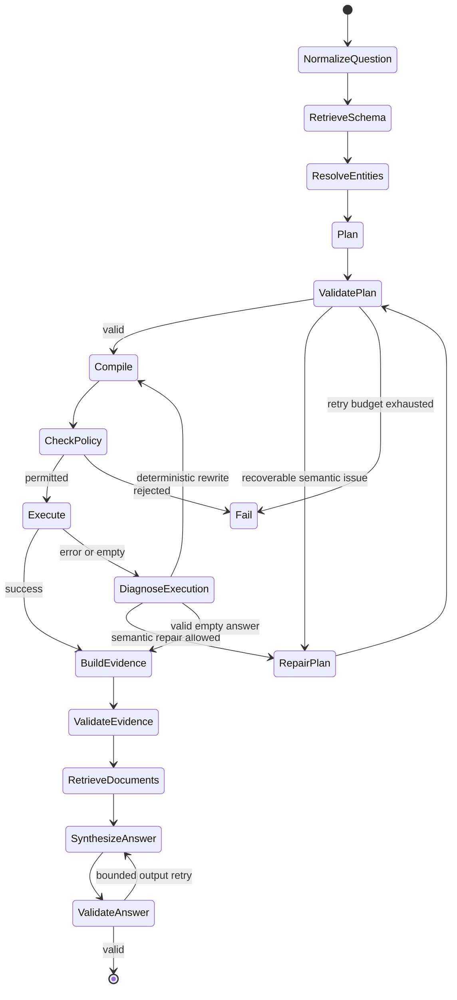

# ShapeLens GraphRAG

## A SHACL-native, typed GraphRAG architecture for Python

**Document status:** Proposed design  
**Working library name:** `shapelens`  
**Target runtime:** Python 3.11+  
**Primary technologies:** RDF, SHACL, SPARQL, Pydantic, Pydantic AI  
**Compatibility baseline:** SHACL 1.0 and SPARQL 1.1, with capability-gated support for SHACL 1.2 and SPARQL 1.2 features

---

## Contents

- **Foundations:** [Executive summary](#1-executive-summary) · [Problem](#2-problem-statement) · [Goals](#3-goals-and-non-goals) · [Principles](#4-design-principles) · [Shape Lenses](#5-the-novel-abstraction-shape-lenses) · [Standards](#6-standards-and-compatibility-strategy)
- **API and architecture:** [User experience](#7-user-facing-experience) · [Architecture](#8-high-level-architecture) · [Domain model](#9-core-domain-model) · [Query representations](#10-query-representations) · [Evidence models](#11-evidence-and-answer-models) · [Catalog build](#12-catalog-build-lifecycle) · [Schema retrieval](#13-schema-indexing-and-retrieval) · [Workflow](#14-question-time-workflow)
- **Planning and execution:** [Entity resolution](#15-entity-resolution) · [Pydantic AI planner](#16-pydantic-ai-planner) · [Plan validation](#17-plan-validation) · [SPARQL compiler](#18-deterministic-sparql-compiler) · [Optimization](#19-query-optimization) · [Graph stores](#20-graph-store-abstraction) · [Execution and repair](#21-execution-diagnosis-and-repair)
- **Grounding and answers:** [Evidence construction](#22-evidence-construction) · [Hybrid RAG](#23-hybrid-graph-and-document-rag) · [Evidence validation](#24-result-and-evidence-validation) · [Answer synthesis](#25-answer-synthesis-with-pydantic-ai) · [`ShapeRAG` facade](#26-the-shaperag-facade)
- **Engineering:** [Extensibility](#27-extensibility-architecture) · [Package layout](#28-proposed-package-layout) · [Configuration](#29-configuration-model) · [Security](#30-security-design) · [Observability](#31-observability) · [Performance](#32-performance-design) · [Testing](#33-testing-strategy)
- **Delivery:** [End-to-end example](#34-detailed-end-to-end-example) · [Roadmap](#35-development-roadmap) · [Initial scope](#36-recommended-initial-feature-subset) · [Risks](#37-risks-and-mitigations) · [ADRs](#38-key-architectural-decisions) · [Future directions](#39-future-directions) · [Recommendation](#40-final-recommendation) · [References](#41-standards-and-implementation-references)

---

## 1. Executive summary

This document proposes **ShapeLens GraphRAG**, a Python library that uses SHACL as an executable semantic interface between natural-language questions and SPARQL-accessible knowledge graphs.

The central idea is to compile every useful SHACL node shape and property shape into a **Shape Lens**. A Shape Lens is simultaneously:

1. a compact semantic document that can be retrieved for an LLM;
2. a set of legal query operations derived from the shape's paths, classes, datatypes, cardinalities, and constraints;
3. a collection of join points that tells the planner how concepts connect;
4. a result contract that can validate returned RDF terms and evidence;
5. a provenance anchor that records exactly which schema knowledge justified a query.

The language model does **not** generate unrestricted SPARQL by default. It produces a typed Pydantic `BoundQueryPlan` whose fields reference known Shape Lens and property IDs. A deterministic compiler validates the plan, chooses a SPARQL dialect, safely renders RDF terms, applies a query policy, and produces SPARQL. The endpoint executes the query under limits. The returned bindings are converted into an `EvidencePacket`, optionally enriched with linked document chunks, validated, and passed to a second typed agent that returns claims with explicit evidence references.

This yields a system that is:

- **easy to use:** a high-level `ShapeRAG.ask()` API works with an RDFLib graph or remote SPARQL endpoint;
- **generic:** the core is driven by SHACL and protocols rather than a fixed domain ontology;
- **flexible:** stores, indexes, models, query dialects, validation strategies, and document retrievers are replaceable;
- **efficient:** schema processing is performed once, retrieval is bounded, SPARQL is compiled deterministically, and model retries are limited;
- **safe and inspectable:** the library can show the chosen shapes, typed plan, generated query, evidence, and diagnostics for every answer.

The recommended implementation has a deterministic outer workflow with two narrowly scoped LLM roles:

- a **planner** that selects and binds schema-backed operations;
- an **answerer** that turns verified evidence into natural language.

Everything between those roles—schema indexing, plan checking, query compilation, endpoint policy, result typing, provenance assembly, and citation validation—is ordinary Python code.

---

## 2. Problem statement

Natural-language-to-SPARQL systems commonly fail for four related reasons:

1. **Schema hallucination.** The model invents classes, predicates, inverse directions, or graph names that look plausible but do not exist.
2. **Semantic ambiguity.** A user phrase such as “worked with,” “expert,” or “active project” may correspond to several graph patterns or domain rules.
3. **Unsafe or inefficient queries.** Generated SPARQL can contain updates, unrestricted federation, expensive property paths, accidental Cartesian products, or unbounded result sets.
4. **Weak grounding.** Even a syntactically valid query may return data that is incomplete, non-conformant, insufficiently provenanced, or poorly connected to the generated answer.

SHACL already contains much of the information needed to address these problems: target classes, property paths, value classes, datatypes, cardinalities, logical constraints, labels, descriptions, messages, and—in SHACL 1.2—agent-oriented intent text. However, a SHACL graph is not directly a natural-language query grammar, and an arbitrary SHACL constraint is not generally invertible into a user query.

The library therefore needs an intermediate layer that turns SHACL into **query affordances**, not a naïve “shape-to-SPARQL translator.”

---

## 3. Goals and non-goals

### 3.1 Goals

The library should:

- answer natural-language questions over RDF graphs using SPARQL;
- use SHACL as the primary schema and constraint source;
- support graph-only RAG and hybrid graph-plus-document RAG;
- use Pydantic models for every boundary where untrusted or model-generated data enters the system;
- offer a first-class Pydantic AI implementation without making the deterministic core depend on a particular model provider;
- work with local RDFLib datasets and remote SPARQL endpoints;
- preserve named-graph and provenance information when the backend can expose it;
- support a portable SPARQL 1.1 subset and capability-gated extensions;
- expose plans, queries, evidence, validation issues, and traces for debugging;
- remain useful when embeddings are unavailable by providing a lexical schema index;
- provide escape hatches through explicit plugins rather than unrestricted model output.

### 3.2 Non-goals

The initial library should not:

- attempt to infer a complete ontology from arbitrary RDF data;
- automatically convert every SHACL-SPARQL constraint into a retrieval query;
- allow the model to issue SPARQL Update operations;
- silently relax user constraints merely to obtain non-empty results;
- require fine-tuning before it is useful;
- assume that SHACL validation alone proves real-world truth;
- hide endpoint-specific behavior behind claims of perfect portability;
- make a vector database mandatory for small or medium shape catalogs.

---

## 4. Design principles

### 4.1 SHACL is the contract; SPARQL is the execution language

SHACL describes what properties mean in a local shape context, what values they may have, and how concepts connect. SPARQL retrieves exact graph evidence. The model's role is to choose among known contracts, not to invent an execution language from scratch.

### 4.2 The model emits references, not schema strings

A plan should refer to `employee.worked_on`, represented internally by a stable property-lens ID, instead of emitting `http://example.org/workedOn` or a raw triple pattern. This allows deterministic lookup, validation, compilation, and migration.

### 4.3 Deterministic outside, agentic inside bounded boxes

The workflow is an explicit state machine. Model calls occur only where semantic judgment is needed. Retries have fixed budgets. Empty results and endpoint errors are diagnosed by code before another model call is considered.

### 4.4 Separate schema retrieval from evidence retrieval

There are two different retrieval problems:

- **schema retrieval:** find the relevant shapes, paths, and constraints;
- **evidence retrieval:** find graph facts and linked text that answer the question.

They should use separate indexes, scoring logic, and data models. A vector index over documents must not be treated as a substitute for discovering legal graph paths.

### 4.5 Every claim should point to machine-identifiable evidence

The answerer returns structured claims whose `evidence_ids` refer to graph facts, result rows, source graphs, or document chunks in an `EvidencePacket`. Rendering human-friendly citations is a final presentation step.

### 4.6 Portable baseline, explicit capabilities

The default compiler emits conservative SPARQL 1.1. Endpoint features—SPARQL 1.2 constructs, full-text search, geospatial functions, federation, entailment, statement-level provenance, query hints—are represented in an `EndpointCapabilities` object and used only when enabled.

### 4.7 Graceful degradation

The same API should support:

- a local graph with ten shapes and no embeddings;
- a remote enterprise endpoint with thousands of shapes and a vector index;
- graph-only answers;
- graph-guided document retrieval;
- a caller-supplied plan with no LLM at all.

---

## 5. The novel abstraction: Shape Lenses

A **Shape Lens** is a compiled, query-oriented representation of one semantic view of the graph.

A single RDF class can have multiple lenses. For example, an `Employee` may have:

- a public-directory lens;
- an HR lens containing sensitive fields;
- a project-staffing lens;
- a data-quality validation lens.

This context sensitivity is important. Global ontology labels alone do not tell the planner which properties are permitted, relevant, or safe in a specific application.

### 5.1 Lens components

Each lens contains:

- **identity:** stable ID, original shape node, shapes-graph ID, version digest;
- **semantic text:** labels, comments, `sh:name`, `sh:description`, `sh:intent`, messages, aliases, path local names;
- **focus contract:** target classes, target nodes, target subjects/objects, or explicit application targets;
- **property affordances:** canonical SHACL path, expected node kind, value class, datatype, cardinality, allowed filter operators, aggregation suitability, and sensitivity policy;
- **join ports:** connections from a property to another lens based on `sh:class`, `sh:node`, target classes, or configured mappings;
- **validation contract:** constraints that can be checked on plan values or returned RDF terms;
- **query metadata:** estimated selectivity, path cost, preferred label path, graph scope, and supported dialect features;
- **retrieval document:** compact text used by lexical and embedding indexes;
- **source references:** the exact triples or shape subgraph from which the lens was compiled.

### 5.2 Query affordances

A property lens exposes only operations compatible with its contract. Examples:

| SHACL information | Derived affordances |
|---|---|
| `sh:datatype xsd:string` | equals, contains, prefix, language-aware match; regex only when policy allows |
| numeric datatype | equals, comparison, range, min/max/average/sum |
| date or date-time datatype | before, after, between, date-part grouping |
| `sh:class ex:Project` | traverse or join to a Project lens, entity equality, existence |
| `sh:maxCount 1` | scalar projection without aggregation; optionality still depends on `sh:minCount` |
| unbounded cardinality | set projection, `COUNT`, `EXISTS`, `NOT EXISTS` |
| `sh:in (...)` | equality or membership restricted to known values |
| `sh:or (...)` | typed union of supported alternatives |
| inverse or sequence `sh:path` | deterministic traversal using the canonical path AST |

The compiler does not claim that every constraint is a query affordance. A complex SHACL-SPARQL constraint may remain validation-only unless a plugin explicitly knows how to turn it into a safe retrieval operation.

### 5.3 Evidence contract

The same lens that permits a plan operation also defines what evidence is expected back. If a plan traverses an employee's `workedOn` property to a project, the evidence contract can require:

- an employee IRI;
- a project IRI;
- the connecting predicate or property path;
- a display label if available;
- source graph or provenance metadata when configured;
- conformance warnings when returned values violate the shape.

This unifies schema grounding, query generation, result validation, and answer citation.

### 5.4 Why this is preferable to direct NL-to-SPARQL

Direct generation treats SPARQL as model-authored code. Shape Lenses instead make the model choose from a typed, versioned semantic API. This resembles compiling a high-level language into a database query rather than asking the model to hand-write arbitrary query text.

---

## 6. Standards and compatibility strategy

### 6.1 Stable baseline

The first production profile should require only:

- RDF 1.1-compatible terms and datasets;
- SHACL Core concepts available in the 2017 Recommendation;
- SPARQL 1.1 query features;
- standard SPARQL Results JSON for remote `SELECT` and `ASK` queries;
- RDF serialization for `CONSTRUCT` queries.

### 6.2 Optional SHACL 1.2 features

When present, the compiler and indexer should recognize:

- `sh:intent` as high-value semantic text for agent guidance;
- `sh:ShapesGraph`, `rdfs:isDefinedBy`, `rdfs:member`, and `owl:imports` for packaging and dependency tracking;
- `sh:usedShapesGraph`, `sh:usedDataGraph`, and related validation provenance terms;
- supported node expressions and `sh:values` as computed property lenses;
- SHACL 1.2 path and value-type additions that the local feature profile enables.

These are enhancements, not prerequisites. A `FeatureProfile` records what was seen and what the library actually supports.

### 6.3 Optional SPARQL 1.2 features

The endpoint adapter may discover or be configured with support for SPARQL 1.2. The compiler can then enable features such as triple terms or version announcements. The default remains a conservative 1.1-compatible query unless the plan requires and the endpoint advertises a newer feature.

### 6.4 Shape profiles

The library should define implementation profiles such as:

- `portable-core`: simple targets, standard paths, core datatypes, basic logical constraints;
- `portable-advanced`: additional SHACL paths and selected advanced constraints;
- `endpoint-native`: custom functions and vendor capabilities;
- `strict-safe`: excludes expensive recursive or unbounded constructs;
- `full`: all installed plugins.

A catalog build reports unsupported shape features rather than silently ignoring them.

---

## 7. User-facing experience

The simplest local use should look like this:

```python
from rdflib import Graph
from shapelens import ShapeRAG

rag = ShapeRAG.from_rdflib(
    data=Graph().parse("data.ttl"),
    shapes=Graph().parse("shapes.ttl"),
    model="openai:gpt-5.2",
)

result = await rag.ask(
    "Which employees worked on Project X and are experts in artificial intelligence?"
)

print(result.answer)
for claim in result.claims:
    print(claim.text, claim.evidence_ids)
```

A remote configuration should remain explicit but compact:

```python
from shapelens import ShapeRAG, ShapeRAGConfig
from shapelens.stores import SPARQLEndpointStore
from shapelens.shapes import RDFShapeSource

rag = ShapeRAG(
    graph=SPARQLEndpointStore(
        query_url="https://kg.example/sparql",
        timeout_seconds=20,
        default_graphs=["urn:graph:production"],
    ),
    shapes=RDFShapeSource("company-shapes.ttl"),
    config=ShapeRAGConfig(
        planner_model="openai:gpt-5.2",
        answer_model="openai:gpt-5.2",
        planning_mode="fast",
    ),
)

result = await rag.ask("Which projects have no assigned project manager?")
```

Advanced callers can stop at any layer:

```python
candidates = await rag.retrieve_schema(question)
plan = await rag.plan(question, candidates=candidates)
compiled = rag.compile(plan)
rows = await rag.execute(compiled)
evidence = await rag.build_evidence(plan, rows)
answer = await rag.answer(question, evidence)
```

The public facade should also expose:

- `rag.explain(question)` for a dry-run explanation;
- `rag.ask_stream(question)` for stage and answer events;
- `rag.validate_catalog()` for shape diagnostics;
- `rag.inspect_lens(lens_id)` for debugging;
- `rag.ask(..., return_debug=True)` for plans, SPARQL, timings, and validation reports.

---

## 8. High-level architecture



There are two lifecycles:

1. **catalog build time:** ingest shapes and ontology data, compile lenses, build indexes and join metadata;
2. **question time:** retrieve lenses, resolve entities, plan, compile, execute, validate, gather evidence, and answer.

The catalog can be built eagerly at startup, loaded from a serialized artifact, or refreshed incrementally.

---

## 9. Core domain model

All public and model-generated data should use frozen or carefully validated Pydantic models. Internally mutable runtime state may use dataclasses where appropriate.

### 9.1 RDF terms

SPARQL bindings should not be converted immediately into ambiguous Python primitives. Preserve RDF identity first:

```python
from typing import Annotated, Literal
from pydantic import BaseModel, Field


class IriTerm(BaseModel):
    kind: Literal["iri"] = "iri"
    value: str


class BlankNodeTerm(BaseModel):
    kind: Literal["bnode"] = "bnode"
    value: str


class LiteralTerm(BaseModel):
    kind: Literal["literal"] = "literal"
    value: str
    datatype: str | None = None
    language: str | None = None
    direction: str | None = None


class TripleTerm(BaseModel):
    kind: Literal["triple"] = "triple"
    subject: "RDFTerm"
    predicate: IriTerm
    object: "RDFTerm"


RDFTerm = Annotated[
    IriTerm | BlankNodeTerm | LiteralTerm | TripleTerm,
    Field(discriminator="kind"),
]
```

`TripleTerm` is capability-gated. A SPARQL 1.1 endpoint adapter will never produce it.

A second conversion layer may expose Python-native values after checking datatypes against a `ValueContract`.

### 9.2 Canonical SHACL path AST

Never hand raw blank-node path structures to the model. Normalize them once:

```python
class PredicatePath(BaseModel):
    kind: Literal["predicate"] = "predicate"
    iri: str


class InversePath(BaseModel):
    kind: Literal["inverse"] = "inverse"
    path: "PathExpr"


class SequencePath(BaseModel):
    kind: Literal["sequence"] = "sequence"
    items: tuple["PathExpr", ...]


class AlternativePath(BaseModel):
    kind: Literal["alternative"] = "alternative"
    items: tuple["PathExpr", ...]


class ZeroOrMorePath(BaseModel):
    kind: Literal["zero_or_more"] = "zero_or_more"
    path: "PathExpr"


class OneOrMorePath(BaseModel):
    kind: Literal["one_or_more"] = "one_or_more"
    path: "PathExpr"


class ZeroOrOnePath(BaseModel):
    kind: Literal["zero_or_one"] = "zero_or_one"
    path: "PathExpr"


PathExpr = Annotated[
    PredicatePath
    | InversePath
    | SequencePath
    | AlternativePath
    | ZeroOrMorePath
    | OneOrMorePath
    | ZeroOrOnePath,
    Field(discriminator="kind"),
]
```

The path parser must be cycle-safe and enforce configurable maximum depth. The SPARQL renderer only renders path ASTs originating from the catalog or a trusted plugin.

### 9.3 Constraints and value contracts

```python
class Cardinality(BaseModel):
    min_count: int | None = None
    max_count: int | None = None


class ValueContract(BaseModel):
    node_kinds: frozenset[str] = Field(default_factory=frozenset)
    datatypes: frozenset[str] = Field(default_factory=frozenset)
    classes: frozenset[str] = Field(default_factory=frozenset)
    allowed_values: tuple[RDFTerm, ...] = ()
    patterns: tuple[str, ...] = ()
    language_ranges: tuple[str, ...] = ()
    cardinality: Cardinality = Field(default_factory=Cardinality)
    nested_shape_ids: tuple[str, ...] = ()
    validation_only_features: tuple[str, ...] = ()
```

This model is deliberately lossy relative to the entire SHACL graph. The complete source subgraph remains available in the registry. `ValueContract` contains the subset needed for common planning, compilation, and result validation.

### 9.4 Property lens

```python
class OperatorSet(BaseModel):
    equality: bool = True
    ordering: bool = False
    string_search: bool = False
    regex: bool = False
    membership: bool = False
    exists: bool = True
    aggregate: frozenset[str] = Field(default_factory=frozenset)


class PropertyLens(BaseModel):
    id: str
    source_shape_id: str
    original_shape_term: RDFTerm
    path: PathExpr
    names: dict[str, str] = Field(default_factory=dict)
    descriptions: dict[str, str] = Field(default_factory=dict)
    intents: tuple[str, ...] = ()
    aliases: tuple[str, ...] = ()
    value: ValueContract
    operators: OperatorSet
    target_lens_ids: tuple[str, ...] = ()
    required_for_complete_evidence: bool = False
    sensitive: bool = False
    estimated_fanout: float | None = None
    source_digest: str
```

### 9.5 Shape Lens

```python
class ShapeTarget(BaseModel):
    kind: Literal[
        "class", "node", "subjects_of", "objects_of", "explicit", "none"
    ]
    value: RDFTerm | None = None


class ShapeLens(BaseModel):
    id: str
    original_shape_term: RDFTerm
    shapes_graph_id: str | None = None
    version_iri: str | None = None
    labels: dict[str, str] = Field(default_factory=dict)
    comments: dict[str, str] = Field(default_factory=dict)
    intents: tuple[str, ...] = ()
    aliases: tuple[str, ...] = ()
    targets: tuple[ShapeTarget, ...] = ()
    focus_classes: frozenset[str] = Field(default_factory=frozenset)
    properties: tuple[PropertyLens, ...]
    retrieval_text: str
    feature_profile: frozenset[str] = Field(default_factory=frozenset)
    source_digest: str
```

Collection and nested-model defaults use `Field(default_factory=...)` so the examples are safe to lift into production code.

### 9.6 Stable IDs

IRI-backed shapes use a catalog-scoped identifier derived from the IRI and shapes-graph version. Blank-node shapes require deterministic skolem IDs. The recommended algorithm is:

1. extract the shape's bounded description, following SHACL list and path blank nodes;
2. canonicalize triples using a deterministic RDF dataset canonicalization strategy or a stable local canonicalizer;
3. hash the canonical bytes;
4. emit an internal ID such as `lens:sha256:<digest>`;
5. retain the original blank-node term and source graph for diagnostics.

IDs are not intended to become public ontology IRIs. They are stable registry keys.

### 9.7 Join graph

The registry maintains a directed multigraph:

- vertices are Shape Lenses;
- edges are Property Lenses whose values can match another lens;
- edge metadata includes direction, path, cardinality, fanout, graph scope, and policy tags.

The schema retriever can expand an initial set of semantically relevant lenses along this graph to discover bridge relationships that the question does not name explicitly.

---

## 10. Query representations

The system benefits from two related intermediate representations.

### 10.1 Semantic intent IR

`SemanticIntent` is schema-independent. It captures what the user appears to ask without committing to RDF paths.

```python
class Mention(BaseModel):
    text: str
    role: Literal["entity", "class", "property", "value", "time", "unknown"]
    quoted: bool = False


class RequestedAnswer(BaseModel):
    kind: Literal["entities", "values", "boolean", "count", "table", "summary"]
    concept: str | None = None


class SemanticConstraint(BaseModel):
    subject_concept: str
    relation_text: str
    object_text: str | None = None
    comparison: str | None = None
    negated: bool = False


class SemanticIntent(BaseModel):
    original_question: str
    normalized_question: str
    language: str | None = None
    answer: RequestedAnswer
    mentions: tuple[Mention, ...] = ()
    constraints: tuple[SemanticConstraint, ...] = ()
    requested_sort: tuple[str, ...] = ()
    requested_limit: int | None = None
```

This layer is useful in `robust` planning mode, in evaluation datasets, and when the schema binder is deterministic or separately replaceable. It is not required for the lowest-latency `fast` mode.

### 10.2 Bound query plan

`BoundQueryPlan` references only catalog IDs and validated RDF values.

```python
class EntityBinding(BaseModel):
    kind: Literal["iri", "candidate_set", "unbound"]
    values: tuple[IriTerm, ...] = ()
    resolution_text: str | None = None


class PlanNode(BaseModel):
    id: str
    lens_id: str
    binding: EntityBinding = EntityBinding(kind="unbound")


class PlanEdge(BaseModel):
    id: str
    source_node: str
    property_lens_id: str
    target_node: str
    quantifier: Literal["any", "none"] = "any"
    optional: bool = False


class ScalarValue(BaseModel):
    term: RDFTerm


class FieldRef(BaseModel):
    node_id: str
    property_lens_id: str


class EqFilter(BaseModel):
    kind: Literal["eq"] = "eq"
    field: FieldRef
    value: ScalarValue


class InFilter(BaseModel):
    kind: Literal["in"] = "in"
    field: FieldRef
    values: tuple[ScalarValue, ...]


class CompareFilter(BaseModel):
    kind: Literal["compare"] = "compare"
    field: FieldRef
    operator: Literal["lt", "lte", "gt", "gte"]
    value: ScalarValue


class TextFilter(BaseModel):
    kind: Literal["text"] = "text"
    field: FieldRef
    operator: Literal["equals", "contains", "starts_with", "regex"]
    text: str
    language: str | None = None


class ExistsFilter(BaseModel):
    kind: Literal["exists"] = "exists"
    field: FieldRef
    exists: bool = True


FilterExpr = Annotated[
    EqFilter | InFilter | CompareFilter | TextFilter | ExistsFilter,
    Field(discriminator="kind"),
]


class Projection(BaseModel):
    id: str
    kind: Literal["node", "field", "count", "min", "max", "sum", "avg"]
    node_id: str
    property_lens_id: str | None = None
    label: str | None = None
    distinct: bool = False


class SortSpec(BaseModel):
    projection_id: str
    direction: Literal["asc", "desc"] = "asc"


class EvidenceRequest(BaseModel):
    include_connecting_facts: bool = True
    include_labels: bool = True
    include_source_graphs: bool = True
    include_linked_documents: bool = True
    neighborhood_depth: int = 0


class BoundQueryPlan(BaseModel):
    question: str
    nodes: tuple[PlanNode, ...]
    edges: tuple[PlanEdge, ...] = ()
    filters: tuple[FilterExpr, ...] = ()
    projections: tuple[Projection, ...]
    sort: tuple[SortSpec, ...] = ()
    limit: int | None = None
    distinct: bool = True
    evidence: EvidenceRequest = Field(default_factory=EvidenceRequest)
    selected_lens_ids: tuple[str, ...] = ()
    planner_notes: tuple[str, ...] = ()
```

The production model should add validators for unique IDs, reference integrity, and non-empty projections.

### 10.3 Why keep the plan smaller than SPARQL

The plan intentionally omits arbitrary subqueries, expressions, `SERVICE`, graph updates, user-authored variables, and free-form query fragments. It covers common analytical questions through a safe algebra. Additional capabilities are introduced as typed plan nodes and compiler plugins, not as strings.

Examples of future typed additions include:

- `UnionGroup` and `OptionalGroup`;
- `AllValuesFilter` for universal quantification;
- temporal overlap predicates;
- geospatial relations;
- full-text search expressions;
- federated source bindings with endpoint allowlists;
- path-length constraints;
- grouped aggregations and `HAVING`;
- caller-defined computed projections.

### 10.4 Plan modes

The library exposes three planning modes:

| Mode | Model calls | Behavior | Intended use |
|---|---:|---|---|
| `fast` | normally 1 planner call | retrieve lenses and ask the model for a bound plan directly | interactive applications |
| `robust` | normally 2 calls | extract semantic intent, then bind it to lenses | difficult schemas, evaluation, explainability |
| `deterministic` | 0 | caller supplies a plan or uses application rules | regulated workflows, tests, repeated queries |

All modes converge on the same `BoundQueryPlan`, validator, compiler, executor, and evidence pipeline.

---

## 11. Evidence and answer models

### 11.1 Graph facts

```python
class FactEvidence(BaseModel):
    id: str
    subject: RDFTerm
    predicate_path: PathExpr
    object: RDFTerm
    source_graph: IriTerm | None = None
    source_document_ids: tuple[str, ...] = ()
    lens_ids: tuple[str, ...] = ()
    query_execution_id: str


class RowEvidence(BaseModel):
    id: str
    bindings: dict[str, RDFTerm]
    fact_ids: tuple[str, ...]


class TextChunkEvidence(BaseModel):
    id: str
    text: str
    document_id: str
    title: str | None = None
    entity_ids: tuple[str, ...] = ()
    source_locator: str | None = None
    score: float | None = None
```

A fact ID should be a deterministic hash over canonical subject, canonical path, object, source graph, and dataset/version identity. Row IDs can hash ordered binding IDs plus the query execution ID.

### 11.2 Evidence packet

```python
class ValidationIssue(BaseModel):
    code: str
    severity: Literal["info", "warning", "error"]
    message: str
    lens_id: str | None = None
    focus_node: RDFTerm | None = None
    path: PathExpr | None = None


class EvidencePacket(BaseModel):
    execution_id: str
    question: str
    plan_digest: str
    query_digest: str
    dataset_revision: str | None = None
    selected_lens_ids: tuple[str, ...]
    facts: tuple[FactEvidence, ...] = ()
    rows: tuple[RowEvidence, ...] = ()
    chunks: tuple[TextChunkEvidence, ...] = ()
    issues: tuple[ValidationIssue, ...] = ()
    truncated: bool = False
```

The packet is the only factual context supplied to the answerer by default. The raw endpoint response may be retained in debug storage but should not be pasted indiscriminately into the model prompt.

### 11.3 Grounded answer

```python
class GroundedClaim(BaseModel):
    text: str
    evidence_ids: tuple[str, ...]
    confidence: Literal["high", "medium", "low"] = "high"


class GroundedAnswer(BaseModel):
    direct_answer: str
    claims: tuple[GroundedClaim, ...]
    limitations: tuple[str, ...] = ()
    no_answer_reason: str | None = None


class AskResult(BaseModel):
    answer: str
    claims: tuple[GroundedClaim, ...]
    evidence: EvidencePacket
    plan: BoundQueryPlan
    sparql: str | None = None
    diagnostics: dict[str, object] = Field(default_factory=dict)
```

An output validator must reject claims that cite unknown evidence IDs. A stricter policy can require every non-trivial sentence in `direct_answer` to be represented by a claim.

---

## 12. Catalog build lifecycle

Catalog construction transforms one or more RDF shapes graphs into an immutable, versioned `ShapeCatalog`.



### 12.1 Source loading

Supported inputs should include:

- an RDFLib `Graph` or `Dataset`;
- local RDF files;
- a trusted in-memory byte stream;
- a configured SPARQL query that returns the shapes graph;
- a custom `ShapeSource` implementation.

Remote URL loading and `owl:imports` must be disabled by default for untrusted inputs. When enabled, they use an allowlist, byte limit, content-type checks, redirect limits, and network policy.

### 12.2 Shapes-graph identity and versioning

The loader records:

- graph IRI or synthetic source ID;
- `owl:versionIRI` and other available version metadata;
- source digest;
- import closure and dependency digests;
- feature profile;
- build timestamp and compiler version.

A catalog revision is a digest over all normalized shapes-graph revisions plus compiler settings. Query and evidence caches include this revision in their keys.

### 12.3 Shape well-formedness

Catalog build performs two distinct checks:

1. **syntactic support check:** can this library parse the shape and all property paths it needs?
2. **SHACL meta-validation:** is the shapes graph well-formed according to the selected SHACL profile?

`pySHACL` is the recommended optional implementation for meta-validation and data validation. Catalog construction should still work without it in a reduced “parse-only” mode, clearly reporting that formal shape validation was skipped.

### 12.4 Normalization

Normalization should:

- resolve prefixes for display while retaining full IRIs internally;
- canonicalize SHACL paths into `PathExpr`;
- flatten safe RDF lists into tuples;
- preserve logical structure rather than naïvely merging incompatible alternatives;
- create stable IDs for blank-node shapes;
- collect language-tagged labels and descriptions;
- inherit or join ontology labels for classes and properties;
- preserve source triple references for every derived field;
- mark unsupported constraints as validation-only metadata;
- detect recursion without expanding it infinitely.

### 12.5 Semantic text extraction

Retrieval text should be assembled from, in descending default importance:

1. `sh:intent` when available;
2. property-local `sh:name`;
3. node-shape `rdfs:label` and property labels;
4. configured aliases and SKOS alternative labels;
5. `sh:description` and `rdfs:comment`;
6. `sh:message` values;
7. target-class labels;
8. local names of path IRIs;
9. labels of value classes and nested shapes;
10. property-group labels.

The source fields remain separately weighted in the lexical index; the concatenated retrieval text is mainly for embeddings and prompt cards.

### 12.6 Affordance derivation

The `ShapeCompiler` derives operators conservatively.

Examples:

- ordering is enabled only for compatible numeric, date, time, or explicitly ordered datatypes;
- string search is enabled for string-like literals;
- regex is available only if both the value type and query policy permit it;
- aggregation is based on value type and cardinality;
- entity traversal requires an IRI-capable value and a resolvable target lens or explicit class;
- `sh:in` values become an enum-like value domain;
- `sh:closed` affects catalog diagnostics and optional plan restrictions but does not by itself forbid reading unknown graph properties outside that lens;
- custom constraints never create query operations unless a `ConstraintPlugin` recognizes them.

### 12.7 Join graph construction

Candidate target lenses for a property are inferred from:

- `sh:class` values;
- `sh:node` and supported nested shape references;
- classes in `sh:or` alternatives;
- ontology `rdfs:range` as a lower-confidence fallback;
- explicit application mappings;
- sampled data typing, only when enabled and clearly marked as inferred.

When multiple lenses target the same class, all remain candidates. Security tags, active profiles, and query context determine which are usable.

### 12.8 Optional statistics

A `GraphProfiler` can collect bounded statistics for optimization and retrieval:

- approximate instance counts per target class;
- property presence frequency;
- distinct value counts;
- average and percentile fanout where affordable;
- common datatypes and languages;
- named-graph distribution;
- label coverage;
- validation-conformance metadata.

Statistics are advisory. They must carry dataset revision, sample method, and staleness information. Catalog build must not issue expensive full scans unless explicitly requested.

### 12.9 Retrieval-document generation

A compact lens card should be understandable without raw Turtle. For example:

```text
Lens: Employee / project staffing
Focus type: Employee
Meaning: An employee who may work on projects and have areas of expertise.
Properties:
- name: string, at most one
- worked on: Project, zero or more; joins to Project lens
- expertise: Skill, zero or more; joins to Skill lens
Useful intents:
- Find employees assigned to a project.
- Find employees with a given expertise.
Source shapes: ex:EmployeeStaffingShape
```

The model receives lens cards, stable IDs, and only the source snippets needed for ambiguous cases.

### 12.10 Incremental rebuild

Incremental catalog updates should be content-addressed:

1. compare source and import digests;
2. recompile only changed shapes and dependents;
3. update affected join-graph edges;
4. update lexical index rows;
5. recompute embeddings only when retrieval text changed;
6. invalidate cached plans that reference changed lens versions.

---

## 13. Schema indexing and retrieval

### 13.1 Index implementations

The core defines a `ShapeIndex` protocol:

```python
class ShapeIndex(Protocol):
    async def search(
        self,
        query: str,
        *,
        limit: int,
        language: str | None,
        required_profiles: frozenset[str] = frozenset(),
    ) -> list["LensHit"]: ...
```

Recommended implementations:

- `MemoryShapeIndex`: token, trigram, and field-weighted scoring; ideal for small catalogs;
- `SQLiteShapeIndex`: FTS5-backed persistent lexical index;
- `HybridShapeIndex`: lexical results fused with an embedding backend;
- user adapters for PostgreSQL, OpenSearch, Qdrant, Weaviate, or other systems.

### 13.2 No-vector fast path

For roughly tens of shapes, include all eligible compact lens cards if they fit the schema-context budget. This is usually simpler and more reliable than embedding retrieval.

For hundreds or thousands of shapes, use retrieval. Embeddings remain optional because field-aware lexical matching is especially strong for ontology terms, abbreviations, labels, and identifiers.

### 13.3 Hybrid scoring

A default score can combine:

- weighted BM25 or FTS score over labels, aliases, intents, descriptions, and path names;
- embedding cosine similarity;
- exact phrase and quoted-mention boosts;
- class/property role compatibility;
- active-profile and access-policy eligibility;
- graph-connectivity bonus;
- stale-statistics or unsupported-feature penalties.

Use reciprocal-rank fusion or a normalized weighted sum rather than assuming lexical and vector scores share a scale.

### 13.4 Structural expansion

Top semantic hits may not include the bridge property needed to connect them. After initial retrieval:

1. identify likely concept lenses from the top hits;
2. find bounded shortest paths in the lens join graph;
3. add bridge property lenses and intermediate node lenses;
4. prune by policy, path cost, and context budget;
5. diversify so one large shape family does not consume all candidates.

This is a major advantage over embedding-only schema retrieval.

### 13.5 Context packing

The `LensContextPacker` chooses what to send to the planner:

- full compact cards for top lenses;
- minimal signatures for bridge lenses;
- source Turtle only for ambiguous or unsupported features;
- stable IDs and allowed operators for every candidate;
- entity-resolution results separately from schema descriptions.

The packer uses an estimated token budget but stores the untruncated candidate set in dependencies so tools can inspect additional lenses if needed.

### 13.6 Retrieval diagnostics

Every query records:

- search terms and normalized language;
- lexical, vector, and structural score components;
- selected and discarded lenses;
- context-budget decisions;
- catalog revision.

This makes schema retrieval independently evaluable.

---

## 14. Question-time workflow

The robust workflow is a typed state machine. An implementation may use `pydantic-graph` internally, but the public API should not require users to understand graph orchestration.



### 14.1 Pipeline state

```python
class RunState(BaseModel):
    run_id: str
    question: str
    normalized_question: str | None = None
    schema_hits: tuple[object, ...] = ()
    entity_candidates: dict[str, tuple[object, ...]] = Field(default_factory=dict)
    semantic_intent: SemanticIntent | None = None
    plan: BoundQueryPlan | None = None
    compiled_query: object | None = None
    raw_result: object | None = None
    evidence: EvidencePacket | None = None
    answer: GroundedAnswer | None = None
    issues: tuple[ValidationIssue, ...] = ()
    repair_count: int = 0
```

Large graphs and raw result bodies should be referenced through runtime handles rather than embedded in persisted state.

### 14.2 Stage events

`ask_stream()` should emit typed events such as:

- `QuestionNormalized`;
- `SchemaCandidatesSelected`;
- `EntitiesResolved`;
- `PlanCreated`;
- `PlanRejected`;
- `QueryCompiled`;
- `QueryStarted` and `QueryFinished`;
- `EvidenceBuilt`;
- `DocumentChunksRetrieved`;
- `AnswerDelta`;
- `RunCompleted`.

Events support user interfaces, tracing, and audit logging without exposing hidden model reasoning.

---

## 15. Entity resolution

Schema retrieval determines *which kinds of things and relations* are relevant. Entity resolution determines *which graph nodes* phrases such as “Project X,” “AI,” or “Oslo office” refer to.

### 15.1 Resolver protocol

```python
class EntityCandidate(BaseModel):
    iri: str
    label: str | None = None
    lens_ids: tuple[str, ...] = ()
    match_kind: Literal[
        "exact_iri", "exact_label", "alias", "normalized", "full_text", "embedding"
    ]
    score: float
    supporting_terms: tuple[str, ...] = ()


class EntityResolver(Protocol):
    async def resolve(
        self,
        text: str,
        *,
        expected_lens_ids: tuple[str, ...],
        limit: int,
    ) -> list[EntityCandidate]: ...
```

### 15.2 Resolution strategies

A composite resolver can use:

1. explicit IRI or CURIE recognition;
2. exact labels from a local entity index;
3. normalized case, punctuation, and Unicode matching;
4. aliases and SKOS labels;
5. endpoint full-text search through a dialect plugin;
6. bounded SPARQL label search;
7. embeddings over entity descriptions when configured.

Expected lens IDs restrict candidates by type or shape. The resolver should return several candidates when ambiguity is material rather than choosing silently.

### 15.3 Ambiguity handling

The default policy is:

- bind automatically when one candidate is clearly dominant and type-compatible;
- pass a small candidate set into the plan when alternatives are semantically equivalent for the question;
- return an ambiguity result when the choice would materially change the answer and no contextual evidence resolves it.

The library may expose an application hook for interactive clarification, but the core pipeline must also be able to complete with a structured ambiguity explanation.

### 15.4 Literal versus entity values

A phrase may be either a literal label filter or an entity reference. The lens contract decides what is legal:

- a property with `sh:datatype xsd:string` expects a literal filter;
- a property with `sh:class ex:Project` normally expects an entity binding;
- a union contract may allow either, but the plan must record which interpretation was selected.

---

## 16. Pydantic AI planner

Pydantic AI is a strong fit because the planner has typed dependencies, a structured output type, tools, and asynchronous output validation.

### 16.1 Planner dependencies

```python
from dataclasses import dataclass


@dataclass(frozen=True)
class PlannerDeps:
    registry: "ShapeRegistry"
    candidates: "CandidateLensSet"
    entity_candidates: dict[str, tuple[EntityCandidate, ...]]
    policy: "QueryPolicy"
    endpoint_capabilities: "EndpointCapabilities"
    plan_validator: "PlanValidator"
```

Dependencies are passed at run time, which keeps the agent reusable and testable.

### 16.2 Agent definition

Illustrative implementation:

```python
from pydantic_ai import Agent, ModelRetry, RunContext

planner_agent = Agent(
    model="openai:gpt-5.2",
    deps_type=PlannerDeps,
    output_type=BoundQueryPlan,
    retries={"output": 1},
    instructions=(
        "Create a graph query plan using only the supplied lens IDs, property-lens "
        "IDs, operators, and resolved RDF values. Do not invent schema terms. "
        "Preserve every user constraint. Prefer the smallest connected plan that "
        "answers the question."
    ),
)


@planner_agent.output_validator
async def validate_output(
    ctx: RunContext[PlannerDeps],
    plan: BoundQueryPlan,
) -> BoundQueryPlan:
    issues = await ctx.deps.plan_validator.validate(
        plan,
        candidates=ctx.deps.candidates,
        policy=ctx.deps.policy,
        endpoint=ctx.deps.endpoint_capabilities,
    )
    errors = [issue for issue in issues if issue.severity == "error"]
    if errors:
        message = "\n".join(f"{e.code}: {e.message}" for e in errors)
        raise ModelRetry(message)
    return plan
```

The actual model ID is application configuration, not a library constant.

### 16.3 Planner tools

Default `fast` mode should minimize tool loops by giving the planner a compact candidate set up front. Optional tools include:

- `inspect_lens(lens_id) -> LensCard`;
- `search_more_lenses(query, limit) -> list[LensCard]`;
- `resolve_entity(text, expected_lens_ids) -> list[EntityCandidate]`;
- `inspect_path(property_lens_id) -> PathExplanation`.

The planner should **not** receive a general `execute_sparql(query: str)` tool. Execution belongs to the controlled outer pipeline. A typed `probe_plan(plan)` tool may be enabled in advanced configurations, but it still passes through validation and policy.

### 16.4 Prompt construction

Planner input should contain:

- original and normalized question;
- answer type requested or inferred;
- compact candidate lens cards;
- explicit list of legal property IDs and operators;
- entity candidates with scores and types;
- endpoint limitations relevant to planning;
- policy constraints such as sensitive fields or maximum result size;
- one or two generic examples of the plan JSON shape, not domain-specific answers.

Do not flood the model with the full ontology or an entire shapes graph.

### 16.5 Robust two-stage planner

In `robust` mode:

1. an intent agent returns `SemanticIntent` without seeing schema details beyond terminology hints;
2. a binder receives the intent and candidate lenses and returns `BoundQueryPlan`;
3. the plan validator checks that every semantic constraint is represented.

This separation enables a coverage check: each extracted intent constraint must map to at least one plan edge or filter. It also provides better error messages when the schema cannot express part of the question.

### 16.6 Deterministic plan generation

Applications may register rules such as:

```python
@rag.plan_rule(question_type="employee_by_project_and_skill")
def employee_rule(args: EmployeeQueryArgs, catalog: ShapeCatalog) -> BoundQueryPlan:
    ...
```

These rules use the same lens IDs and compiler. They are useful for common high-volume intents and can be selected before the LLM planner.

---

## 17. Plan validation

Plan validation is the most important trust boundary. It has several layers.

### 17.1 Pydantic structural validation

Pydantic checks:

- discriminated union variants;
- required fields;
- ID formats;
- literal types;
- numeric ranges;
- duplicate or dangling references through model validators;
- maximum list sizes.

### 17.2 Catalog reference validation

The validator ensures:

- every `lens_id` exists in the active catalog revision;
- every property belongs to the source node's lens or an explicitly compatible lens;
- edge direction matches the property path;
- target node lens is compatible with the property's value contract;
- the plan uses only lenses included in the candidate context or explicitly inspected by a tool;
- deactivated or policy-restricted shapes are not used.

Restricting plans to retrieved or inspected lenses prevents a model from guessing IDs that happen to exist elsewhere in the catalog.

### 17.3 Operator compatibility

Examples:

- ordering comparisons require an ordered value type;
- text operations require a string-like literal;
- regex requires policy permission;
- aggregate functions must be supported for the value type;
- entity values must match an IRI-capable property;
- literal datatypes and language tags must satisfy the value contract;
- `none` quantification must compile to a connected `NOT EXISTS`, not an unbound negation.

### 17.4 Connectivity validation

All projected variables must be connected to the plan's constrained component unless an explicit cross-product node is enabled. This prevents accidental Cartesian products.

The validator should compute connected components over plan nodes and edges and report exactly which projection or filter is disconnected.

### 17.5 Constraint coverage

In robust mode, the validator compares `SemanticIntent` to the plan:

- every entity mention is bound or explained;
- every positive relation is represented by an edge or field filter;
- every negation is represented by a negated/existence construct;
- requested aggregation, sort, and limit are preserved;
- no unrequested restrictive filter has been introduced.

A plan can contain additional joins needed to connect concepts, but not additional business constraints without justification.

### 17.6 Policy validation

`QueryPolicy` controls:

- allowed lenses and property tags;
- sensitive fields;
- named graphs;
- query forms;
- federation;
- regex and custom functions;
- maximum nodes, edges, filters, projections, path depth, limit, and aggregate complexity;
- whether inferred or sampled schema links may be used;
- whether document retrieval may expose particular sources.

Policy failures are not sent to the model for creative workarounds. They terminate or produce a policy-limited answer.

### 17.7 Capability validation

The plan must be compilable for the selected endpoint dialect. A geospatial operation, for example, requires a known geospatial plugin and endpoint support. The planner may be retried with a diagnostic that a requested operation is unsupported, but the library must not substitute a semantically different operation.

---

## 18. Deterministic SPARQL compiler

The compiler translates a valid plan into an internal SPARQL AST and then renders text. It should never build a query through ad hoc string concatenation of model output.

### 18.1 Compiler stages

1. resolve lens and property references;
2. allocate deterministic variables;
3. create graph patterns from nodes and edges;
4. add entity bindings using `VALUES` or local bindings;
5. compile filters with typed term rendering;
6. compile negation and optionality;
7. build projections and aggregates;
8. add labels and provenance according to evidence policy;
9. apply safe rewrites and join ordering;
10. apply graph scope and dialect rules;
11. enforce query limits;
12. render SPARQL and parse it again as a final syntax check.

### 18.2 Internal AST

The AST can be library-owned and intentionally smaller than the full SPARQL grammar:

```python
class TriplePattern(BaseModel): ...
class PathPattern(BaseModel): ...
class ValuesClause(BaseModel): ...
class FilterExpression(BaseModel): ...
class OptionalGroup(BaseModel): ...
class NotExistsGroup(BaseModel): ...
class GraphGroup(BaseModel): ...
class SelectQuery(BaseModel): ...
class ConstructQuery(BaseModel): ...
```

An AST enables structural policy checks and vendor-specific rendering without reparsing model-authored text.

### 18.3 Variable allocation

Variables are derived from plan IDs and sanitized by the compiler:

- node `employee` becomes `?n_employee`;
- a projected name becomes `?v_employee_name`;
- internal graph provenance becomes `?_src_1`.

User text never becomes a variable name. Stable allocation makes query snapshots reproducible.

### 18.4 Node typing

A lens with `sh:targetClass ex:Employee` can compile to:

```sparql
?n_employee a ex:Employee .
```

Whether this triple is required depends on `TypeStrategy`:

- `explicit`: always emit type constraints;
- `minimal`: emit them when needed for disambiguation or policy;
- `entailment-aware`: rely on a configured endpoint entailment regime where safe;
- `target-native`: use a target-specific compiler plugin.

The default should be `explicit` because it is predictable.

### 18.5 Property paths

A `PathExpr` renders deterministically using parentheses where required. Unbounded repetition is allowed only when:

- the path came from a trusted lens;
- the active policy permits it;
- the endpoint supports it;
- a path-cost budget is not exceeded.

The planner cannot construct a novel repeated path.

### 18.6 Safe value binding

Remote SPARQL does not provide a universal prepared-statement mechanism equivalent to relational parameter binding. Therefore:

- RDF terms are parsed and validated before compilation;
- IRIs and literals are rendered with a trusted RDF-term serializer;
- multi-value bindings use `VALUES`;
- raw user strings are never interpolated into query syntax;
- regex patterns are escaped or rejected according to an explicit regex mode;
- local RDFLib execution may use initial bindings when supported, but the query still passes policy checks.

Example:

```sparql
VALUES ?n_project { <https://kg.example/id/project-x> }
VALUES ?n_skill   { <https://kg.example/id/artificial-intelligence> }
```

### 18.7 Positive edges

A plan edge from employee to project through a predicate path compiles to:

```sparql
?n_employee ex:workedOn ?n_project .
```

A sequence, inverse, or alternative shape path becomes one SPARQL property-path expression or a semantically equivalent group selected by the dialect.

### 18.8 Negation

`quantifier="none"` compiles to a correlated `FILTER NOT EXISTS` group:

```sparql
FILTER NOT EXISTS {
  ?n_employee ex:workedOn ?n_project .
  VALUES ?n_project { <https://kg.example/id/project-x> }
}
```

The compiler verifies that the negated group shares at least one variable with the positive outer pattern.

### 18.9 Optional projections

Projection of a property with `minCount = 0` generally uses `OPTIONAL` unless the user's question requires its existence. A filter on that property makes it required unless the filter explicitly handles absence.

Cardinality informs result typing but does not alone determine query semantics.

### 18.10 Aggregation and duplicate control

Many graph traversals multiply rows. The compiler should:

- use `DISTINCT` by default for entity-list answers;
- isolate aggregates in subqueries where additional many-valued projections would distort counts;
- compile `COUNT(DISTINCT ?x)` when the projection semantics request distinct entities;
- reject ambiguous combinations rather than guessing whether duplicates are meaningful.

### 18.11 Label strategy

Labels are evidence presentation, not identity. A configurable `LabelStrategy` defines prioritized paths and languages:

1. shape-local display property override;
2. `skos:prefLabel`;
3. `rdfs:label`;
4. configured domain label property;
5. compact IRI fallback.

Language filters should be explicit. The compiler may fetch labels in a separate batched query to keep the primary query selective.

### 18.12 Named graphs and provenance

Provenance strategies are backend-specific:

- `NoProvenance`: query the configured dataset normally;
- `NamedGraphProvenance`: compile patterns under `GRAPH ?source_graph` when dataset semantics allow it;
- `ExplicitPropertyProvenance`: follow configured provenance properties;
- `StatementProvenance`: use a supported RDF reification or triple-term strategy;
- `BackendProvenance`: call a store-specific API.

The compiler must not rewrite a default-union query into `GRAPH ?g` without an explicit strategy because that may change semantics.

### 18.13 Query forms

The first version should primarily compile:

- `SELECT` for rows, entities, values, and aggregates;
- `ASK` for boolean answers;
- `CONSTRUCT` for optional evidence-neighborhood retrieval.

`DESCRIBE` should be avoided by default because endpoint behavior is implementation-defined. SPARQL Update is never generated.

### 18.14 Dialects and capabilities

```python
class EndpointCapabilities(BaseModel):
    sparql_versions: frozenset[str] = frozenset({"1.1"})
    query_forms: frozenset[str] = frozenset({"select", "ask", "construct"})
    result_formats: frozenset[str] = frozenset()
    supports_service: bool = False
    supports_property_paths: bool = True
    supports_triple_terms: bool = False
    entailment_regimes: frozenset[str] = frozenset()
    extension_functions: frozenset[str] = frozenset()
    vendor: str | None = None
```

Capabilities can come from a SPARQL Service Description, safe feature probes, or configuration. Configuration wins when a service description is absent or inaccurate.

### 18.15 Query policy pass

After rendering, a separate policy checker parses the generated query and verifies:

- it is a permitted query form;
- it contains no update operation;
- `SERVICE`, `LOAD`, or other disallowed clauses are absent;
- graph IRIs are permitted;
- limits and offsets are within policy;
- function IRIs are allowed;
- query length and structural complexity are bounded;
- all constants correspond to validated plan values or trusted catalog terms.

This defense-in-depth check protects against compiler bugs as well as model behavior.

---

## 19. Query optimization

Optimization should be conservative and semantics-preserving.

### 19.1 Static rewrites

Safe rewrites include:

- place `VALUES` clauses for resolved entities early;
- push compatible filters near the patterns that bind their variables;
- remove duplicate type and path patterns;
- merge compatible `VALUES` bindings;
- use direct predicate patterns instead of path syntax for one predicate;
- move label retrieval to a second phase when it would multiply core rows;
- use subqueries for aggregates over many-valued relationships;
- use `EXISTS` rather than projecting unused values;
- request only needed variables.

### 19.2 Join ordering

SPARQL endpoints may reorder basic graph patterns, but source order still matters for some engines and for readability. A simple cost model should prioritize:

1. explicit entity bindings;
2. highly selective typed literal filters;
3. rare types or properties from available statistics;
4. low-fanout joins;
5. broad type scans;
6. optional labels and evidence enrichment.

Statistics are hints. The compiler must produce valid queries when no statistics exist.

### 19.3 Query splitting

A single query is not always optimal. The execution planner may split work into:

1. core answer query;
2. batched label query for result IRIs;
3. provenance query;
4. focused evidence-neighborhood `CONSTRUCT`;
5. linked-document retrieval.

This reduces row multiplication and keeps each stage bounded. The `CompiledExecutionPlan` records all subqueries and how their results combine.

### 19.4 Prepared plan cache

Cache keys include:

- normalized semantic intent or canonical bound plan;
- catalog revision;
- endpoint capability revision;
- query policy revision;
- compiler version;
- graph-scope configuration.

Entity values may be parameter slots in an internal template even though final remote SPARQL uses rendered `VALUES` terms. This allows repeated questions with different entities to reuse planning and compilation work.

### 19.5 Result cache

Result caching is optional and must include dataset revision or a configured freshness window. In systems without revision metadata, cached results should expose their age and be disabled for highly dynamic data by default.

---

## 20. Graph store abstraction

### 20.1 Protocol

```python
class GraphStore(Protocol):
    async def capabilities(self) -> EndpointCapabilities: ...

    async def select(
        self,
        query: str,
        *,
        timeout_seconds: float,
        max_rows: int,
    ) -> "SelectResult": ...

    async def ask(
        self,
        query: str,
        *,
        timeout_seconds: float,
    ) -> bool: ...

    async def construct(
        self,
        query: str,
        *,
        timeout_seconds: float,
        max_triples: int,
    ) -> "RDFGraphHandle": ...
```

There is intentionally no update method on the read-only GraphRAG interface.

### 20.2 RDFLib store

`RDFLibGraphStore` supports:

- `Graph` and `Dataset` inputs;
- local SPARQL execution;
- direct triple access for labels and evidence;
- optional initial bindings;
- controlled serialization;
- test-friendly in-memory operation.

RDFLib can access files and network resources indirectly while parsing or querying, so the adapter must configure or document security restrictions for untrusted data.

### 20.3 Remote SPARQL store

`SPARQLEndpointStore` uses an injected asynchronous HTTP client and supports:

- GET or POST according to query size and policy;
- direct `application/sparql-query` POST by default for larger queries;
- content negotiation;
- connection pooling;
- authentication hooks;
- retry only for safe transport failures, not arbitrary endpoint errors;
- response byte limits and streaming parsers;
- cancellation and deadlines;
- endpoint-specific error normalization.

The query endpoint is separate from any update endpoint, and the library never calls the latter.

### 20.4 Error taxonomy

```python
class GraphStoreError(Exception): ...
class QuerySyntaxError(GraphStoreError): ...
class QueryRejectedError(GraphStoreError): ...
class QueryTimeoutError(GraphStoreError): ...
class ResultLimitError(GraphStoreError): ...
class EndpointUnavailableError(GraphStoreError): ...
class UnsupportedFeatureError(GraphStoreError): ...
class ResultFormatError(GraphStoreError): ...
```

Normalized errors enable deterministic diagnosis and controlled repair.

---

## 21. Execution, diagnosis, and repair

### 21.1 Execution budgets

Every run has independent limits for:

- total wall-clock deadline;
- model requests and tokens;
- planner output retries;
- query count;
- per-query timeout;
- response bytes;
- rows and triples;
- document chunks;
- repair attempts.

Limits are represented in a `RunBudget` dependency and decremented centrally.

### 21.2 Syntax and endpoint failures

A syntax failure after local parsing usually indicates a dialect mismatch or renderer bug. The repair order is:

1. normalize endpoint error;
2. compare used features with capabilities;
3. deterministically downgrade syntax where equivalent;
4. re-render and re-check policy;
5. only then ask the planner for a new plan if the operation itself is unsupported.

Do not ask the LLM to edit raw SPARQL error text into a new query.

### 21.3 Timeout or excessive-result failures

The system may apply semantics-preserving rewrites:

- lower a default presentation limit when the user did not request all results;
- split labels or provenance into secondary queries;
- replace projected relationship values with `EXISTS` when only existence matters;
- add a subquery to isolate distinct answer entities;
- reorder selective bindings;
- switch to a backend-native full-text or geospatial operator only if equivalent and configured.

If the user explicitly requested an exhaustive result and policy cannot provide it, the answer should be marked truncated or rejected rather than silently narrowed.

### 21.4 Empty results

An empty result is not automatically an error. The diagnostic ladder is:

1. confirm resolved entity IDs still exist or have expected types;
2. run bounded conjunct probes to identify which required edge or filter eliminates all rows;
3. inspect literal normalization, language, datatype, and exact-versus-alias matching;
4. determine whether the graph has no matching data or whether the plan likely mis-bound a concept;
5. perform one plan repair only when diagnostics support a different schema binding;
6. otherwise return a grounded “no matching results” answer with diagnostic limitations.

The library must not drop user constraints merely to produce results. Optional relaxation is an explicit `RelaxationPolicy` and every relaxed constraint is reported.

### 21.5 Plan repair

A repair prompt receives:

- original question;
- prior typed plan;
- structured validation or execution issue codes;
- relevant lens cards;
- probe summaries;
- instructions to change only the diagnosed part.

It returns another `BoundQueryPlan`, never raw SPARQL. The normal validator and compiler run again.

### 21.6 Circuit breakers

Track endpoint failures and latency. Repeated timeout or rejection events can open a circuit breaker, causing later calls to fail quickly with a structured service limitation. This prevents model retries from amplifying an endpoint incident.

---

## 22. Evidence construction

GraphRAG needs more than endpoint rows. The evidence builder turns query outputs into a stable, minimal context for answering.

### 22.1 Binding normalization

SPARQL Results JSON bindings are parsed into `RDFTerm` variants. The parser checks:

- required binding fields;
- legal IRIs and datatypes;
- language and direction metadata;
- response-size limits;
- duplicate variable names;
- unsupported term kinds.

No endpoint-provided lexical value is trusted as already typed Python data.

### 22.2 Mapping rows to facts

The compiler emits an `EvidenceMap` alongside each query. It records which projected or hidden variables correspond to:

- plan nodes;
- property-lens paths;
- source graphs;
- display labels;
- provenance terms.

The evidence builder uses this map to create `FactEvidence` without reverse-engineering the SPARQL string.

### 22.3 Evidence query strategy

For simple predicate edges, the answer query can project enough variables to construct facts directly.

For complex property paths, there are three modes:

- `path_assertion`: record that the endpoints are connected by the catalog path without materializing intermediate triples;
- `path_witness`: run a bounded witness query that returns intermediate nodes and predicates where possible;
- `construct_neighborhood`: retrieve a small graph around result nodes using a compiler-generated `CONSTRUCT`.

The default can be `path_assertion` for efficiency, with `path_witness` enabled for audit-sensitive applications.

### 22.4 Provenance

Each fact includes the strongest available provenance:

1. statement-level source;
2. named graph;
3. explicit `prov:wasDerivedFrom` or configured provenance path;
4. dataset and query execution identity;
5. no source detail beyond the endpoint, clearly indicated.

A locally constructed evidence graph can include a query-execution resource linking facts to the plan digest, query digest, shapes used, dataset revision, and timestamps.

### 22.5 Evidence completeness

The packet records whether evidence is:

- complete for the requested result set;
- truncated by row or byte limits;
- missing labels;
- missing provenance;
- based on stale statistics or cache;
- affected by validation warnings.

Answer generation uses this metadata to formulate limitations.

---

## 23. Hybrid graph and document RAG

The document layer is optional and subordinate to the graph plan.

### 23.1 Document retriever protocol

```python
class DocumentFilter(BaseModel):
    entity_iris: tuple[str, ...] = ()
    document_ids: tuple[str, ...] = ()
    source_types: tuple[str, ...] = ()
    date_from: str | None = None
    date_to: str | None = None


class DocumentRetriever(Protocol):
    async def search(
        self,
        query: str,
        *,
        filters: DocumentFilter,
        limit: int,
    ) -> list[TextChunkEvidence]: ...
```

### 23.2 Late fusion: recommended default

1. SPARQL identifies exact answer entities, relationships, and source document IDs.
2. The document retriever searches only chunks linked to those entities or documents.
3. Graph facts and chunks are combined in one evidence packet.
4. The answerer can use text for explanation while graph facts define the answer set.

This reduces semantic drift compared with an unrestricted vector search.

### 23.3 Early fusion

When entity resolution cannot find a phrase directly in the graph, document or entity embeddings may suggest candidate IRIs. These candidates still go through type checks, plan validation, and graph confirmation before they become answer evidence.

### 23.4 Link strategies

Documents may link to graph entities through:

- `schema:about` or another configured RDF property;
- `prov:wasDerivedFrom`;
- named graph metadata;
- a side-table in the document store;
- entity annotations produced during ingestion.

The core library should not mandate one vocabulary. A `DocumentLinkResolver` converts graph evidence into retrieval filters.

### 23.5 Chunk evidence policy

Chunks should include stable IDs, source locator, document title, linked entities, and retrieval score. The answerer must distinguish:

- graph facts that determine a set membership or numerical result;
- text that explains or contextualizes those facts;
- text-only claims that are not represented in the graph.

Applications can prohibit text-only claims or allow them with a separate confidence label.

---

## 24. Result and evidence validation

Validation occurs at three different scopes.

### 24.1 Row-contract validation

For every projection, the compiler produces a `ProjectionContract`:

- expected RDF term kinds;
- datatypes or value classes;
- required versus optional binding;
- scalar versus set behavior;
- coercion rules;
- associated lens and property.

A dynamic Pydantic model or `TypeAdapter` validates normalized rows. This catches endpoint data that contradicts the planner's assumptions.

### 24.2 Focused SHACL validation

When `pySHACL` is installed, selected shapes and focus nodes can validate evidence. Three modes are needed:

- `values`: validate only returned values against extracted contracts; fastest and default;
- `focused_complete`: fetch the properties needed by selected shapes for answer nodes, then run focused SHACL validation;
- `full_graph`: validate the complete local graph or delegate to an external validation service.

Running ordinary SHACL validation on a deliberately partial evidence subgraph can create false `minCount` failures. Therefore, `focused_complete` must fetch a shape-aware closure before formal validation.

### 24.3 Shape selection

For large shapes graphs, validate only the relevant shapes and answer focus nodes when the validator supports shape selection and focus-node filtering. The catalog already knows the exact source shape IDs used by the plan.

### 24.4 Non-conformant data policy

Configurable policies:

- `reject`: do not answer from non-conformant evidence;
- `warn`: answer and include limitations;
- `filter`: omit violating rows when doing so preserves query semantics and report the omission;
- `observe`: retain issues only in diagnostics.

Filtering must never be the silent default.

### 24.5 Validation reports as evidence

Validation reports can themselves be represented in the evidence packet. This supports questions such as “Which employee records are missing an email address?” In that case, a validation result is not merely a warning; it is the queried evidence.

A specialized `ValidationQueryPlanner` can compile certain data-quality questions into SHACL validation operations or SPARQL over persisted validation reports.

---

## 25. Answer synthesis with Pydantic AI

### 25.1 Answerer dependencies

```python
@dataclass(frozen=True)
class AnswerDeps:
    evidence: EvidencePacket
    answer_policy: "AnswerPolicy"
    language: str | None
```

### 25.2 Structured output

The answer agent returns `GroundedAnswer`, not arbitrary Markdown. Its instructions should require:

- answer only from the evidence packet;
- preserve distinctions between exact graph results and text context;
- cite evidence IDs for every claim;
- mention truncation, ambiguity, missing provenance, or validation issues;
- return a clear no-answer reason when evidence is insufficient.

### 25.3 Output validator

The validator checks:

- every evidence ID exists;
- forbidden evidence types are not used for restricted claim classes;
- claims do not cite only rows that lack the relevant fact mapping;
- the answer does not claim completeness when the packet is truncated;
- no-answer output is used when the result set is empty and no explanatory evidence supports another conclusion;
- sensitive source locators are not exposed.

A stricter optional validator can use a deterministic claim template for entity lists and numeric answers, leaving the LLM only the explanatory prose.

### 25.4 Deterministic rendering option

For common answer types, deterministic rendering is preferable:

- boolean;
- count;
- short entity list;
- simple table;
- validation issue list.

The `AnswerRenderer` can generate the direct answer from rows, while an optional model writes a concise explanation. This reduces cost and factual risk.

### 25.5 Citation rendering

Internal evidence IDs are converted to application-specific citations:

- footnote numbers;
- source graph labels;
- document links;
- expandable fact cards;
- row references in a table.

Citation rendering occurs after structured answer validation so the model cannot fabricate display URLs or source labels.

### 25.6 Streaming

Evidence must be fixed before answer text is streamed. `ask_stream()` can first emit pipeline events, then stream answer text, and finally emit a verified `GroundedAnswer`. Applications that cannot retract streamed text may choose deterministic rendering or buffer until validation completes.

---

## 26. The `ShapeRAG` facade

### 26.1 Main methods

```python
class ShapeRAG:
    @classmethod
    def from_rdflib(
        cls,
        *,
        data: object,
        shapes: object,
        **kwargs: object,
    ) -> "ShapeRAG": ...

    @classmethod
    async def from_endpoint(
        cls,
        *,
        endpoint_url: str,
        shapes: object,
        **kwargs: object,
    ) -> "ShapeRAG": ...

    async def build_catalog(self, *, force: bool = False) -> "CatalogBuildReport": ...

    async def ask(
        self,
        question: str,
        *,
        context: "RequestContext | None" = None,
        return_debug: bool = False,
    ) -> AskResult: ...

    async def ask_stream(
        self,
        question: str,
        *,
        context: "RequestContext | None" = None,
    ) -> "AsyncIterator[RunEvent]": ...

    async def retrieve_schema(self, question: str) -> "CandidateLensSet": ...
    async def plan(self, question: str) -> BoundQueryPlan: ...
    def compile(self, plan: BoundQueryPlan) -> "CompiledExecutionPlan": ...
    async def execute(self, plan: "CompiledExecutionPlan") -> "ExecutionResult": ...
    async def build_evidence(self, result: "ExecutionResult") -> EvidencePacket: ...
    async def answer(self, evidence: EvidencePacket) -> GroundedAnswer: ...
    async def explain(self, question: str) -> "ExplainResult": ...
```

### 26.2 Request context

```python
class RequestContext(BaseModel):
    user_id: str | None = None
    tenant_id: str | None = None
    language: str | None = None
    allowed_profiles: frozenset[str] = Field(default_factory=frozenset)
    allowed_graphs: frozenset[str] = Field(default_factory=frozenset)
    attributes: dict[str, str] = Field(default_factory=dict)
```

Policy derives from server-side context. User prompts cannot grant themselves access by claiming a role.

### 26.3 Explain result

`explain()` should return:

- normalized interpretation;
- retrieved lens cards and scores;
- entity candidates;
- bound plan;
- policy and capability decisions;
- generated SPARQL without executing it by default;
- estimated cost and warnings;
- human-readable explanation based on structured data, not private model reasoning.

### 26.4 Catalog API

```python
catalog = await rag.catalog()

for lens in catalog.find(text="expertise"):
    print(lens.id, lens.labels)

print(catalog.explain_join("lens:Employee", "lens:Skill"))
```

This makes the library useful as a schema exploration tool independently of question answering.

---

## 27. Extensibility architecture

The core should depend on small Python protocols. Optional integrations live in extras or separate packages.

### 27.1 Key protocols

```python
class ShapeSource(Protocol): ...
class ShapeIndex(Protocol): ...
class EmbeddingProvider(Protocol): ...
class GraphStore(Protocol): ...
class EntityResolver(Protocol): ...
class DocumentRetriever(Protocol): ...
class Planner(Protocol): ...
class Answerer(Protocol): ...
class QueryDialect(Protocol): ...
class ConstraintPlugin(Protocol): ...
class ProvenanceStrategy(Protocol): ...
class CacheStore(Protocol): ...
class TraceSink(Protocol): ...
```

### 27.2 Constraint plugins

A custom SHACL constraint component may carry valuable semantics. A plugin can:

- recognize parameter IRIs;
- add retrieval text;
- derive allowed plan operations;
- validate model-produced values;
- compile a typed operation to SPARQL;
- validate returned evidence.

```python
class ConstraintPlugin(Protocol):
    name: str

    def recognizes(self, component_iri: str) -> bool: ...
    def enrich_property(self, shape: "RawShape", lens: PropertyLens) -> PropertyLens: ...
    def validate_operation(self, operation: object, lens: PropertyLens) -> list[ValidationIssue]: ...
    def compile_operation(self, operation: object, context: "CompileContext") -> object: ...
```

A plugin must implement the full trust chain for any operation it introduces.

### 27.3 Query dialect plugins

Examples:

- Virtuoso full-text;
- GraphDB search and inference options;
- Blazegraph hints;
- Jena text;
- Stardog reasoning or path queries;
- GeoSPARQL functions;
- RDF-star or SPARQL 1.2 triple terms.

Dialect plugins declare capabilities and render only typed AST nodes. They do not receive raw natural language.

### 27.4 Planner plugins

The default is `PydanticAIPlanner`. Alternatives may include:

- deterministic template planner;
- another structured-output agent framework;
- a remote planning service;
- a fine-tuned model behind the same `Planner` protocol.

Fine-tuning can later improve schema binding, but the target output remains `BoundQueryPlan`, preserving validation and compiler guarantees.

### 27.5 Entry points

Optional third-party plugins can register through Python package entry points, for example:

```toml
[project.entry-points."shapelens.constraint_plugins"]
geo = "shapelens_geo:GeoConstraintPlugin"

[project.entry-points."shapelens.dialects"]
graphdb = "shapelens_graphdb:GraphDBDialect"
```

Auto-loading should be opt-in in security-sensitive deployments.

---

## 28. Proposed package layout

```text
src/shapelens/
├── __init__.py
├── api.py                         # ShapeRAG facade
├── config.py                      # Pydantic settings and policies
├── exceptions.py
├── models/
│   ├── rdf.py                     # RDFTerm and codecs
│   ├── path.py                    # canonical SHACL path AST
│   ├── shape.py                   # ShapeLens and PropertyLens
│   ├── intent.py                  # SemanticIntent
│   ├── plan.py                    # BoundQueryPlan
│   ├── query.py                   # internal SPARQL AST
│   ├── evidence.py
│   ├── answer.py
│   └── events.py
├── shapes/
│   ├── source.py
│   ├── loader.py
│   ├── imports.py
│   ├── normalize.py
│   ├── path_parser.py
│   ├── constraints.py
│   ├── compiler.py
│   ├── registry.py
│   ├── profiles.py
│   └── serialization.py
├── index/
│   ├── base.py
│   ├── memory.py
│   ├── sqlite.py
│   ├── hybrid.py
│   └── context_packer.py
├── resolution/
│   ├── entities.py
│   ├── labels.py
│   └── composite.py
├── planning/
│   ├── base.py
│   ├── pydantic_ai.py
│   ├── prompts.py
│   ├── binder.py
│   ├── validator.py
│   └── rules.py
├── sparql/
│   ├── ast.py
│   ├── compiler.py
│   ├── renderer.py
│   ├── optimizer.py
│   ├── policy.py
│   ├── capabilities.py
│   ├── parser_check.py
│   └── dialects/
│       ├── portable.py
│       └── base.py
├── stores/
│   ├── base.py
│   ├── rdflib.py
│   ├── endpoint.py
│   └── results.py
├── evidence/
│   ├── builder.py
│   ├── mapping.py
│   ├── provenance.py
│   ├── validators.py
│   └── graph.py
├── documents/
│   ├── base.py
│   ├── links.py
│   └── null.py
├── answering/
│   ├── base.py
│   ├── pydantic_ai.py
│   ├── deterministic.py
│   ├── validators.py
│   └── render.py
├── pipeline/
│   ├── engine.py
│   ├── graph.py
│   ├── state.py
│   ├── budgets.py
│   └── repair.py
├── validation/
│   ├── pyshacl.py
│   ├── row_contracts.py
│   └── reports.py
├── observability/
│   ├── traces.py
│   ├── metrics.py
│   └── redaction.py
└── testing/
    ├── fake_model.py
    ├── fake_store.py
    ├── datasets.py
    └── assertions.py
```

### 28.1 Distribution extras

Proposed extras:

```text
shapelens                  # Pydantic, RDFLib, HTTP client, deterministic core
shapelens[ai]              # Pydantic AI planner and answerer
shapelens[shacl]           # pySHACL validation
shapelens[oxigraph]        # PyOxigraph local backend
shapelens[sqlite]          # persistent schema catalog/index support
shapelens[evals]           # evaluation tooling
shapelens[all]
```

Pydantic should be a core dependency. Pydantic AI can be an extra so deterministic and server-side users can avoid model-provider dependencies, while `shapelens[ai]` is the recommended installation.

---

## 29. Configuration model

```python
from pydantic import BaseModel, Field


class QueryPolicy(BaseModel):
    allowed_query_forms: frozenset[str] = frozenset({"select", "ask", "construct"})
    allow_service: bool = False
    allow_regex: bool = False
    allow_custom_functions: bool = False
    allowed_graphs: frozenset[str] = frozenset()
    max_plan_nodes: int = 12
    max_plan_edges: int = 16
    max_filters: int = 20
    max_property_path_depth: int = 6
    max_result_rows: int = 500
    max_construct_triples: int = 5_000
    default_limit: int = 100
    query_timeout_seconds: float = 20.0


class RetrievalConfig(BaseModel):
    schema_top_k: int = 12
    structural_expansion_depth: int = 2
    max_lens_context_chars: int = 30_000
    use_embeddings: bool = False
    lexical_weight: float = 0.6
    embedding_weight: float = 0.4


class ValidationConfig(BaseModel):
    mode: Literal["values", "focused_complete", "full_graph"] = "values"
    nonconformant_policy: Literal["reject", "warn", "filter", "observe"] = "warn"
    meta_validate_shapes: bool = True


class ShapeRAGConfig(BaseModel):
    planner_model: str | None = None
    answer_model: str | None = None
    planning_mode: Literal["fast", "robust", "deterministic"] = "fast"
    language: str = "en"
    planner_retries: int = 1
    execution_repairs: int = 1
    answer_retries: int = 1
    query: QueryPolicy = Field(default_factory=QueryPolicy)
    retrieval: RetrievalConfig = Field(default_factory=RetrievalConfig)
    validation: ValidationConfig = Field(default_factory=ValidationConfig)
```

Server deployments may derive these settings from environment variables through `pydantic-settings` in an optional package.

### 29.1 Configuration precedence

Recommended precedence:

1. hard security ceiling set by application code;
2. tenant policy;
3. endpoint policy;
4. library configuration;
5. per-request preferences that can only reduce, never expand, permissions.

Model output and user text are never configuration sources.

---

## 30. Security design

### 30.1 Threat model

Relevant threats include:

- prompt injection in user questions, shape comments, labels, or retrieved documents;
- SPARQL injection through literals, IRIs, regexes, or plugin fragments;
- update or destructive operations;
- SSRF through `SERVICE`, RDF imports, parsers, or dereferenced IRIs;
- denial of service through property paths, regexes, Cartesian products, huge results, recursive shapes, or import cycles;
- sensitive data exposure through shape retrieval, graph patterns, provenance, logs, or citations;
- cross-tenant cache leakage;
- malicious endpoint result payloads;
- untrusted plugin code.

### 30.2 Prompt-injection boundaries

Shape metadata and document text are data, not instructions. Prompt construction should:

- clearly delimit candidate lens cards and evidence;
- state that instructions inside those fields are untrusted content;
- expose legal operations as structured schema rather than prose alone;
- validate all model output independently;
- avoid giving the model credentials, raw HTTP clients, or unrestricted query tools.

### 30.3 Query safety

Mandatory controls:

- no SPARQL Update interface;
- AST-based compilation;
- validated RDF-term rendering;
- post-render parse and policy check;
- disabled `SERVICE` by default;
- graph and function allowlists;
- limits, deadlines, and response byte caps;
- connected-plan checks;
- restricted property-path depth and repetition;
- separate read-only endpoint credentials.

### 30.4 Shape and RDF loading safety

For untrusted RDF:

- disable remote context and import resolution unless explicitly allowed;
- restrict URL schemes and hosts;
- cap bytes, triples, nesting, and redirects;
- use parser security guidance;
- isolate parsing when higher assurance is required;
- never execute SHACL-JS or arbitrary extension code by default.

### 30.5 Access control

Security tags may live in application configuration or optional shape annotations, but enforcement belongs to `QueryPolicy`, not the planner.

Access checks occur:

- before lens cards enter the planner context;
- during plan validation;
- during graph-scope compilation;
- before evidence and document chunks enter the answerer;
- during citation rendering and trace export.

### 30.6 Logging and redaction

Default logs should contain hashes and IDs rather than full query literals, result values, or document text. Debug mode must be explicit and support a `Redactor` that can remove sensitive properties based on lens policy tags.

### 30.7 Plugin safety

Plugins execute Python code and are trusted. Auto-discovery should be optional; deployments can supply an explicit plugin list. Plugin-generated AST nodes pass through the same policy checker.

---

## 31. Observability

### 31.1 Trace model

Each run creates a trace with spans for:

- catalog lookup;
- schema retrieval;
- entity resolution;
- planner request;
- plan validation;
- compilation and policy;
- each graph query;
- evidence building;
- SHACL validation;
- document retrieval;
- answer generation and validation.

Span attributes should include stable IDs, counts, durations, cache hits, issue codes, and model usage—not hidden chain-of-thought.

### 31.2 Metrics

Useful metrics:

- catalog build time and changed-lens count;
- schema-retrieval precision proxies and chosen-lens frequency;
- entity-resolution ambiguity rate;
- plan validation failure rate by issue code;
- model output retry rate;
- compiled-query complexity;
- endpoint latency, timeout, and rejection rate;
- empty-result rate and diagnostic outcomes;
- evidence validation warning rate;
- answer citation coverage;
- cache hit rate;
- total per-question cost and latency.

### 31.3 Reproducibility record

For each answer retain, subject to policy:

- catalog revision;
- endpoint capability revision;
- model/provider identifiers and settings;
- prompt template version;
- bound plan and digest;
- query and digest;
- dataset revision or query timestamp;
- evidence IDs and source metadata;
- validation issues;
- renderer version.

This record allows a result to be audited without exposing model reasoning.

---

## 32. Performance design

### 32.1 Latency budget strategy

The normal `fast` path should require:

- one schema-index search;
- zero or one entity-resolution query, preferably batched;
- one planner model request;
- one core SPARQL query;
- optional batched label/provenance and document requests in parallel;
- deterministic or one answer model request.

No stage should trigger an open-ended tool loop.

### 32.2 Concurrency

After core rows are known, independent work can run concurrently:

- label lookup;
- provenance lookup;
- focused evidence graph retrieval;
- linked-document search;
- row-contract validation for separate batches.

Use structured concurrency and cancel dependent work when the run deadline expires.

### 32.3 Memory behavior

Remote results should be parsed incrementally where possible. Enforce row and byte limits before building large Pydantic object trees. Evidence packets should contain only projected and required hidden variables, not full endpoint payloads.

### 32.4 Catalog serialization

Serialize compiled lenses, join graph, lexical index metadata, source digests, and embeddings into a versioned artifact. Loading a catalog should be substantially cheaper than reparsing all shapes.

The artifact format should have:

- schema version;
- compiler version;
- checksums;
- forward-compatible optional fields;
- no executable code;
- migration hooks.

### 32.5 Model-context efficiency

Lens cards should favor compact tables or structured JSON over raw Turtle. Send only:

- selected semantic fields;
- property IDs;
- value types;
- cardinality;
- allowed operators;
- join targets;
- brief intent text.

The full source shape is available through an inspection tool for exceptional cases.

### 32.6 Cost-aware planning

The system can choose:

- deterministic rendering instead of an answer model for simple results;
- a smaller planner model for well-described shape catalogs;
- robust two-stage planning only after a fast-plan failure or for configured high-risk questions;
- no embeddings for small catalogs;
- no formal SHACL validation for every query when value-contract checks suffice.

These are policy choices exposed in diagnostics.

---

## 33. Testing strategy

### 33.1 Unit tests

Test independently:

- RDF term parsing and rendering;
- SHACL path normalization, including lists and cycles;
- constraint extraction;
- stable shape IDs;
- affordance derivation;
- join graph construction;
- lexical and hybrid scoring;
- every plan validator rule;
- SPARQL AST rendering and parse round-trips;
- policy rejection;
- result parsing;
- evidence IDs;
- answer citation validation.

### 33.2 Property-based tests

Use Hypothesis for:

- literal and IRI round-trips;
- randomly composed safe path ASTs;
- plan graph connectivity invariants;
- renderer escaping;
- limit and budget enforcement;
- catalog serialization round-trips.

### 33.3 Golden query tests

For each supported plan feature, store:

- input shapes;
- bound plan;
- expected portable SPARQL;
- expected AST;
- expected result contract.

Golden tests should normalize whitespace and prefix order while preserving semantic structure.

### 33.4 Conformance fixtures

Use selected W3C SHACL and SPARQL tests where licensing and scope permit. The library is not a full SHACL or SPARQL implementation, but its path parser, term handling, and generated syntax should be checked against standards-derived cases.

### 33.5 Store integration matrix

Run a shared behavioral suite against:

- RDFLib memory graph;
- RDFLib dataset with named graphs;
- an embedded Oxigraph option;
- representative remote endpoints in CI or nightly tests;
- mocked HTTP error and size-limit cases.

### 33.6 Model tests

Pydantic AI tests should use test or function models to assert:

- candidate lenses are passed correctly;
- valid plans are accepted;
- invalid IDs trigger retries;
- retries stop at the configured budget;
- tools cannot bypass policy;
- answer claims require evidence.

A small live-model suite can run separately because it is non-deterministic and has external cost.

### 33.7 End-to-end evaluation dataset

Each case contains:

- question;
- graph fixture;
- shapes graph;
- expected intent constraints;
- acceptable lens set;
- acceptable plan equivalence class;
- expected answer bindings;
- expected evidence relations;
- expected answer claims.

Metrics should separate:

1. schema retrieval recall;
2. entity resolution accuracy;
3. plan semantic accuracy;
4. SPARQL execution accuracy;
5. evidence completeness;
6. answer faithfulness and citation validity;
7. latency and cost.

A single end-answer score hides which layer failed.

### 33.8 Adversarial tests

Include:

- user attempts to request updates or `SERVICE` calls;
- malicious labels or `sh:description` text containing instructions;
- invalid IRIs and literal escape sequences;
- cyclic paths and imports;
- highly connected plans;
- regex denial-of-service patterns;
- cross-tenant lens and cache access;
- oversized endpoint responses;
- result datatypes contradicting shapes;
- empty results that must not cause constraint dropping.

---

## 34. Detailed end-to-end example

Question:

> Which employees worked on Project X and are experts in artificial intelligence?

### 34.1 Example shapes

```turtle
@prefix ex: <https://example.org/> .
@prefix sh: <http://www.w3.org/ns/shacl#> .
@prefix xsd: <http://www.w3.org/2001/XMLSchema#> .
@prefix rdfs: <http://www.w3.org/2000/01/rdf-schema#> .

ex:EmployeeStaffingShape
    a sh:NodeShape ;
    sh:targetClass ex:Employee ;
    rdfs:label "Employee staffing view"@en ;
    sh:property ex:EmployeeNameShape ;
    sh:property ex:EmployeeWorkedOnShape ;
    sh:property ex:EmployeeExpertiseShape .

ex:EmployeeNameShape
    a sh:PropertyShape ;
    sh:path ex:name ;
    sh:name "name"@en ;
    sh:datatype xsd:string ;
    sh:maxCount 1 .

ex:EmployeeWorkedOnShape
    a sh:PropertyShape ;
    sh:path ex:workedOn ;
    sh:name "worked on"@en ;
    sh:description "A project to which the employee contributed."@en ;
    sh:class ex:Project .

ex:EmployeeExpertiseShape
    a sh:PropertyShape ;
    sh:path ex:expertise ;
    sh:name "expertise"@en ;
    sh:description "A skill or subject in which the employee has expertise."@en ;
    sh:class ex:Skill .

ex:ProjectShape
    a sh:NodeShape ;
    sh:targetClass ex:Project ;
    rdfs:label "Project"@en ;
    sh:property [
        sh:path ex:name ;
        sh:name "project name"@en ;
        sh:datatype xsd:string ;
        sh:maxCount 1
    ] .

ex:SkillShape
    a sh:NodeShape ;
    sh:targetClass ex:Skill ;
    rdfs:label "Skill"@en ;
    sh:property [
        sh:path rdfs:label ;
        sh:name "skill label"@en ;
        sh:datatype xsd:string
    ] .
```

### 34.2 Catalog compilation

The compiler creates three principal lenses and two join ports:

```text
EmployeeStaffing
  focus class: ex:Employee
  properties:
    employee.name -> xsd:string, max 1
    employee.worked_on -> ex:Project, many, joins Project
    employee.expertise -> ex:Skill, many, joins Skill

Project
  focus class: ex:Project
  properties:
    project.name -> xsd:string, max 1

Skill
  focus class: ex:Skill
  properties:
    skill.label -> xsd:string
```

The lexical index gives strong matches for “employees,” “worked on,” “project,” “experts,” and “artificial intelligence.” Structural expansion connects the Employee lens to both Project and Skill.

### 34.3 Entity resolution

The resolver may issue a batched label query or consult a local entity index:

```text
"Project X"
  -> https://example.org/id/project-x
     type-compatible with Project
     match: exact label

"artificial intelligence"
  -> https://example.org/id/skill-ai
     type-compatible with Skill
     match: preferred label
```

If “Project X” matches multiple project IRIs, the candidates remain explicit until context or application policy resolves them.

### 34.4 Bound plan

Illustrative plan:

```json
{
  "question": "Which employees worked on Project X and are experts in artificial intelligence?",
  "nodes": [
    {
      "id": "employee",
      "lens_id": "lens:employee-staffing",
      "binding": {"kind": "unbound", "values": []}
    },
    {
      "id": "project",
      "lens_id": "lens:project",
      "binding": {
        "kind": "iri",
        "values": [
          {"kind": "iri", "value": "https://example.org/id/project-x"}
        ]
      }
    },
    {
      "id": "skill",
      "lens_id": "lens:skill",
      "binding": {
        "kind": "iri",
        "values": [
          {"kind": "iri", "value": "https://example.org/id/skill-ai"}
        ]
      }
    }
  ],
  "edges": [
    {
      "id": "worked_on",
      "source_node": "employee",
      "property_lens_id": "prop:employee-worked-on",
      "target_node": "project",
      "quantifier": "any",
      "optional": false
    },
    {
      "id": "has_expertise",
      "source_node": "employee",
      "property_lens_id": "prop:employee-expertise",
      "target_node": "skill",
      "quantifier": "any",
      "optional": false
    }
  ],
  "filters": [],
  "projections": [
    {
      "id": "employee_iri",
      "kind": "node",
      "node_id": "employee",
      "distinct": true
    },
    {
      "id": "employee_name",
      "kind": "field",
      "node_id": "employee",
      "property_lens_id": "prop:employee-name"
    }
  ],
  "distinct": true,
  "evidence": {
    "include_connecting_facts": true,
    "include_labels": true,
    "include_source_graphs": true,
    "include_linked_documents": false,
    "neighborhood_depth": 0
  },
  "selected_lens_ids": [
    "lens:employee-staffing",
    "lens:project",
    "lens:skill"
  ]
}
```

### 34.5 Plan validation

The validator confirms:

- all three lenses and both properties are in the candidate set;
- `worked_on` starts at Employee and accepts a Project-like IRI;
- `expertise` starts at Employee and accepts a Skill-like IRI;
- the two resolved IRIs are compatible with their target lenses;
- the graph is connected through `employee`;
- both user constraints are represented;
- no extra filter was added;
- the employee name projection is legal and optional if the graph lacks a name;
- the result limit will be capped by policy.

### 34.6 Compiled SPARQL

A portable query can be:

```sparql
PREFIX ex: <https://example.org/>

SELECT DISTINCT ?n_employee ?v_employee_name
WHERE {
  VALUES ?n_project { <https://example.org/id/project-x> }
  VALUES ?n_skill { <https://example.org/id/skill-ai> }

  ?n_employee a ex:Employee ;
              ex:workedOn ?n_project ;
              ex:expertise ?n_skill .

  OPTIONAL {
    ?n_employee ex:name ?v_employee_name .
  }
}
ORDER BY ?v_employee_name
LIMIT 100
```

The compiler may omit `ORDER BY` unless requested or a stable presentation order is configured. It can also fetch names in a second query if the primary graph pattern has additional many-valued projections.

### 34.7 Execution result

Illustrative endpoint rows:

```text
employee = ex:alice    name = "Alice Nguyen"
employee = ex:omar     name = "Omar Haddad"
```

### 34.8 Evidence packet

```text
fact:f1  ex:alice ex:workedOn ex:project-x
fact:f2  ex:alice ex:expertise ex:skill-ai
fact:f3  ex:omar  ex:workedOn ex:project-x
fact:f4  ex:omar  ex:expertise ex:skill-ai
row:r1   employee=ex:alice, name="Alice Nguyen", facts=[f1,f2]
row:r2   employee=ex:omar,  name="Omar Haddad", facts=[f3,f4]
```

If named-graph provenance is enabled, each fact also carries its source graph. If the graph returns a value with the wrong datatype or a missing required property, the packet includes validation issues.

### 34.9 Grounded answer

Structured answer:

```json
{
  "direct_answer": "Alice Nguyen and Omar Haddad match both conditions.",
  "claims": [
    {
      "text": "Alice Nguyen worked on Project X and has artificial-intelligence expertise.",
      "evidence_ids": ["fact:f1", "fact:f2"],
      "confidence": "high"
    },
    {
      "text": "Omar Haddad worked on Project X and has artificial-intelligence expertise.",
      "evidence_ids": ["fact:f3", "fact:f4"],
      "confidence": "high"
    }
  ],
  "limitations": []
}
```

The final renderer converts fact IDs into the application's citation style.

### 34.10 Empty-result diagnosis

Suppose the query returns no rows. Bounded probes can determine:

- Project X exists and employees are linked to it;
- the AI skill exists;
- no employee in the project has the exact `ex:expertise ex:skill-ai` relation.

The correct response is then a grounded “No employees matched both conditions in the queried data,” not a query with the expertise condition removed.

---

## 35. Development roadmap

### Phase 0: design spikes

Deliverables:

- validate the path AST against representative SHACL graphs;
- prove typed-plan-to-SPARQL compilation for common patterns;
- test Pydantic AI structured planning with lens cards;
- compare all-shapes context versus lexical retrieval on small catalogs;
- verify remote result parsing and safe term rendering;
- decide catalog serialization format.

Exit criterion: the employee/project/skill example works locally without raw SPARQL generation.

### Phase 1: deterministic kernel

Implement:

- RDF term models and codecs;
- SHACL loader and path parser;
- core constraint extraction;
- Shape Lens compiler and registry;
- in-memory lexical index;
- bound plan models and validators;
- portable SPARQL AST, compiler, renderer, and policy;
- RDFLib graph store;
- result-contract validation;
- evidence packet and deterministic answer renderer.

No LLM is required in this phase. Plans are fixtures or caller-authored.

Exit criterion: comprehensive unit and golden-query tests pass for positive joins, filters, negation, optional values, counts, and labels.

### Phase 2: Pydantic AI planner

Implement:

- candidate lens context packer;
- entity resolver interface and simple label resolver;
- `PydanticAIPlanner` fast mode;
- output validator and one bounded retry;
- fake-model tests;
- plan explanation output;
- prompt versioning and usage tracking.

Exit criterion: a benchmark set of natural-language questions produces valid plans with no raw schema invention.

### Phase 3: remote endpoint support

Implement:

- asynchronous SPARQL Protocol client;
- capability configuration and Service Description parsing;
- response streaming and limits;
- normalized endpoint errors;
- execution diagnosis and deterministic rewrites;
- named graph scope;
- authentication hooks and read-only policies.

Exit criterion: the same test suite runs against at least two materially different SPARQL implementations.

### Phase 4: formal SHACL validation

Implement:

- optional pySHACL adapter;
- meta-validation of shapes;
- selected-shape and focus-node validation;
- focused-complete evidence closure;
- validation issue mapping;
- validation-report query mode.

Exit criterion: non-conformant evidence is handled correctly under all four policies.

### Phase 5: hybrid GraphRAG

Implement:

- document retriever and link resolver protocols;
- graph-guided document filters;
- answerer with `GroundedAnswer` output;
- claim-to-evidence validation;
- citation renderer;
- streaming events;
- deterministic versus model answer selection.

Exit criterion: graph facts determine the answer set and linked chunks add explanation without introducing uncited claims.

### Phase 6: scale and persistence

Implement:

- SQLite catalog and FTS index;
- optional embedding index interface;
- structural retrieval expansion;
- incremental catalog rebuild;
- plan and result caches;
- graph statistics and cost hints;
- parallel evidence enrichment;
- OpenTelemetry-compatible traces.

Exit criterion: catalogs with thousands of shapes remain usable within configured context, latency, and memory budgets.

### Phase 7: advanced profiles and plugins

Implement selectively:

- robust two-stage planner;
- custom constraint plugins;
- geospatial and full-text typed operations;
- SPARQL 1.2 and RDF triple-term support;
- endpoint dialect packages;
- fine-tuned planner adapter;
- durable execution integration where needed.

---

## 36. Recommended initial feature subset

To avoid building a full SPARQL compiler before proving value, version 0.1 should support:

### SHACL input

- `sh:NodeShape` and `sh:PropertyShape`;
- IRI-backed and blank-node property shapes;
- `sh:targetClass` and explicit application targets;
- predicate, inverse, sequence, and alternative paths;
- `sh:class`, `sh:node`, `sh:datatype`, `sh:nodeKind`;
- `sh:minCount`, `sh:maxCount`, `sh:in`, `sh:or`;
- labels, descriptions, comments, messages, and optional `sh:intent`;
- shape imports only from trusted local sources.

### Query plan

- entity nodes and bound IRIs;
- positive and negative edges;
- equality, membership, ordered comparison, text equality/contains, and existence filters;
- entity and field projections;
- count/min/max/sum/average;
- sort, distinct, and limit;
- label retrieval.

### SPARQL

- `SELECT` and `ASK`;
- basic graph patterns;
- property paths from catalog paths;
- `VALUES`;
- `OPTIONAL`;
- `FILTER`, `EXISTS`, and `NOT EXISTS`;
- aggregates, grouping, ordering, and limits;
- no federation, update, arbitrary custom functions, or user-defined raw patterns.

### GraphRAG

- exact graph evidence;
- optional linked-document chunks;
- structured grounded answer;
- deterministic citation validation.

This subset covers a large proportion of entity lookup, relationship intersection, missing-property, filtering, aggregation, and data-quality questions.

---

## 37. Risks and mitigations

### 37.1 Shapes are incomplete or validation-oriented

**Risk:** A shapes graph may omit useful relationships, labels, or query semantics.

**Mitigation:** Merge ontology labels, allow explicit lens overlays, support sampled range hints, and report schema gaps. Never treat inferred hints as equal to formal shape contracts without marking their confidence.

### 37.2 One class has many context-specific shapes

**Risk:** The planner chooses a lens with sensitive or irrelevant properties.

**Mitigation:** Preserve separate lenses, use profiles and request policy, retrieve context-specific descriptions, and never merge all shapes for a class into one universal view by default.

### 37.3 Complex SHACL is not invertible

**Risk:** A constraint describes invalid data but does not define a useful retrieval relation.

**Mitigation:** Keep unsupported constraints validation-only. Add typed plugins only when semantics are understood.

### 37.4 Endpoint behavior differs

**Risk:** Valid SPARQL performs differently or unsupported extensions are assumed.

**Mitigation:** conservative baseline, capabilities object, dialect plugins, integration matrix, and deterministic downgrade paths.

### 37.5 Result evidence is partial

**Risk:** Projected rows prove an answer but do not contain all triples needed for formal validation or explanation.

**Mitigation:** explicit evidence modes, focused closure, provenance strategies, and completeness flags.

### 37.6 Agent retries become expensive

**Risk:** Repeated model and endpoint calls increase cost and latency.

**Mitigation:** bounded retries, deterministic diagnostics first, cached plans, deterministic answers, and no open-ended execution tool.

### 37.7 Schema metadata contains prompt injection

**Risk:** A malicious label or description instructs the model to bypass policy.

**Mitigation:** treat metadata as delimited data, expose legal IDs structurally, independently validate output, and keep execution outside the model.

### 37.8 Dynamic Pydantic models become complex

**Risk:** Per-plan model creation increases overhead and debugging difficulty.

**Mitigation:** use a stable `RDFTerm` union plus `ProjectionContract` and `TypeAdapter` for most rows; generate named models only when a public typed-result API requires them; cache adapters by plan digest.

### 37.9 Blank-node shape IDs change

**Risk:** Unstable IDs invalidate caches and examples.

**Mitigation:** canonical bounded descriptions, content hashes, source-graph revision, and clear distinction between internal IDs and ontology IRIs.

### 37.10 Query plan is not expressive enough

**Risk:** Users fall back to raw SPARQL frequently.

**Mitigation:** track unsupported intent categories, add typed algebra nodes based on real cases, and provide a trusted application-level `CompiledPatternPlugin`. Raw SPARQL remains a separate expert API, never a model output mode.

---

## 38. Key architectural decisions

### ADR-001: The LLM does not generate raw SPARQL by default

**Decision:** model output is a typed, shape-bound plan.  
**Reason:** reduces schema hallucination, enables policy, permits deterministic optimization, and makes plans portable across dialects.

### ADR-002: SHACL is compiled into multiple context-specific lenses

**Decision:** do not collapse all shapes for one class into a single schema object.  
**Reason:** SHACL is contextual; different shapes may encode different applications, permissions, or completeness expectations.

### ADR-003: The library owns a small query algebra

**Decision:** implement only the SPARQL subset needed by typed operations, with plugins for extensions.  
**Reason:** a full generic SPARQL AST would increase scope and weaken safety without helping common GraphRAG use cases.

### ADR-004: Schema retrieval and document retrieval are separate

**Decision:** maintain distinct indexes and protocols.  
**Reason:** they solve different problems and have different correctness criteria.

### ADR-005: Evidence is a first-class typed artifact

**Decision:** answer generation consumes an `EvidencePacket` and returns claims with evidence IDs.  
**Reason:** enables grounding, citations, validation, audit, and deterministic rendering.

### ADR-006: Pydantic AI is an adapter over a deterministic core

**Decision:** require Pydantic in core; expose Pydantic AI as the recommended planner/answerer extra.  
**Reason:** preserves testability, portability, and non-LLM use while taking advantage of typed dependencies, tools, and output validation.

### ADR-007: Pydantic Graph is internal and optional

**Decision:** the default pipeline may use `pydantic-graph` internally, but public APIs remain ordinary methods and async iterators.  
**Reason:** typed state-machine orchestration is useful, but ease of use requires hiding its complexity.

### ADR-008: SHACL 1.2 and SPARQL 1.2 are capability-gated

**Decision:** use a stable 1.0/1.1 baseline and detect newer features.  
**Reason:** current implementations vary, while newer metadata such as `sh:intent` provides real value when available.

---

## 39. Future directions

### 39.1 Learned lens retrieval

Training data can record question-to-lens relevance without changing the plan schema. A learned reranker can improve schema retrieval while lexical and structural signals remain available for explanation.

### 39.2 Fine-tuned plan model

Once a corpus of questions, candidate lenses, accepted plans, and execution outcomes exists, fine-tune a model to produce `BoundQueryPlan`. This is safer and more reusable than fine-tuning direct SPARQL because the deterministic compiler and policy remain unchanged.

### 39.3 Query-plan learning from accepted SPARQL

A migration tool can parse a curated subset of existing SPARQL queries, map predicates to property lenses, and produce plan templates. Human review resolves constructs outside the typed algebra.

### 39.4 Conversational plans

Conversation state can preserve resolved entities and prior plans. Follow-up questions modify a typed plan through explicit operations such as add filter, change projection, or compare groups, rather than asking the model to rewrite the entire SPARQL query.

### 39.5 Shape authoring feedback

Repeated schema-retrieval failures can generate reports recommending:

- missing labels or aliases;
- ambiguous descriptions;
- absent `sh:intent` statements;
- unlinked target classes;
- property shapes that should use stable IRIs;
- missing provenance or label configuration.

The library could become a tool for improving SHACL graphs for both humans and agents.

### 39.6 Persisted validation GraphRAG

Validation reports can form a separate knowledge graph. Users can ask:

- which records violate a profile;
- which shapes produce the most failures;
- whether data quality improved between revisions;
- which source graphs contain violations.

This reuses the same lens, SPARQL, evidence, and answer architecture.

### 39.7 Multi-endpoint planning

A future typed federation layer can assign plan fragments to allowlisted stores based on lens ownership and join keys. It should prefer application-side bounded joins over giving the model unrestricted `SERVICE` access.

### 39.8 Query-aware SHACL profiles

Applications can publish a Shapes Graph profile specifically intended as an agent query interface. It may contain:

- stable IRI-backed property shapes;
- concise names and intent statements;
- queryable versus validation-only tags;
- preferred label and provenance paths;
- sensitivity metadata;
- computational cost classes.

The core remains compatible with ordinary SHACL, while such profiles produce better plans with less configuration.

---

## 40. Final recommendation

Implement ShapeLens GraphRAG as a **compiler architecture**, not as a free-running SPARQL agent:

1. compile SHACL into versioned Shape Lenses;
2. retrieve a small connected lens subgraph for each question;
3. resolve mentioned entities separately;
4. use Pydantic AI to emit a typed, lens-bound plan;
5. validate the plan against shapes, policy, and endpoint capabilities;
6. deterministically compile safe SPARQL;
7. execute under strict budgets and diagnose failures structurally;
8. convert results into a typed evidence packet;
9. optionally retrieve documents constrained by graph evidence;
10. render or generate a claim-based answer whose evidence references are validated.

The most important design rule is simple:

> The language model chooses semantic operations; ordinary Python proves that those operations are legal and turns them into SPARQL.

That separation is what makes the system generic enough for many domains, flexible enough for multiple stores and models, efficient enough for real applications, and inspectable enough to trust.

---

## 41. Standards and implementation references

The design is informed by the following primary specifications and official project documentation. The linked versions were reviewed on **6 August 2026**.

### RDF, SHACL, and SPARQL

- [Shapes Constraint Language (SHACL), W3C Recommendation](https://www.w3.org/TR/shacl/)
- [SHACL 1.2 Core](https://www.w3.org/TR/shacl12-core/)
- [SHACL 1.2 SPARQL Extensions](https://www.w3.org/TR/shacl12-sparql/)
- [SHACL 1.2 Profiling](https://www.w3.org/TR/shacl12-profiling/)
- [SPARQL 1.1 Query Language](https://www.w3.org/TR/sparql11-query/)
- [SPARQL 1.1 Protocol](https://www.w3.org/TR/sparql11-protocol/)
- [SPARQL 1.2 Query Language](https://www.w3.org/TR/sparql12-query/)
- [SPARQL 1.2 Protocol](https://www.w3.org/TR/sparql12-protocol/)
- [SPARQL 1.2 Service Description](https://www.w3.org/TR/sparql12-service-description/)

### Python implementation stack

- [Pydantic models](https://docs.pydantic.dev/latest/concepts/models/)
- [Pydantic discriminated unions](https://docs.pydantic.dev/latest/concepts/unions/#discriminated-unions)
- [Pydantic `TypeAdapter`](https://docs.pydantic.dev/latest/concepts/type_adapter/)
- [Pydantic AI agents](https://ai.pydantic.dev/agents/)
- [Pydantic AI dependencies](https://ai.pydantic.dev/dependencies/)
- [Pydantic AI structured output and validators](https://ai.pydantic.dev/output/)
- [Pydantic Graph](https://ai.pydantic.dev/graph/)
- [RDFLib documentation](https://rdflib.readthedocs.io/en/stable/)
- [pySHACL official repository](https://github.com/RDFLib/pySHACL)

Because the 1.2 specifications are evolving working drafts, implementation support should be advertised through explicit feature profiles and tested capabilities rather than assumed from version labels alone.
